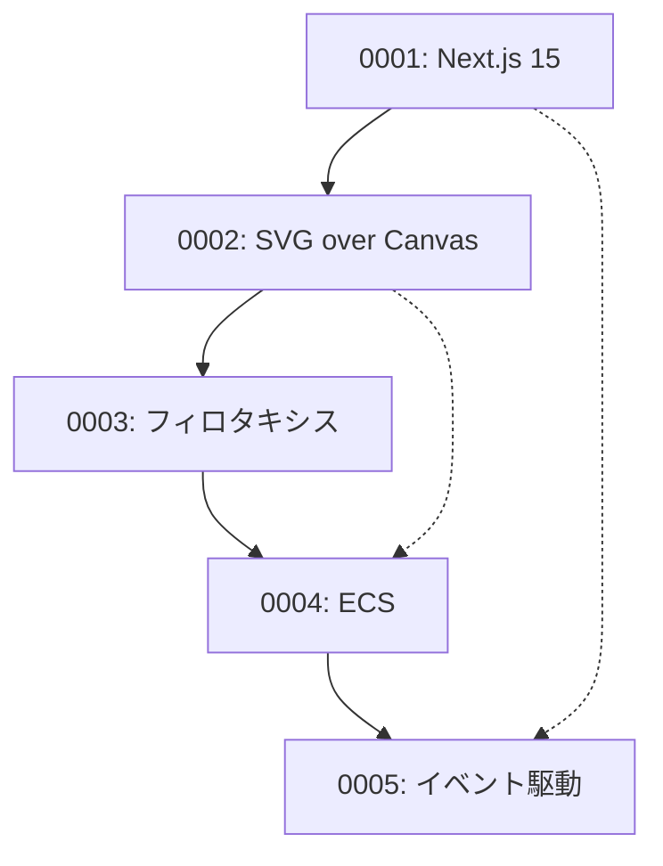

# Architecture Decision Records (ADR)

> [!info] ADRについて
> Architecture Decision Records (ADR) は、プロジェクトの重要な技術的決定を記録し、その背景と理由を文書化するためのドキュメントです。

## ADR一覧

### 承認済み決定

| ADR | タイトル | 日付 | 関連技術 |
|-----|---------|------|----------|
| [[0001-use-nextjs-15\|ADR-0001]] | Next.js 15の採用 | 2025-02-08 | `#nextjs` `#frontend` `#framework` |
| [[0002-svg-over-canvas\|ADR-0002]] | SVG over Canvasの採用 | 2025-02-08 | `#svg` `#rendering` `#accessibility` |
| [[0003-phyllotaxis-algorithm\|ADR-0003]] | フィロタキシスアルゴリズム実装 | 2025-02-08 | `#phyllotaxis` `#algorithm` `#mathematics` |
| [[0004-ecs-architecture\|ADR-0004]] | ECSアーキテクチャ採用 | 2025-02-08 | `#ecs` `#architecture` `#data-oriented` |
| [[0005-event-driven-architecture\|ADR-0005]] | イベント駆動アーキテクチャ採用 | 2025-02-08 | `#event-driven` `#decoupling` `#react` |

## 技術領域別分類

### フロントエンド技術
- [[0001-use-nextjs-15|Next.js 15の採用]]
- [[0002-svg-over-canvas|SVG over Canvasの採用]]

### アーキテクチャパターン
- [[0004-ecs-architecture|ECSアーキテクチャ採用]]
- [[0005-event-driven-architecture|イベント駆動アーキテクチャ採用]]

### アルゴリズム・数学
- [[0003-phyllotaxis-algorithm|フィロタキシスアルゴリズム実装]]

## 決定の関係性



## ADRテンプレート

新しいADRを作成する際は、以下のテンプレートを使用してください：

```markdown
---
title: "ADR-XXXX: [決定のタイトル]"
type: adr
status: [proposed|approved|deprecated|superseded]
date: YYYY-MM-DD
decision-makers: [development-team]
tags: [adr, relevant, tags]
related:
  - "[[related-adr]]"
  - "[[design]]"
---

# ADR-XXXX: [決定のタイトル]

> [!info] ステータス
> [提案中/承認済み/廃止/置換済み]

## コンテキスト

[決定が必要になった背景と問題]

## 決定

[採用した解決策]

## 理由

[この決定を選んだ理由]

## 代替案

[検討した他の選択肢]

## 影響

[この決定による影響と制約]

## 関連文書

> [!note] 外部リンク
> - [外部リンク](URL)

> [!info] 内部文書
> - [[internal-link|内部文書]]
```

## 関連文書

> [!info] プロジェクト文書
> - [[design|設計書]]
> - [[requirements|要件定義書]]
> - [[tasks|実装計画]]

> [!note] 参考資料
> - [ADR GitHub](https://adr.github.io/)
> - [Documenting Architecture Decisions](https://cognitect.com/blog/2011/11/15/documenting-architecture-decisions)