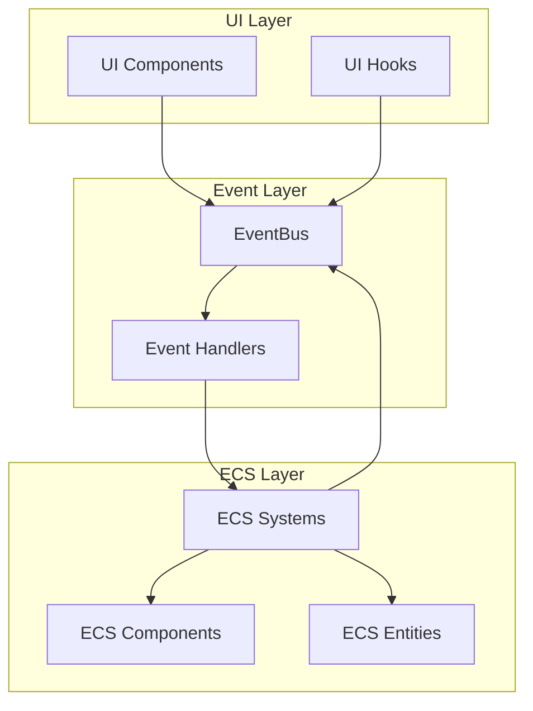

# API仕様書インデックス

> [!info] 概要
> Phyllotaxis Plannerの各種APIとインターフェース仕様書の一覧です。

## 📚 仕様書構成

### 🎨 UIコンポーネントAPI

| 仕様書 | 概要 | 対象読者 |
|--------|------|----------|
| [[components\|コンポーネントAPI]] | ReactコンポーネントのProps・State・メソッド仕様 | フロントエンド開発者 |

### ⚙️ ECSシステムAPI

| 仕様書 | 概要 | 対象読者 |
|--------|------|----------|
| [[ecs-systems\|ECSシステムAPI]] | Entity・Component・Systemのインターフェース仕様 | システム開発者 |

### 📡 イベントAPI

| 仕様書 | 概要 | 対象読者 |
|--------|------|----------|
| [[events\|イベントAPI]] | イベント定義・フロー・ハンドラー仕様 | 全開発者 |

## 🎯 API設計原則

### 型安全性

> [!tip] TypeScript First
> すべてのAPIはTypeScriptの型定義を基準とし、実行時の型安全性を保証

### 一貫性

> [!tip] 命名規則の統一
> - コンポーネント: PascalCase (`PhyllotaxisMap`)
> - Props/State: camelCase (`onThemeChange`)
> - イベント: SCREAMING_SNAKE_CASE (`IDEA_ADDED`)
> - 型定義: PascalCase + Interface接頭辞 (`IPositionComponent`)

### 拡張性

> [!tip] 後方互換性
> - 新しいプロパティは常にオプショナル
> - 既存のインターフェースは非破壊的変更のみ
> - バージョニング戦略の適用

## 🔄 API使用フロー

## 📖 使用ガイド

### 開発者向け

1. **新しいコンポーネント作成時**
   - [[components|コンポーネントAPI仕様]]を参照
   - Props・Stateインターフェースを定義
   - TypeScript型定義を作成

2. **ECSシステム拡張時**
   - [[ecs-systems|ECSシステムAPI仕様]]を参照
   - 必要なComponent・Systemインターフェースを実装
   - World統合パターンに従う

3. **イベント追加時**
   - [[events|イベントAPI仕様]]を参照
   - EventMap型定義に追加
   - 型安全なイベントハンドラーを実装

### テスト戦略

> [!note] API契約テスト
> - 各APIの契約（入力・出力・副作用）をテスト
> - TypeScript型定義の整合性確認
> - 実行時型チェックの実装

## 🔗 関連リソース

> [!info] アーキテクチャ文書
> 
> - [[../architecture/system-overview|システム概要図]]
> - [[../architecture/component-diagram|コンポーネント関係図]]
> - [[../architecture/ecs/overview|ECS概要]]
> - [[../architecture/event-driven-design|イベント駆動設計]]

> [!note] 設計決定記録
> 
> - [[../adr/0001-use-nextjs-15|ADR-0001: Next.js 15採用]]
> - [[../adr/0004-ecs-architecture|ADR-0004: ECSアーキテクチャ]]
> - [[../adr/0005-event-driven-architecture|ADR-0005: イベント駆動アーキテクチャ]]

> [!tip] 開発ガイド
> 
> - [[../guides/development|開発環境セットアップ]]
> - [[../guides/contributing|コントリビューションガイド]]