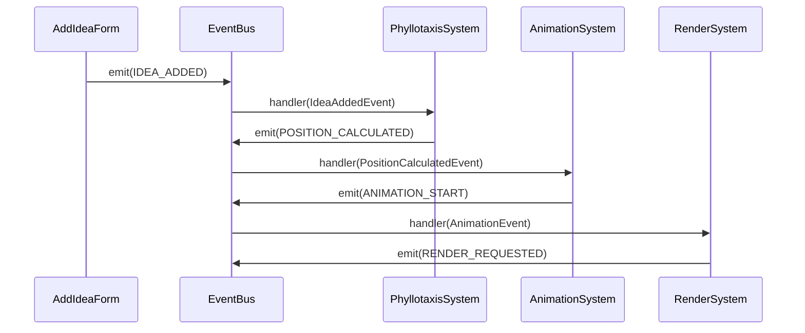

# イベントAPI仕様

> [!info] 概要
> イベント駆動アーキテクチャのイベント定義、フロー、ハンドラーの詳細仕様を定義します。

## EventBus インターフェース

### 基本インターフェース

```typescript
interface EventBus {
  emit<T>(event: string, data: T): void;
  on<T>(event: string, handler: (data: T) => void): () => void;
  off(event: string, handler: Function): void;
  once<T>(event: string, handler: (data: T) => void): void;
  clear(): void;
  getListenerCount(event: string): number;
}

interface EventBusOptions {
  maxListeners?: number;
  enableBatching?: boolean;
  batchInterval?: number;
  enableLogging?: boolean;
}
```

## イベント定義

### IdeaEvents

```typescript
export enum IdeaEvents {
  IDEA_ADDED = 'idea:added',
  IDEA_REMOVED = 'idea:removed',
  IDEA_UPDATED = 'idea:updated',
  THEME_CHANGED = 'theme:changed',
}

export interface IdeaAddedEvent {
  id: string;
  text: string;
  timestamp: Date;
  position?: { x: number; y: number };
}

export interface IdeaRemovedEvent {
  id: string;
  timestamp: Date;
}

export interface IdeaUpdatedEvent {
  id: string;
  oldText: string;
  newText: string;
  timestamp: Date;
}

export interface ThemeChangedEvent {
  oldTheme: string;
  newTheme: string;
  timestamp: Date;
}
```

### SystemEvents

```typescript
export enum SystemEvents {
  POSITION_CALCULATED = 'position:calculated',
  ANIMATION_START = 'animation:start',
  ANIMATION_END = 'animation:end',
  RENDER_REQUESTED = 'render:requested',
  ERROR_OCCURRED = 'error:occurred',
  SYSTEM_READY = 'system:ready',
}

export interface PositionCalculatedEvent {
  entityId: string;
  position: Position;
  angle: number;
  radius: number;
  index: number;
}

export interface AnimationEvent {
  entityId: string;
  animationType: 'fadeIn' | 'fadeOut' | 'slideIn' | 'slideOut' | 'scaleIn' | 'scaleOut' | 'bounce';
  duration: number;
  easing: 'linear' | 'ease-in' | 'ease-out' | 'ease-in-out' | 'bounce';
}

export interface RenderRequestedEvent {
  entityId?: string; // undefined = 全体再描画
  priority: 'high' | 'normal' | 'low';
  timestamp: Date;
}

export interface ErrorEvent {
  source: string;
  message: string;
  error?: Error;
  recoverable: boolean;
  recoveryEvent?: string;
  recoveryData?: any;
  timestamp: Date;
}
```

### UIEvents

```typescript
export enum UIEvents {
  FORM_SUBMITTED = 'ui:form:submitted',
  BUTTON_CLICKED = 'ui:button:clicked',
  INPUT_CHANGED = 'ui:input:changed',
  MODAL_OPENED = 'ui:modal:opened',
  MODAL_CLOSED = 'ui:modal:closed',
}
```

## 型安全なイベントマップ

```typescript
export interface EventMap {
  [IdeaEvents.IDEA_ADDED]: IdeaAddedEvent;
  [IdeaEvents.IDEA_REMOVED]: IdeaRemovedEvent;
  [IdeaEvents.IDEA_UPDATED]: IdeaUpdatedEvent;
  [IdeaEvents.THEME_CHANGED]: ThemeChangedEvent;
  [SystemEvents.POSITION_CALCULATED]: PositionCalculatedEvent;
  [SystemEvents.ANIMATION_START]: AnimationEvent;
  [SystemEvents.ANIMATION_END]: AnimationEvent;
  [SystemEvents.RENDER_REQUESTED]: RenderRequestedEvent;
  [SystemEvents.ERROR_OCCURRED]: ErrorEvent;
}
```

## React統合API

### useEventBus Hook

```typescript
export const useEventBus = () => {
  const eventBus = useRef<EventBus>(
    new EventBusImpl({
      enableBatching: true,
      enableLogging: process.env.NODE_ENV === 'development'
    })
  ).current;
  
  const emit = useCallback(<K extends keyof EventMap>(
    event: K,
    data: EventMap[K]
  ) => {
    eventBus.emit(event, data);
  }, [eventBus]);
  
  const subscribe = useCallback(<K extends keyof EventMap>(
    event: K,
    handler: (data: EventMap[K]) => void
  ) => {
    return eventBus.on(event, handler);
  }, [eventBus]);
  
  return { emit, subscribe, eventBus };
};
```

### useEventListener Hook

```typescript
export const useEventListener = <K extends keyof EventMap>(
  event: K,
  handler: (data: EventMap[K]) => void,
  deps: React.DependencyList = []
) => {
  const { subscribe } = useEventBus();
  
  useEffect(() => {
    const unsubscribe = subscribe(event, handler);
    return unsubscribe;
  }, [event, subscribe, ...deps]);
};
```

## イベントフロー仕様

### アイデア追加フロー



### エラー処理フロー

```typescript
// エラー処理の標準パターン
class SystemWithErrorHandling {
  constructor(private eventBus: EventBus) {}
  
  processData(data: any): void {
    try {
      // 処理ロジック
      this.performOperation(data);
    } catch (error) {
      this.eventBus.emit(SystemEvents.ERROR_OCCURRED, {
        source: this.constructor.name,
        message: error.message,
        error: error as Error,
        recoverable: true,
        recoveryEvent: 'fallback:event',
        recoveryData: this.getDefaultData(),
        timestamp: new Date()
      });
    }
  }
}
```

## 使用例

### コンポーネントでのイベント発行

```typescript
const AddIdeaForm: React.FC = () => {
  const { emit } = useEventBus();
  
  const handleSubmit = (text: string) => {
    emit(IdeaEvents.IDEA_ADDED, {
      id: generateId(),
      text,
      timestamp: new Date()
    });
  };
  
  return (
    <form onSubmit={handleSubmit}>
      {/* フォーム実装 */}
    </form>
  );
};
```

### システムでのイベント購読

```typescript
class PhyllotaxisSystem {
  constructor(private eventBus: EventBus) {
    this.setupEventHandlers();
  }
  
  private setupEventHandlers(): void {
    this.eventBus.on(IdeaEvents.IDEA_ADDED, (data: IdeaAddedEvent) => {
      this.calculatePosition(data);
    });
  }
}
```

## 関連文書

> [!info] API仕様書
> - [[components|コンポーネントAPI]]
> - [[ecs-systems|ECSシステムAPI]]

> [!note] アーキテクチャ文書
> - [[../architecture/event-driven-design|イベント駆動設計]]
> - [[../architecture/ecs/integration|React統合]]