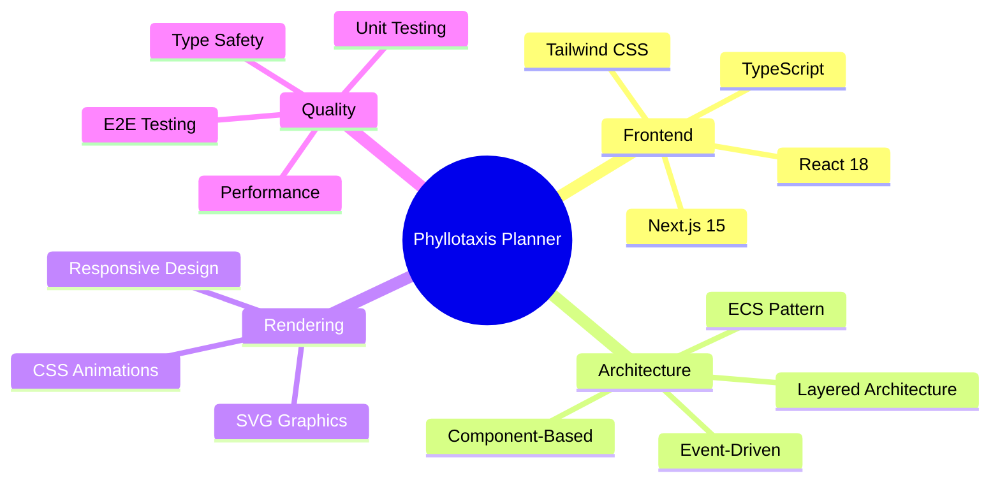
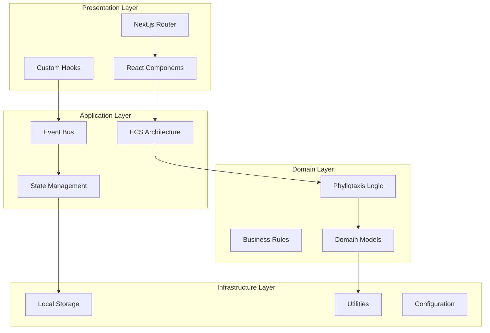
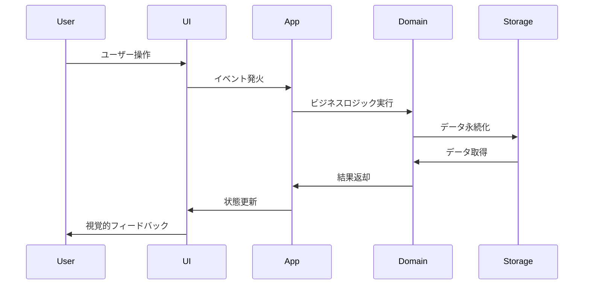
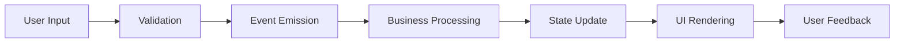
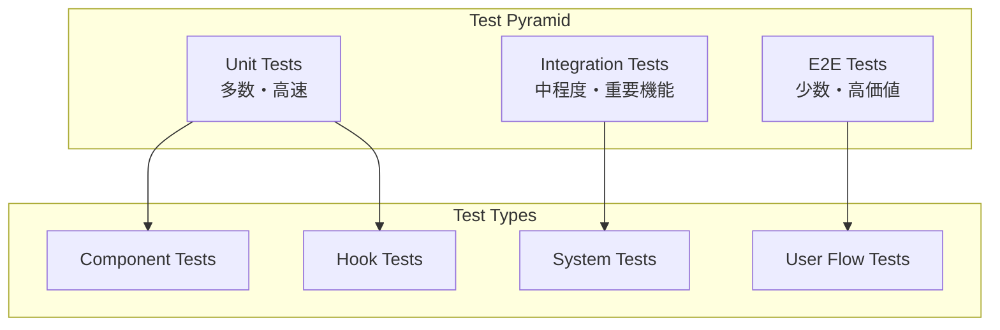

# アーキテクチャ設計文書

> [!info] 概要
> Phyllotaxis Plannerのアーキテクチャ設計に関する包括的なドキュメント集です。

## 📋 文書一覧

### 🏗️ 基本アーキテクチャ

| 文書 | 概要 | 対象読者 |
|------|------|----------|
| [[system-overview\|システム概要図]] | システム全体のアーキテクチャ概要 | 全開発者・PM |
| [[component-diagram\|コンポーネント関係図]] | React/ECSコンポーネントの関係性 | フロントエンド開発者 |
| [[data-flow\|データフロー図]] | データの流れとイベント処理 | 全開発者 |

### 🔧 詳細設計

| 文書                                | 概要                         | 対象読者         |
| --------------------------------- | -------------------------- | ------------ |
| [[ecs-design\|ECS設計詳細]]           | Entity Component Systemの詳細 | アーキテクト・上級開発者 |
| [[event-driven-design\|イベント駆動設計]] | イベントバスとメッセージング             | 全開発者         |
|                                   |                            |              |

## 🎯 アーキテクチャの特徴

### 主要な設計パターン



### 🌟 設計原則

> [!note] 1. 関心の分離 (Separation of Concerns)
> - 各層が明確な責務を持つ
> - UIロジックとビジネスロジックの分離
> - データとプレゼンテーションの分離

> [!note] 2. 疎結合 (Loose Coupling)
> - イベント駆動による柔軟な連携
> - 依存関係の最小化
> - インターフェースベースの設計

> [!note] 3. 高凝集 (High Cohesion)
> - 関連する機能の集約
> - 単一責任の原則
> - モジュールの独立性

> [!note] 4. 拡張性 (Extensibility)
> - 新機能追加時の影響最小化
> - プラグイン可能なアーキテクチャ
> - 設定による動作変更

> [!note] 5. テスタビリティ (Testability)
> - 各層の独立したテスト
> - モックとスタブの活用
> - 自動化されたテスト戦略

## 🏛️ アーキテクチャ層構成

### レイヤー構成図



### 各層の責務

#### 🎨 Presentation Layer
- **React Components**: ユーザーインターフェースの構築
- **Next.js Router**: ページルーティングとナビゲーション
- **Custom Hooks**: UIロジックの抽象化と再利用

#### ⚙️ Application Layer
- **ECS Architecture**: エンティティ・コンポーネント・システムの管理
- **Event Bus**: コンポーネント間の非同期通信
- **State Management**: アプリケーション状態の管理

#### 🧠 Domain Layer
- **Phyllotaxis Logic**: 黄金角による配置計算
- **Business Rules**: アプリケーション固有のルール
- **Domain Models**: ビジネスオブジェクトの定義

#### 🔧 Infrastructure Layer
- **Local Storage**: データの永続化
- **Utilities**: 共通ユーティリティ関数
- **Configuration**: アプリケーション設定

## 🔄 データフローパターン

### 基本フロー



### イベント駆動フロー



## 🚀 パフォーマンス戦略

### 最適化アプローチ

> [!tip] React最適化
> - `React.memo` による不要な再レンダリング防止
> - `useMemo` / `useCallback` による計算結果のメモ化
> - 仮想化による大量データの効率的表示

> [!tip] ECS最適化
> - システムの並列実行
> - コンポーネントの効率的なクエリ
> - メモリプールによるオブジェクト再利用

> [!tip] イベント最適化
> - イベントのバッチ処理
> - 不要なイベントリスナーの自動削除
> - 優先度付きイベントキュー

### パフォーマンス指標

| 指標 | 目標値 | 測定方法 |
|------|--------|----------|
| 初期ロード時間 | < 2秒 | Lighthouse |
| アイデア追加時間 | < 100ms | Performance API |
| アニメーション FPS | 60fps | DevTools |
| メモリ使用量 | < 50MB | DevTools Memory |
| バンドルサイズ | < 500KB | Webpack Bundle Analyzer |

## 🛡️ セキュリティ考慮事項

### セキュリティ対策

> [!warning] 入力検証
> - XSS攻撃の防止
> - 入力値のサニタイゼーション
> - 文字数制限の実装

> [!warning] データ保護
> - ローカルストレージの暗号化
> - 機密情報の除外
> - データの整合性チェック

> [!warning] 依存関係管理
> - 脆弱性のある依存関係の監視
> - 定期的なセキュリティアップデート
> - 最小権限の原則

## 🧪 テスト戦略

### テストピラミッド



### テスト範囲

| テストレベル | 対象 | ツール | カバレッジ目標 |
|--------------|------|--------|----------------|
| Unit | 関数・コンポーネント | Vitest | 90%+ |
| Integration | システム連携 | React Testing Library | 80%+ |
| E2E | ユーザーフロー | Playwright | 主要フロー100% |

## 📚 学習リソース

### 推奨学習順序

1. **基礎理解**
   - [[system-overview|システム概要図]] を読む
   - Next.js 15とReact 18の基本を学習

2. **アーキテクチャ理解**
   - [[component-diagram|コンポーネント関係図]] を理解
   - ECSパターンの概念を学習

3. **データフロー理解**
   - [[data-flow|データフロー図]] を詳細に学習
   - イベント駆動アーキテクチャを理解

4. **実装詳細**
   - 各ADRを読んで設計決定の背景を理解
   - 実際のコードと設計文書を照らし合わせ

### 外部リソース

> [!note] アーキテクチャパターン
> - [Clean Architecture](https://blog.cleancoder.com/uncle-bob/2012/08/13/the-clean-architecture.html)
> - [ECS Pattern](https://en.wikipedia.org/wiki/Entity_component_system)
> - [Event-Driven Architecture](https://martinfowler.com/articles/201701-event-driven.html)

> [!note] React/Next.js
> - [Next.js 15 Documentation](https://nextjs.org/docs)
> - [React 18 Features](https://reactjs.org/blog/2022/03/29/react-v18.html)
> - [React Performance](https://reactjs.org/docs/optimizing-performance.html)

## 🔧 開発ガイドライン

### コーディング規約

> [!tip] TypeScript
> - 厳密な型定義の使用
> - インターフェースベースの設計
> - 型ガードの活用

> [!tip] React
> - 関数コンポーネントの使用
> - カスタムフックによるロジック分離
> - propsの型安全性確保

> [!tip] ECS
> - コンポーネントはデータのみ保持
> - システムはロジックのみ実装
> - エンティティは識別子とコンテナのみ

### ファイル構成規約

```
src/
├── components/          # React コンポーネント
├── hooks/              # カスタムフック
├── ecs/                # ECS関連
│   ├── components/     # ECSコンポーネント
│   ├── systems/        # ECSシステム
│   └── entities/       # エンティティ
├── events/             # イベント定義
├── utils/              # ユーティリティ
└── types/              # 型定義
```

## 🚀 今後の拡張計画

### Phase 2: 機能拡張
- アイデア間の関連性表示
- カテゴリ別色分け
- 検索・フィルタ機能

### Phase 3: 協調機能
- リアルタイム共同編集
- コメント機能
- バージョン管理

### Phase 4: 高度な機能
- AI による関連アイデア提案
- エクスポート機能
- テンプレート機能

## 関連文書

> [!info] 設計文書
> - [[design|設計書]]
> - [[requirements|要件定義書]]
> - [[tasks|実装計画]]

> [!note] 設計決定記録
> - [[0001-use-nextjs-15|ADR-0001: Next.js 15採用]]
> - [[0002-svg-over-canvas|ADR-0002: SVG over Canvas]]
> - [[0003-phyllotaxis-algorithm|ADR-0003: フィロタキシスアルゴリズム]]
> - [[0004-ecs-architecture|ADR-0004: ECSアーキテクチャ]]
> - [[0005-event-driven-architecture|ADR-0005: イベント駆動アーキテクチャ]]

> [!info] 実装ガイド
> - [[../guides/development|開発環境セットアップ]]
> - [[../guides/contributing|コントリビューションガイド]]
> - [[../guides/coding-standards|コーディング規約]]