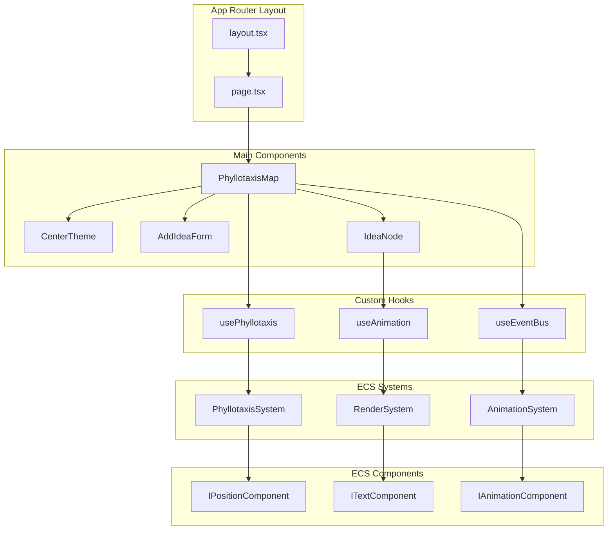
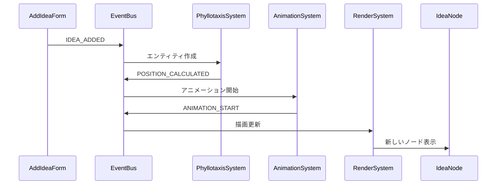
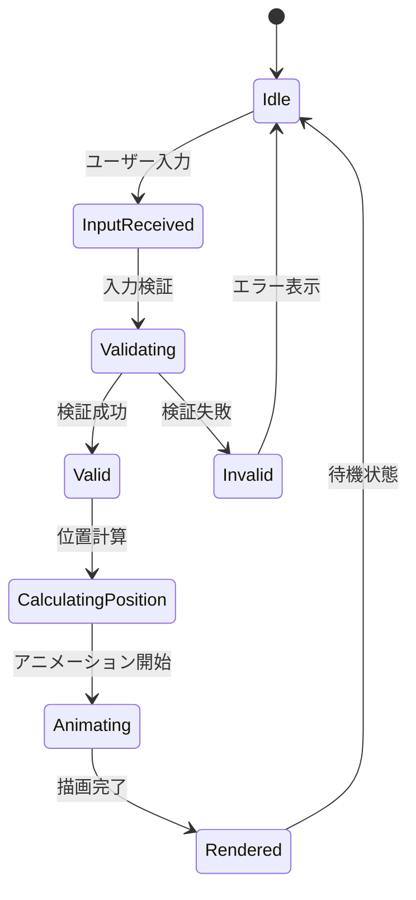

# コンポーネント関係図

> [!info] 概要
> Phyllotaxis Plannerのコンポーネント間の関係性と依存関係を詳細に示します。

## React コンポーネント階層



## コンポーネント詳細仕様

### 🎯 メインコンポーネント

#### PhyllotaxisMap
> [!note] 責務
> アプリケーション全体の状態管理と描画領域の提供

```typescript
interface PhyllotaxisMapProps {
  // プロップスなし（ルートコンポーネント）
}

interface PhyllotaxisMapState {
  centerTheme: string;
  ideas: Idea[];
  nextId: number;
  isLoading: boolean;
}
```

**主要機能:**
- アプリケーション全体の状態管理
- SVG描画領域の設定とレスポンシブ対応
- 子コンポーネントへのデータ配信
- イベントバスとの連携

**依存関係:**
- `usePhyllotaxis` - フィロタキシス計算ロジック
- `useEventBus` - イベント駆動通信
- `CenterTheme`, `AddIdeaForm`, `IdeaNode` - 子コンポーネント

#### CenterTheme
> [!note] 責務
> 中心テーマの表示と編集機能

```typescript
interface CenterThemeProps {
  theme: string;
  onThemeChange: (theme: string) => void;
  position: Position;
  isEditing: boolean;
}
```

**主要機能:**
- 中心テーマのテキスト表示
- インライン編集機能
- プレースホルダーテキストの表示
- テーマ変更時のイベント発火

**SVG要素:**
```typescript
<g transform={`translate(${position.x}, ${position.y})`}>
  <circle className="center-theme-bg" />
  <text className="center-theme-text">{theme}</text>
</g>
```

#### AddIdeaForm
> [!note] 責務
> 新しいアイデアの入力と追加

```typescript
interface AddIdeaFormProps {
  onAddIdea: (text: string) => void;
  isDisabled: boolean;
  maxLength: number;
}
```

**主要機能:**
- アイデアテキストの入力フォーム
- 入力検証（空文字列、文字数制限）
- エラーメッセージの表示
- 送信時のイベント発火

**バリデーション:**
- 空文字列チェック
- 最大文字数制限（100文字）
- 重複チェック（オプション）

#### IdeaNode
> [!note] 責務
> 個別アイデアの視覚的表現

```typescript
interface IdeaNodeProps {
  idea: Idea;
  isAnimating: boolean;
  onSelect?: (id: string) => void;
  onEdit?: (id: string, newText: string) => void;
}
```

**主要機能:**
- アイデアテキストの表示
- 植物の葉を連想させるデザイン
- アニメーション状態の反映
- インタラクション（選択、編集）

**SVG要素:**
```typescript
<g transform={`translate(${idea.position.x}, ${idea.position.y})`}>
  <path d="leaf-shape" className="idea-leaf" />
  <text className="idea-text">{idea.text}</text>
</g>
```

### 🎣 カスタムフック

#### usePhyllotaxis
> [!note] 責務
> フィロタキシス計算ロジックの抽象化

```typescript
interface UsePhyllotaxisReturn {
  calculatePosition: (index: number) => Position;
  config: PhyllotaxisConfig;
  updateConfig: (newConfig: Partial<PhyllotaxisConfig>) => void;
}
```

**主要機能:**
- 黄金角による位置計算
- 設定パラメータの管理
- 計算結果のメモ化
- レスポンシブ対応

#### useEventBus
> [!note] 責務
> イベント駆動通信の抽象化

```typescript
interface UseEventBusReturn {
  emit: <T>(event: string, data: T) => void;
  subscribe: <T>(event: string, handler: (data: T) => void) => () => void;
  unsubscribe: (event: string, handler: Function) => void;
}
```

**主要機能:**
- イベントの発火と購読
- 自動的なクリーンアップ
- 型安全なイベントハンドリング
- React ライフサイクルとの統合

#### useAnimation
> [!note] 責務
> アニメーション状態の管理

```typescript
interface UseAnimationReturn {
  isAnimating: boolean;
  startAnimation: (duration?: number) => void;
  stopAnimation: () => void;
  animationProgress: number;
}
```

**主要機能:**
- アニメーション状態の追跡
- CSS transitionsとの連携
- アニメーション完了の検知
- パフォーマンス最適化

### ⚙️ ECS コンポーネント

#### IPositionComponent
> [!note] 責務
> エンティティの位置情報を保持

```typescript
interface IPositionComponent extends IComponent {
  readonly type: 'position';
  x: number;
  y: number;
  angle: number;
  radius: number;
}
```

#### ITextComponent
> [!note] 責務
> エンティティのテキスト情報を保持

```typescript
interface ITextComponent extends IComponent {
  readonly type: 'text';
  content: string;
  maxLength: number;
  isEditable: boolean;
}
```

#### IAnimationComponent
> [!note] 責務
> エンティティのアニメーション状態を保持

```typescript
interface IAnimationComponent extends IComponent {
  readonly type: 'animation';
  isAnimating: boolean;
  duration: number;
  easing: string;
  progress: number;
}
```

### 🔧 ECS システム

#### PhyllotaxisSystem
> [!note] 責務
> フィロタキシス配置計算の実行

```typescript
class PhyllotaxisSystem implements System {
  requiredComponents = ['position', 'text'];
  
  update(entities: Entity[], deltaTime: number): void {
    // 位置計算とイベント発火
  }
}
```

**処理フロー:**
1. エンティティの位置コンポーネント取得
2. フィロタキシス位置計算
3. 位置情報の更新
4. `POSITION_CALCULATED` イベント発火

#### AnimationSystem
> [!note] 責務
> アニメーション状態の管理と更新

```typescript
class AnimationSystem implements System {
  requiredComponents = ['animation', 'position'];
  
  update(entities: Entity[], deltaTime: number): void {
    // アニメーション進行状況の更新
  }
}
```

**処理フロー:**
1. アニメーション中のエンティティ特定
2. 進行状況の計算
3. アニメーション完了の検知
4. `ANIMATION_END` イベント発火

#### RenderSystem
> [!note] 責務
> SVG要素の動的生成と更新

```typescript
class RenderSystem implements System {
  requiredComponents = ['position', 'text'];
  
  update(entities: Entity[], deltaTime: number): void {
    // SVG要素の更新
  }
}
```

**処理フロー:**
1. 描画が必要なエンティティ特定
2. SVG要素の生成・更新
3. CSS クラスの適用
4. DOM への反映

## コンポーネント間通信

### 📡 イベントフロー



### 🔄 状態管理パターン



## パフォーマンス考慮事項

### 🚀 最適化戦略

1. **React.memo**: 不要な再レンダリング防止
```typescript
const IdeaNode = React.memo(({ idea, isAnimating }: IdeaNodeProps) => {
  // コンポーネント実装
});
```

2. **useMemo**: 計算結果のメモ化
```typescript
const positions = useMemo(() => {
  return ideas.map((_, index) => calculatePosition(index));
}, [ideas.length, config]);
```

3. **useCallback**: 関数のメモ化
```typescript
const handleAddIdea = useCallback((text: string) => {
  emit(IdeaEvents.IDEA_ADDED, { text });
}, [emit]);
```

### 📊 パフォーマンス指標

- **初期レンダリング**: < 100ms
- **アイデア追加**: < 50ms
- **アニメーション**: 60fps維持
- **メモリ使用量**: < 50MB（50アイデア時）

## テスト戦略

### 🧪 コンポーネントテスト

```typescript
// コンポーネント単体テスト
describe('IdeaNode', () => {
  it('should render idea text correctly', () => {
    render(<IdeaNode idea={mockIdea} isAnimating={false} />);
    expect(screen.getByText(mockIdea.text)).toBeInTheDocument();
  });
});

// カスタムフックテスト
describe('usePhyllotaxis', () => {
  it('should calculate correct position', () => {
    const { result } = renderHook(() => usePhyllotaxis());
    const position = result.current.calculatePosition(0);
    expect(position.x).toBe(expectedX);
  });
});
```

### 🔗 統合テスト

```typescript
// コンポーネント間の連携テスト
describe('Idea Addition Flow', () => {
  it('should add idea and update display', async () => {
    render(<PhyllotaxisMap />);
    
    const input = screen.getByPlaceholderText('新しいアイデア');
    fireEvent.change(input, { target: { value: 'Test Idea' } });
    fireEvent.click(screen.getByText('追加'));
    
    await waitFor(() => {
      expect(screen.getByText('Test Idea')).toBeInTheDocument();
    });
  });
});
```

## 関連文書

> [!info] アーキテクチャ文書
> - [[system-overview|システム概要図]]
> - [[data-flow|データフロー図]]
> - [[ecs-design|ECS設計詳細]]
> - [[event-driven-design|イベント駆動設計]]

> [!note] 設計決定記録
> - [[0001-use-nextjs-15|ADR-0001: Next.js 15採用]]
> - [[0002-svg-over-canvas|ADR-0002: SVG over Canvas]]
> - [[0004-ecs-architecture|ADR-0004: ECSアーキテクチャ]]

> [!info] 実装ガイド
> - [[design#コンポーネントとインターフェース|設計書: コンポーネント設計]]
> - [[tasks|実装計画]]