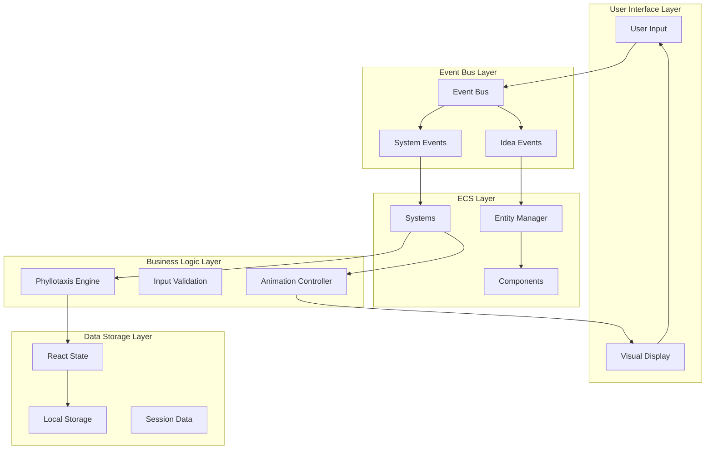
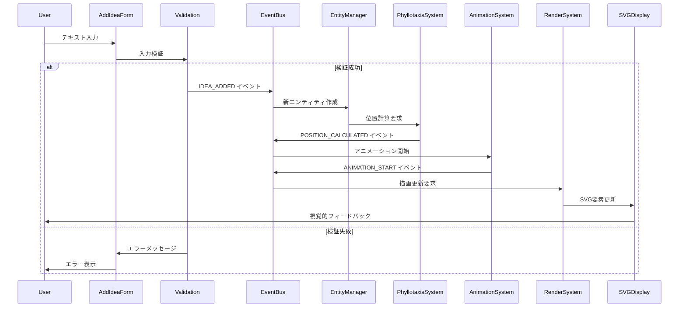
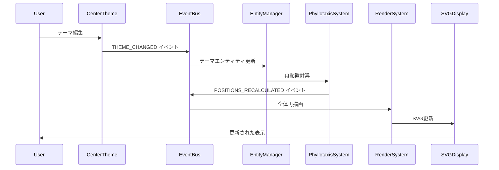
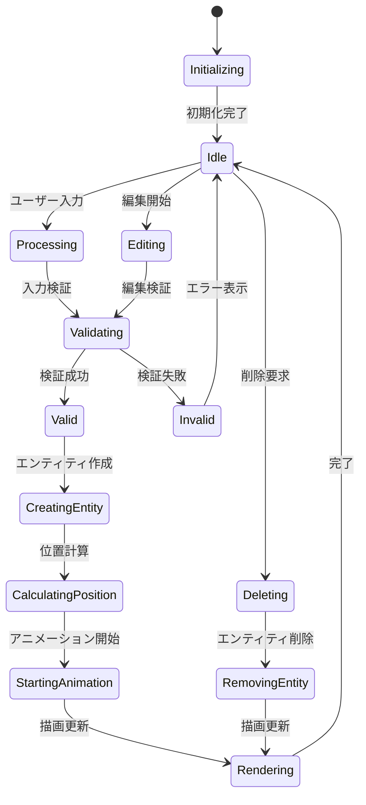
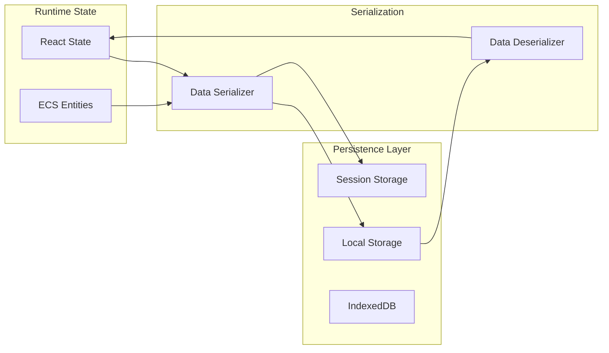
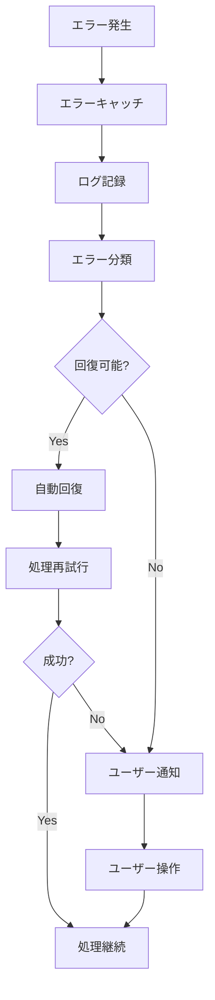

# データフロー図

> [!info] 概要
> Phyllotaxis Plannerにおけるデータの流れとイベント駆動アーキテクチャの詳細を示します。

## 全体データフロー概要



## 詳細データフロー

### 🎯 アイデア追加フロー



### 🔄 テーマ変更フロー



## イベント定義と詳細

### 📢 Idea Events

#### IDEA_ADDED
> [!note] 発火タイミング
> ユーザーが新しいアイデアを追加した時

```typescript
interface IdeaAddedEvent {
  id: string;
  text: string;
  timestamp: Date;
  userId?: string;
}

// 発火例
eventBus.emit(IdeaEvents.IDEA_ADDED, {
  id: generateId(),
  text: userInput,
  timestamp: new Date()
});
```

**処理の流れ:**
1. AddIdeaFormでの入力検証
2. 新しいエンティティの作成
3. PhyllotaxisSystemでの位置計算
4. AnimationSystemでのアニメーション開始

#### IDEA_REMOVED
> [!note] 発火タイミング
> ユーザーがアイデアを削除した時

```typescript
interface IdeaRemovedEvent {
  id: string;
  timestamp: Date;
}
```

#### IDEA_UPDATED
> [!note] 発火タイミング
> アイデアのテキストが編集された時

```typescript
interface IdeaUpdatedEvent {
  id: string;
  oldText: string;
  newText: string;
  timestamp: Date;
}
```

#### THEME_CHANGED
> [!note] 発火タイミング
> 中心テーマが変更された時

```typescript
interface ThemeChangedEvent {
  oldTheme: string;
  newTheme: string;
  timestamp: Date;
}
```

### ⚙️ System Events

#### POSITION_CALCULATED
> [!note] 発火タイミング
> PhyllotaxisSystemが位置計算を完了した時

```typescript
interface PositionCalculatedEvent {
  entityId: string;
  position: Position;
  angle: number;
  radius: number;
  index: number;
}
```

#### ANIMATION_START
> [!note] 発火タイミング
> アニメーションが開始された時

```typescript
interface AnimationStartEvent {
  entityId: string;
  animationType: 'fadeIn' | 'slideIn' | 'scaleIn';
  duration: number;
  easing: string;
}
```

#### ANIMATION_END
> [!note] 発火タイミング
> アニメーションが完了した時

```typescript
interface AnimationEndEvent {
  entityId: string;
  animationType: string;
  duration: number;
}
```

#### RENDER_REQUESTED
> [!note] 発火タイミング
> 描画更新が要求された時

```typescript
interface RenderRequestedEvent {
  entityIds: string[];
  renderType: 'full' | 'partial' | 'animation';
  priority: 'high' | 'normal' | 'low';
}
```

#### ERROR_OCCURRED
> [!note] 発火タイミング
> システムエラーが発生した時

```typescript
interface ErrorOccurredEvent {
  source: string;
  message: string;
  error: Error;
  recoverable: boolean;
  timestamp: Date;
}
```

## 状態管理パターン

### 🗃️ React State Management



### 📊 状態の種類と管理

#### Application State
```typescript
interface AppState {
  centerTheme: string;
  ideas: Idea[];
  nextId: number;
  isLoading: boolean;
  error: string | null;
}
```

#### UI State
```typescript
interface UIState {
  selectedIdeaId: string | null;
  isEditing: boolean;
  showAddForm: boolean;
  animatingIds: Set<string>;
}
```

#### ECS State
```typescript
interface ECSState {
  entities: Map<string, Entity>;
  systems: System[];
  componentFactories: Map<string, ComponentFactory>;
}
```

## データ永続化

### 💾 Local Storage Strategy



#### 保存データ構造
```typescript
interface SavedData {
  version: string;
  timestamp: Date;
  centerTheme: string;
  ideas: SavedIdea[];
  settings: UserSettings;
}

interface SavedIdea {
  id: string;
  text: string;
  position: Position;
  createdAt: Date;
  updatedAt: Date;
}
```

#### 自動保存機能
```typescript
// 自動保存のデバウンス実装
const useAutoSave = (data: AppState) => {
  const debouncedSave = useMemo(
    () => debounce((data: AppState) => {
      localStorage.setItem('phyllotaxis-data', JSON.stringify(data));
    }, 1000),
    []
  );
  
  useEffect(() => {
    debouncedSave(data);
  }, [data, debouncedSave]);
};
```

## パフォーマンス最適化

### 🚀 データフロー最適化

#### イベントバッチング
```typescript
class BatchedEventBus extends EventBus {
  private batchQueue: BatchedEvent[] = [];
  private batchTimeout: NodeJS.Timeout | null = null;
  
  emit<T>(event: string, data: T): void {
    this.batchQueue.push({ event, data, timestamp: Date.now() });
    
    if (!this.batchTimeout) {
      this.batchTimeout = setTimeout(() => {
        this.flushBatch();
      }, 16); // 60fps
    }
  }
  
  private flushBatch(): void {
    const batch = [...this.batchQueue];
    this.batchQueue = [];
    this.batchTimeout = null;
    
    // 同種イベントの統合
    const consolidated = this.consolidateEvents(batch);
    consolidated.forEach(({ event, data }) => {
      super.emit(event, data);
    });
  }
}
```

#### メモ化戦略
```typescript
// 位置計算のメモ化
const usePhyllotaxisPositions = (ideas: Idea[], config: PhyllotaxisConfig) => {
  return useMemo(() => {
    return ideas.map((_, index) => calculatePosition(index, config));
  }, [ideas.length, config.radiusScale, config.centerX, config.centerY]);
};

// レンダリングのメモ化
const IdeaNode = React.memo(({ idea, isAnimating }: IdeaNodeProps) => {
  return (
    <g transform={`translate(${idea.position.x}, ${idea.position.y})`}>
      <IdeaLeaf idea={idea} isAnimating={isAnimating} />
      <IdeaText text={idea.text} />
    </g>
  );
}, (prevProps, nextProps) => {
  return (
    prevProps.idea.id === nextProps.idea.id &&
    prevProps.idea.text === nextProps.idea.text &&
    prevProps.isAnimating === nextProps.isAnimating &&
    positionsEqual(prevProps.idea.position, nextProps.idea.position)
  );
});
```

### 📈 パフォーマンス指標

| 操作 | 目標時間 | 最大許容時間 |
|------|----------|--------------|
| アイデア追加 | < 50ms | < 100ms |
| 位置計算 | < 10ms | < 20ms |
| アニメーション開始 | < 16ms | < 32ms |
| 描画更新 | < 16ms | < 32ms |
| 状態保存 | < 100ms | < 200ms |

## エラーハンドリング

### 🛡️ エラー処理フロー



#### エラー分類と対応
```typescript
enum ErrorType {
  VALIDATION_ERROR = 'validation',
  CALCULATION_ERROR = 'calculation',
  RENDERING_ERROR = 'rendering',
  STORAGE_ERROR = 'storage',
  NETWORK_ERROR = 'network'
}

interface ErrorHandler {
  canRecover(error: Error): boolean;
  recover(error: Error): Promise<void>;
  notify(error: Error): void;
}

class PhyllotaxisErrorHandler implements ErrorHandler {
  canRecover(error: Error): boolean {
    return error.name === 'CalculationError' || 
           error.name === 'RenderingError';
  }
  
  async recover(error: Error): Promise<void> {
    switch (error.name) {
      case 'CalculationError':
        // デフォルト位置を使用
        return this.useDefaultPositions();
      case 'RenderingError':
        // 簡易描画モードに切り替え
        return this.enableFallbackRendering();
    }
  }
}
```

## テストデータフロー

### 🧪 テスト戦略

```typescript
// イベントフローのテスト
describe('Idea Addition Data Flow', () => {
  let eventBus: EventBus;
  let entityManager: EntityManager;
  let phyllotaxisSystem: PhyllotaxisSystem;
  
  beforeEach(() => {
    eventBus = new EventBus();
    entityManager = new EntityManager(eventBus);
    phyllotaxisSystem = new PhyllotaxisSystem(eventBus);
  });
  
  it('should complete full data flow', async () => {
    const mockIdea = { id: '1', text: 'Test Idea' };
    
    // イベント発火
    eventBus.emit(IdeaEvents.IDEA_ADDED, mockIdea);
    
    // エンティティ作成の確認
    await waitFor(() => {
      expect(entityManager.getEntity('1')).toBeDefined();
    });
    
    // 位置計算の確認
    await waitFor(() => {
      const entity = entityManager.getEntity('1');
      const position = getPositionComponent(entity);
      expect(position.x).toBeGreaterThan(0);
    });
  });
});
```

## 関連文書

> [!info] アーキテクチャ文書
> - [[system-overview|システム概要図]]
> - [[component-diagram|コンポーネント関係図]]
> - [[ecs-design|ECS設計詳細]]
> - [[event-driven-design|イベント駆動設計]]

> [!note] 設計決定記録
> - [[0004-ecs-architecture|ADR-0004: ECSアーキテクチャ]]
> - [[0005-event-driven-architecture|ADR-0005: イベント駆動アーキテクチャ]]

> [!info] 実装ガイド
> - [[design#イベント駆動アーキテクチャ設計|設計書: イベント駆動設計]]
> - [[design#データモデル|設計書: データモデル]]
> - [[tasks|実装計画]]