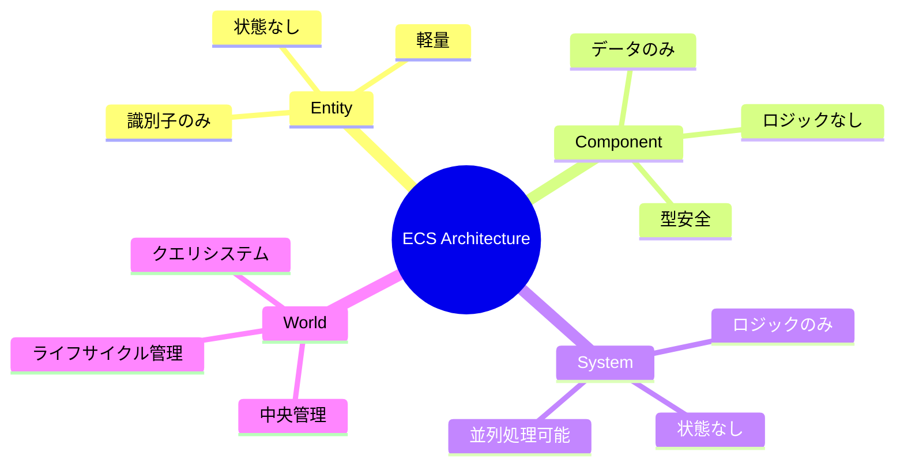

# ECS設計文書インデックス

> [!info] 概要
> Entity Component System (ECS) アーキテクチャの設計文書一覧です。

## 📚 文書構成

### 🎯 基本概念

| 文書 | 概要 | 対象読者 |
|------|------|----------|
| [[overview\|ECS概要]] | ECSの基本概念と設計原則 | 全開発者 |
| [[world\|World設計]] | ECS中央管理システム | 全開発者 |
| [[entities\|エンティティ設計]] | エンティティとライフサイクル | フロントエンド開発者 |

### 🧩 詳細設計

| 文書 | 概要 | 対象読者 |
|------|------|----------|
| [[components\|コンポーネント設計]] | コンポーネントの詳細仕様 | フロントエンド開発者 |
| [[systems\|システム設計]] | システムの実装詳細 | フロントエンド開発者 |
| [[integration\|React統合]] | React統合と最適化 | 上級開発者 |

## 🎨 ECS設計概要

## 🚀 学習パス

### 初心者向け

1. [[overview|ECS概要]] - 基本概念の理解
2. [[components|コンポーネント設計]] - データ構造の理解
3. 実際のコード例を確認

### 中級者向け

1. [[systems|システム設計]] - ロジック実装の理解
2. [[integration|React統合]] - 実装統合の理解
3. パフォーマンス最適化の実践

### 上級者向け

1. 全文書の詳細理解
2. カスタムシステムの実装
3. パフォーマンスプロファイリング

## 🔗 関連リソース

> [!note] 外部リンク
> 
> - [ECS Architecture Pattern](https://en.wikipedia.org/wiki/Entity_component_system)
> - [Data-Oriented Design](https://www.dataorienteddesign.com/dodbook/)
> - [Game Programming Patterns](https://gameprogrammingpatterns.com/component.html)

> [!info] プロジェクト文書
> 
> - [[../system-overview|システム概要図]]
> - [[../component-diagram|コンポーネント関係図]]
> - [[../../adr/0004-ecs-architecture|ADR-0004: ECSアーキテクチャ採用]]