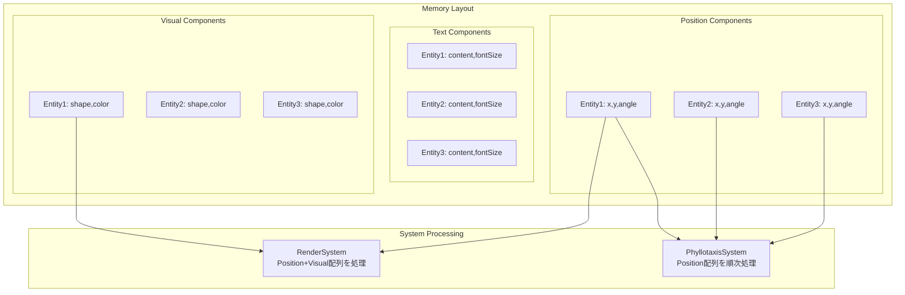

# ECSコンポーネント設計

> [!info] 概要
> Phyllotaxis PlannerのECSアーキテクチャにおけるコンポーネント設計の詳細を説明します。

## コンポーネント設計原則

### 🎯 基本原則

> [!warning] データのみ保持
> コンポーネントはデータのみを保持し、メソッドやロジックは一切持たない

```typescript
// ✅ 正しいコンポーネント設計
interface IPositionComponent {
  readonly type: 'position';
  x: number;
  y: number;
  angle: number;
}

// ❌ 間違ったコンポーネント設計
interface BadComponent {
  x: number;
  y: number;
  updatePosition(): void; // ロジックを持ってはいけない
}
```

### 🏗️ コンポーネント基底構造

```typescript
// ecs/core/Component.ts
interface IComponent {
  readonly type: ComponentType;
}

// コンポーネントタイプの定義
export const ComponentTypes = {
  POSITION: 'position',
  TEXT: 'text',
  VISUAL: 'visual',
  ANIMATION: 'animation',
  INTERACTION: 'interaction'
} as const;

export type ComponentType = typeof ComponentTypes[keyof typeof ComponentTypes];
```

## コンポーネント詳細設計

### 📍 PositionComponent

> [!note] 責務
> エンティティの空間的位置情報を管理

```typescript
// ecs/components/interfaces/IPositionComponent.ts
interface IPositionComponent extends IComponent {
  readonly type: typeof ComponentTypes.POSITION;
  x: number;                    // X座標（SVG座標系）
  y: number;                    // Y座標（SVG座標系）
  angle: number;                // 回転角度（度）
  radius: number;               // 中心からの距離
  scale: number;                // スケール倍率
  zIndex: number;               // 描画順序
}

// ファクトリ関数
export const createPositionComponent = (
  x: number = 0,
  y: number = 0,
  angle: number = 0,
  radius: number = 0,
  scale: number = 1,
  zIndex: number = 0
): IPositionComponent => ({
  type: ComponentTypes.POSITION,
  x, y, angle, radius, scale, zIndex
});
```

**使用例:**
```typescript
// 中心テーマの位置
const centerPosition = createPositionComponent(400, 300, 0, 0, 1.5, 10);

// アイデアノードの位置
const ideaPosition = createPositionComponent(450, 250, 45, 80, 1.0, 1);
```

### 📝 TextComponent

> [!note] 責務
> エンティティのテキスト情報を管理

```typescript
// ecs/components/interfaces/ITextComponent.ts
interface ITextComponent extends IComponent {
  readonly type: typeof ComponentTypes.TEXT;
  content: string;              // テキスト内容
  maxLength: number;            // 最大文字数
  isEditable: boolean;          // 編集可能フラグ
  fontSize: number;             // フォントサイズ（px）
  fontFamily: string;           // フォントファミリー
  color: string;                // テキスト色（CSS色値）
  alignment: TextAlignment;     // テキスト配置
}

type TextAlignment = 'left' | 'center' | 'right';

// ファクトリ関数
export const createTextComponent = (
  content: string,
  options: Partial<Omit<ITextComponent, 'type' | 'content'>> = {}
): ITextComponent => ({
  type: ComponentTypes.TEXT,
  content: content.slice(0, options.maxLength || 100),
  maxLength: 100,
  isEditable: true,
  fontSize: 14,
  fontFamily: 'Inter, sans-serif',
  color: '#374151',
  alignment: 'center',
  ...options
});
```

**使用例:**
```typescript
// アイデアテキスト
const ideaText = createTextComponent('新しいアイデア', {
  fontSize: 14,
  color: '#1F2937'
});

// 中心テーマテキスト
const themeText = createTextComponent('メインテーマ', {
  fontSize: 18,
  fontFamily: 'Inter, sans-serif',
  color: '#111827',
  isEditable: true
});
```

### 🎨 VisualComponent

> [!note] 責務
> エンティティの視覚的表現を管理

```typescript
// ecs/components/interfaces/IVisualComponent.ts
interface IVisualComponent extends IComponent {
  readonly type: typeof ComponentTypes.VISUAL;
  shape: ShapeType;             // 形状タイプ
  fillColor: string;            // 塗りつぶし色
  strokeColor: string;          // 境界線色
  strokeWidth: number;          // 境界線幅
  opacity: number;              // 透明度（0-1）
  visible: boolean;             // 表示フラグ
  cssClasses: string[];         // 追加CSSクラス
  customStyles: Record<string, string>; // カスタムスタイル
}

type ShapeType = 'circle' | 'ellipse' | 'rect' | 'leaf' | 'custom';

// ファクトリ関数
export const createVisualComponent = (
  shape: ShapeType = 'leaf',
  fillColor: string = '#10B981',
  strokeColor: string = '#059669',
  options: Partial<Omit<IVisualComponent, 'type' | 'shape' | 'fillColor' | 'strokeColor'>> = {}
): IVisualComponent => ({
  type: ComponentTypes.VISUAL,
  shape,
  fillColor,
  strokeColor,
  strokeWidth: 2,
  opacity: 1,
  visible: true,
  cssClasses: [],
  customStyles: {},
  ...options
});
```

**使用例:**
```typescript
// アイデアノードの葉っぱ形状
const leafVisual = createVisualComponent('leaf', '#10B981', '#059669', {
  opacity: 0.9,
  cssClasses: ['idea-leaf', 'hover-effect']
});

// 中心テーマの円形状
const circleVisual = createVisualComponent('circle', '#F3F4F6', '#D1D5DB', {
  strokeWidth: 3,
  cssClasses: ['center-theme']
});
```

### 🎬 AnimationComponent

> [!note] 責務
> エンティティのアニメーション状態を管理

```typescript
// ecs/components/interfaces/IAnimationComponent.ts
interface IAnimationComponent extends IComponent {
  readonly type: typeof ComponentTypes.ANIMATION;
  isAnimating: boolean;         // アニメーション中フラグ
  duration: number;             // アニメーション時間（ms）
  easing: EasingType;           // イージング関数
  progress: number;             // 進行状況（0-1）
  startTime: number;            // 開始時刻（timestamp）
  animationType: AnimationType; // アニメーション種類
  loop: boolean;                // ループフラグ
  delay: number;                // 開始遅延（ms）
}

type AnimationType = 'fadeIn' | 'fadeOut' | 'slideIn' | 'slideOut' | 'scaleIn' | 'scaleOut' | 'bounce';
type EasingType = 'linear' | 'ease-in' | 'ease-out' | 'ease-in-out' | 'bounce';

// ファクトリ関数
export const createAnimationComponent = (
  animationType: AnimationType = 'fadeIn',
  duration: number = 500,
  easing: EasingType = 'ease-out',
  options: Partial<Omit<IAnimationComponent, 'type' | 'animationType' | 'duration' | 'easing'>> = {}
): IAnimationComponent => ({
  type: ComponentTypes.ANIMATION,
  isAnimating: false,
  duration,
  easing,
  progress: 0,
  startTime: 0,
  animationType,
  loop: false,
  delay: 0,
  ...options
});
```

**使用例:**
```typescript
// アイデア追加時のフェードインアニメーション
const fadeInAnimation = createAnimationComponent('fadeIn', 600, 'ease-out');

// バウンス効果
const bounceAnimation = createAnimationComponent('bounce', 800, 'bounce', {
  loop: true
});
```

### 🖱️ InteractionComponent

> [!note] 責務
> エンティティのユーザーインタラクションを管理

```typescript
// ecs/components/interfaces/IInteractionComponent.ts
interface IInteractionComponent extends IComponent {
  readonly type: typeof ComponentTypes.INTERACTION;
  clickable: boolean;           // クリック可能フラグ
  hoverable: boolean;           // ホバー可能フラグ
  draggable: boolean;           // ドラッグ可能フラグ
  selectable: boolean;          // 選択可能フラグ
  isSelected: boolean;          // 選択状態
  isHovered: boolean;           // ホバー状態
  isDragging: boolean;          // ドラッグ状態
  cursor: CursorType;           // カーソル種類
  tabIndex: number;             // タブインデックス
  ariaLabel?: string;           // アクセシビリティラベル
}

type CursorType = 'default' | 'pointer' | 'grab' | 'grabbing' | 'move' | 'text';

// ファクトリ関数
export const createInteractionComponent = (
  options: Partial<Omit<IInteractionComponent, 'type'>> = {}
): IInteractionComponent => ({
  type: ComponentTypes.INTERACTION,
  clickable: true,
  hoverable: true,
  draggable: false,
  selectable: true,
  isSelected: false,
  isHovered: false,
  isDragging: false,
  cursor: 'pointer',
  tabIndex: 0,
  ...options
});
```

**使用例:**
```typescript
// アイデアノードのインタラクション
const ideaInteraction = createInteractionComponent({
  clickable: true,
  hoverable: true,
  selectable: true,
  ariaLabel: 'アイデアノード'
});

// 中心テーマのインタラクション
const themeInteraction = createInteractionComponent({
  clickable: true,
  hoverable: true,
  draggable: false,
  cursor: 'text',
  ariaLabel: '中心テーマ'
});
```

## コンポーネント型ガード

### 🔍 型安全なアクセス

```typescript
// ecs/components/index.ts
export const isPositionComponent = (
  component: IComponent
): component is IPositionComponent =>
  component.type === ComponentTypes.POSITION;

export const isTextComponent = (
  component: IComponent
): component is ITextComponent => 
  component.type === ComponentTypes.TEXT;

export const isVisualComponent = (
  component: IComponent
): component is IVisualComponent => 
  component.type === ComponentTypes.VISUAL;

export const isAnimationComponent = (
  component: IComponent
): component is IAnimationComponent => 
  component.type === ComponentTypes.ANIMATION;

export const isInteractionComponent = (
  component: IComponent
): component is IInteractionComponent => 
  component.type === ComponentTypes.INTERACTION;
```

### 🛠️ ヘルパー関数

```typescript
// World経由での安全なコンポーネント取得
export const getPositionComponent = (
  entityId: EntityId, 
  world: World
): IPositionComponent | undefined => {
  const component = world.getComponent(entityId, ComponentTypes.POSITION);
  return component && isPositionComponent(component) ? component : undefined;
};

export const getTextComponent = (
  entityId: EntityId, 
  world: World
): ITextComponent | undefined => {
  const component = world.getComponent(entityId, ComponentTypes.TEXT);
  return component && isTextComponent(component) ? component : undefined;
};

// 必須コンポーネントの存在チェック
export const hasRequiredComponents = (
  entityId: EntityId,
  world: World,
  requiredTypes: ComponentType[]
): boolean => {
  return requiredTypes.every(type => world.hasComponent(entityId, type));
};
```

## コンポーネント組み合わせパターン

### 🎭 エンティティブループリント

```typescript
// ecs/blueprints/EntityBlueprints.ts
interface EntityBlueprint {
  name: string;
  components: ComponentType[];
  create(entityId: EntityId, world: World, ...args: any[]): void;
}

// アイデアエンティティのブループリント
export const IdeaBlueprint: EntityBlueprint = {
  name: 'idea',
  components: [
    ComponentTypes.POSITION,
    ComponentTypes.TEXT,
    ComponentTypes.VISUAL,
    ComponentTypes.ANIMATION,
    ComponentTypes.INTERACTION
  ],
  
  create(entityId: EntityId, world: World, text: string, position?: { x: number; y: number }) {
    world.addComponent(entityId, createTextComponent(text));
    world.addComponent(entityId, createPositionComponent(
      position?.x || 0, 
      position?.y || 0
    ));
    world.addComponent(entityId, createVisualComponent('leaf'));
    world.addComponent(entityId, createAnimationComponent('fadeIn'));
    world.addComponent(entityId, createInteractionComponent());
  }
};

// テーマエンティティのブループリント
export const ThemeBlueprint: EntityBlueprint = {
  name: 'theme',
  components: [
    ComponentTypes.POSITION,
    ComponentTypes.TEXT,
    ComponentTypes.VISUAL,
    ComponentTypes.INTERACTION
  ],
  
  create(entityId: EntityId, world: World, theme: string) {
    world.addComponent(entityId, createTextComponent(theme, {
      fontSize: 18,
      color: '#1F2937',
      isEditable: true
    }));
    
    world.addComponent(entityId, createPositionComponent(0, 0, 0, 0, 1.5, 10));
    world.addComponent(entityId, createVisualComponent('circle', '#F3F4F6', '#D1D5DB'));
    world.addComponent(entityId, createInteractionComponent({
      cursor: 'text',
      ariaLabel: '中心テーマ'
    }));
  }
};
```

## パフォーマンス考慮事項

### 🚀 メモリ効率

```typescript
// コンポーネントプールによるメモリ最適化
class ComponentPool<T extends IComponent> {
  private pool: T[] = [];
  private createFn: () => T;
  
  constructor(createFn: () => T, initialSize = 10) {
    this.createFn = createFn;
    // 初期プールを作成
    for (let i = 0; i < initialSize; i++) {
      this.pool.push(createFn());
    }
  }
  
  acquire(): T {
    return this.pool.pop() || this.createFn();
  }
  
  release(component: T): void {
    this.resetComponent(component);
    this.pool.push(component);
  }
  
  private resetComponent(component: T): void {
    // コンポーネントの状態をデフォルトにリセット
    switch (component.type) {
      case ComponentTypes.POSITION:
        const pos = component as IPositionComponent;
        pos.x = pos.y = pos.angle = pos.radius = 0;
        pos.scale = 1;
        pos.zIndex = 0;
        break;
      case ComponentTypes.ANIMATION:
        const anim = component as IAnimationComponent;
        anim.isAnimating = false;
        anim.progress = 0;
        anim.startTime = 0;
        break;
    }
  }
}

// 使用例
const positionPool = new ComponentPool(() => createPositionComponent(), 50);
const animationPool = new ComponentPool(() => createAnimationComponent(), 50);
```

### 📊 データ局所性



## テスト戦略

### 🧪 コンポーネントテスト

```typescript
describe('PositionComponent', () => {
  it('should create with default values', () => {
    const position = createPositionComponent();
    
    expect(position.type).toBe(ComponentTypes.POSITION);
    expect(position.x).toBe(0);
    expect(position.y).toBe(0);
    expect(position.scale).toBe(1);
  });
  
  it('should create with custom values', () => {
    const position = createPositionComponent(100, 200, 45, 80, 1.5, 2);
    
    expect(position.x).toBe(100);
    expect(position.y).toBe(200);
    expect(position.angle).toBe(45);
    expect(position.radius).toBe(80);
    expect(position.scale).toBe(1.5);
    expect(position.zIndex).toBe(2);
  });
});

describe('TextComponent', () => {
  it('should truncate content to maxLength', () => {
    const longText = 'a'.repeat(150);
    const text = createTextComponent(longText, { maxLength: 100 });
    
    expect(text.content.length).toBe(100);
  });
  
  it('should apply custom options', () => {
    const text = createTextComponent('Test', {
      fontSize: 16,
      color: '#FF0000',
      alignment: 'left'
    });
    
    expect(text.fontSize).toBe(16);
    expect(text.color).toBe('#FF0000');
    expect(text.alignment).toBe('left');
  });
});
```

### 🔗 統合テスト

```typescript
describe('Component Integration', () => {
  it('should work with World system', () => {
    const world = new World();
    const entityId = world.createEntity();
    
    // コンポーネント追加
    world.addComponent(entityId, createPositionComponent(100, 200));
    world.addComponent(entityId, createTextComponent('Test'));
    
    // コンポーネント取得
    const position = getPositionComponent(entityId, world);
    const text = getTextComponent(entityId, world);
    
    expect(position?.x).toBe(100);
    expect(text?.content).toBe('Test');
  });
  
  it('should support blueprint creation', () => {
    const world = new World();
    const factory = new EntityFactory();
    factory.registerBlueprint(IdeaBlueprint);
    
    const entityId = factory.create('idea', world, 'Test Idea');
    
    expect(hasRequiredComponents(entityId, world, IdeaBlueprint.components)).toBe(true);
  });
});
```

## 関連文書

> [!info] ECS設計文書
> - [[overview|ECS概要]]
> - [[world|World設計]]
> - [[entities|エンティティ設計]]
> - [[systems|システム設計]]
> - [[integration|React統合とパフォーマンス]]

> [!note] アーキテクチャ文書
> - [[component-diagram|コンポーネント関係図]]
> - [[data-flow|データフロー図]]

> [!info] 実装ガイド
> - [[design#ecs-entity-component-system-設計|設計書: ECS設計]]
> - [[tasks|実装計画]]