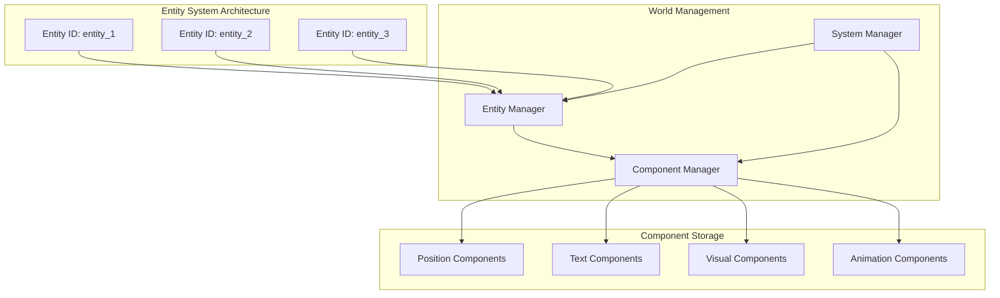
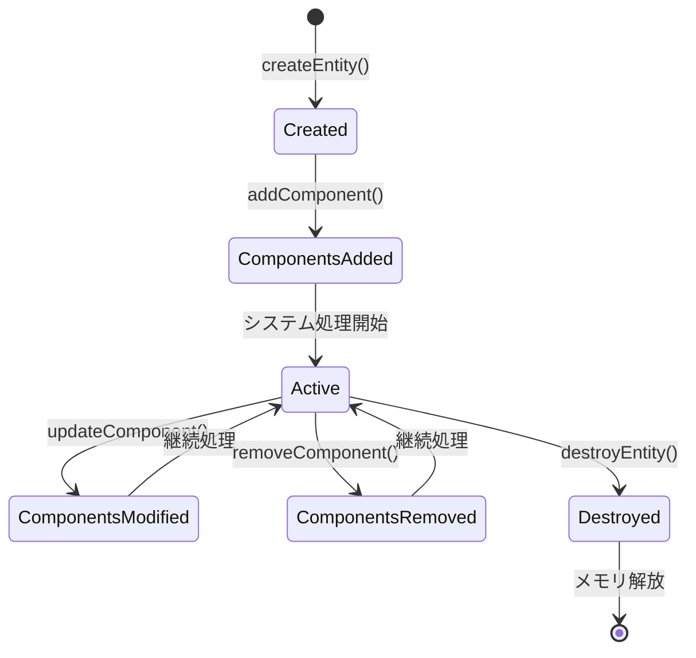

# ECSエンティティ設計

> [!info] 概要
> Phyllotaxis PlannerのECSアーキテクチャにおけるエンティティ設計、タイプ管理、ファクトリパターン、クエリシステムの詳細を説明します。MVPに必要な機能に焦点を当てたシンプルで実用的な設計です。

## 設計原則

### 🎯 エンティティの基本概念

> [!note] エンティティはIDのみ
> エンティティ自体はユニークなIDのみを持ち、データはコンポーネントに格納される

```typescript
// エンティティはIDのみ
type EntityId = string;

// データはコンポーネントに格納
const entity = world.createEntity(); // IDのみ返される
world.addComponent(entity, createIdeaTextComponent('アイデア'));
world.addComponent(entity, createPositionComponent(100, 200));
```

### 🏷️ エンティティタイプシステム

```typescript
// エンティティタイプの定義
export type EntityType = 'idea' | 'theme';

// TextComponentのentityTypeプロパティで識別
interface ITextComponent extends IComponent {
  entityType: 'idea' | 'theme'; // 重要：エンティティタイプ識別子
  content: string;
  fontSize: number;
  color: string;
}
```



## エンティティ管理システム

### 🏊 EntityPool

> [!note] 責務
> エンティティIDの効率的な生成と再利用（実装済み）

```typescript
// src/ecs/core/Entity.ts
export class EntityPool {
  private availableIds: EntityId[] = [];
  private nextId: number = 1;
  private activeEntities: Set<EntityId> = new Set();

  acquire(): EntityId {
    let id: EntityId;
    if (this.availableIds.length > 0) {
      id = this.availableIds.pop()!;
    } else {
      id = `entity_${this.nextId++}`;
    }
    this.activeEntities.add(id);
    return id;
  }

  release(id: EntityId): void {
    if (this.activeEntities.has(id)) {
      this.activeEntities.delete(id);
      this.availableIds.push(id);
    }
  }

  isActive(id: EntityId): boolean {
    return this.activeEntities.has(id);
  }

  getActiveEntities(): EntityId[] {
    return Array.from(this.activeEntities);
  }

  getStats(): EntityPoolStats {
    return {
      active: this.activeEntities.size,
      available: this.availableIds.length,
      total: this.nextId - 1
    };
  }
}
```

### 🏭 EntityFactory

> [!note] 責務
> エンティティタイプに応じた適切なコンポーネント構成でエンティティを作成

```typescript
// src/ecs/entities/EntityFactory.ts
export interface CreateEntityOptions {
  x?: number;
  y?: number;
  withAnimation?: boolean;
  animationDuration?: number;
  customTextOptions?: any;
  customVisualOptions?: any;
  customPositionOptions?: any;
}

export class EntityFactory {
  private world: IWorld;
  private typeManager: EntityTypeManager;

  constructor(world: IWorld) {
    this.world = world;
    this.typeManager = new EntityTypeManager(world);
  }

  // テーマエンティティを作成
  createThemeEntity(content: string, options: CreateEntityOptions = {}): EntityId | null {
    if (!this.typeManager.canCreateEntity('theme')) {
      console.warn('Cannot create theme entity: maximum count reached');
      return null;
    }

    const entityId = this.world.createEntity();
    
    // テキストコンポーネント
    const textComponent = createThemeTextComponent(content, options.customTextOptions);
    this.world.addComponent(entityId, textComponent);

    // 視覚コンポーネント
    const visualComponent = createThemeVisualComponent(options.customVisualOptions);
    this.world.addComponent(entityId, visualComponent);

    // 位置コンポーネント（中心位置）
    const positionComponent = createPositionComponent(
      options.x || 400, // デフォルト中心X
      options.y || 300, // デフォルト中心Y
      { index: -1, zIndex: 1000, ...options.customPositionOptions }
    );
    this.world.addComponent(entityId, positionComponent);

    return entityId;
  }

  // アイデアエンティティを作成
  createIdeaEntity(content: string, options: CreateEntityOptions = {}): EntityId | null {
    if (!this.typeManager.canCreateEntity('idea')) {
      console.warn('Cannot create idea entity: maximum count reached');
      return null;
    }

    const entityId = this.world.createEntity();
    const index = getNextAvailableIndex(this.world);

    // テキストコンポーネント
    const textComponent = createIdeaTextComponent(content, options.customTextOptions);
    this.world.addComponent(entityId, textComponent);

    // 視覚コンポーネント
    const visualComponent = createIdeaVisualComponent(options.customVisualOptions);
    this.world.addComponent(entityId, visualComponent);

    // 位置コンポーネント
    const positionComponent = options.x !== undefined && options.y !== undefined
      ? createPositionComponent(options.x, options.y, { index, zIndex: index })
      : createPhyllotaxisPositionComponent(index, 0, 0, 400, 300);
    this.world.addComponent(entityId, positionComponent);

    // アニメーションコンポーネント
    const animationComponent = createAnimationComponent(
      'fadeIn',
      options.animationDuration || 500,
      { isAnimating: options.withAnimation || false }
    );
    this.world.addComponent(entityId, animationComponent);

    return entityId;
  }
}
```

### 🏷️ EntityTypeManager

> [!note] 責務
> エンティティタイプの識別と制限管理

```typescript
// src/ecs/entities/EntityTypes.ts
export type EntityType = 'idea' | 'theme';

export const ENTITY_TYPE_CONFIG: Record<EntityType, EntityTypeInfo> = {
  theme: {
    type: 'theme',
    displayName: '中心テーマ',
    description: 'マップの中心となる主要テーマ',
    maxCount: 1, // テーマは1つのみ
    requiredComponents: ['position', 'text', 'visual'],
    optionalComponents: ['animation'],
  },
  idea: {
    type: 'idea',
    displayName: 'アイデア',
    description: 'テーマから派生するアイデア要素',
    maxCount: 50, // MVP制限
    requiredComponents: ['position', 'text', 'visual'],
    optionalComponents: ['animation'],
  },
};

export class EntityTypeManager {
  private world: IWorld;
  private typeCache: Map<EntityId, EntityType | undefined> = new Map();

  constructor(world: IWorld) {
    this.world = world;
  }

  // エンティティのタイプを取得（キャッシュ付き）
  getEntityType(entityId: EntityId): EntityType | undefined {
    const textComponent = getTextComponent(this.world, entityId);
    return textComponent?.entityType;
  }

  // 指定されたタイプのエンティティを新規作成可能かチェック
  canCreateEntity(type: EntityType): boolean {
    const config = ENTITY_TYPE_CONFIG[type];
    const currentCount = this.getEntityCount(type);
    return config.maxCount === -1 || currentCount < config.maxCount;
  }

  // 指定されたタイプのエンティティ数を取得
  getEntityCount(type: EntityType): number {
    return this.world.getAllEntities().filter(entityId => {
      const entityType = this.getEntityType(entityId);
      return entityType === type;
    }).length;
  }
}
```

## エンティティ管理とクエリ

### 🔍 EntityManager

> [!note] 責務
> エンティティのライフサイクル管理とクエリ機能を提供

```typescript
// src/ecs/entities/EntityManager.ts
export interface EntityQuery {
  type?: EntityType;
  hasComponents?: string[];
  textContains?: string;
  indexRange?: { min: number; max: number };
  isAnimating?: boolean;
  isVisible?: boolean;
}

export class EntityManager {
  private world: IWorld;
  private typeManager: EntityTypeManager;
  private factory: EntityFactory;

  constructor(world: IWorld) {
    this.world = world;
    this.typeManager = new EntityTypeManager(world);
    this.factory = new EntityFactory(world);
  }

  // エンティティクエリを実行
  query(conditions: EntityQuery): EntityId[] {
    let entities = this.world.getAllEntities();

    // タイプフィルタ
    if (conditions.type) {
      entities = entities.filter(entityId => 
        this.typeManager.getEntityType(entityId) === conditions.type
      );
    }

    // 必要コンポーネントフィルタ
    if (conditions.hasComponents) {
      entities = entities.filter(entityId =>
        conditions.hasComponents!.every(componentType =>
          this.world.hasComponent(entityId, componentType as any)
        )
      );
    }

    // テキスト内容フィルタ
    if (conditions.textContains) {
      entities = entities.filter(entityId => {
        const textComponent = getTextComponent(this.world, entityId);
        return textComponent?.content.includes(conditions.textContains!) || false;
      });
    }

    return entities;
  }

  // アイデアエンティティをインデックス順で取得
  getIdeaEntitiesSorted(): EntityId[] {
    return this.query({ type: 'idea' }).sort((a, b) => {
      const posA = getPositionComponent(this.world, a);
      const posB = getPositionComponent(this.world, b);
      return (posA?.index || 0) - (posB?.index || 0);
    });
  }

  // テーマエンティティを取得
  getThemeEntity(): EntityId | undefined {
    const themeEntities = this.query({ type: 'theme' });
    return themeEntities[0];
  }
}
```

### 🔧 ヘルパー関数

> [!note] 責務
> エンティティとコンポーネントの操作を簡素化

```typescript
// src/ecs/components/helpers.ts
// エンティティタイプ判定
export const isThemeEntity = (world: IWorld, entityId: EntityId): boolean => {
  const textComponent = getTextComponent(world, entityId);
  return textComponent?.entityType === 'theme';
};

export const isIdeaEntity = (world: IWorld, entityId: EntityId): boolean => {
  const textComponent = getTextComponent(world, entityId);
  return textComponent?.entityType === 'idea';
};

// エンティティ取得
export const getThemeEntity = (world: IWorld): EntityId | undefined => {
  return world.getAllEntities()
    .find(entityId => isThemeEntity(world, entityId));
};

export const getIdeaEntitiesSortedByIndex = (world: IWorld): EntityId[] => {
  return world.getAllEntities()
    .filter(entityId => isIdeaEntity(world, entityId))
    .sort((a, b) => {
      const posA = getPositionComponent(world, a);
      const posB = getPositionComponent(world, b);
      return (posA?.index || 0) - (posB?.index || 0);
    });
};

// インデックス管理
export const getNextAvailableIndex = (world: IWorld): number => {
  const ideaEntities = getIdeaEntitiesSortedByIndex(world);
  if (ideaEntities.length === 0) return 0;
  
  const lastEntity = ideaEntities[ideaEntities.length - 1];
  const lastPosition = getPositionComponent(world, lastEntity);
  return (lastPosition?.index || 0) + 1;
};
```

## エンティティクエリシステム

### 🔍 EntityQuery

> [!note] 責務
> 効率的なエンティティ検索とフィルタリング

```typescript
// ecs/core/EntityQuery.ts
interface QueryFilter {
  all?: ComponentType[];      // すべて必要
  any?: ComponentType[];      // いずれか必要
  none?: ComponentType[];     // 持ってはいけない
}

class EntityQuery {
  private world: World;
  private cachedResults: Map<string, EntityId[]> = new Map();
  private cacheVersion: number = 0;
  
  constructor(world: World) {
    this.world = world;
  }
  
  find(filter: QueryFilter): EntityId[] {
    const cacheKey = this.createCacheKey(filter);
    
    // キャッシュチェック
    if (this.cachedResults.has(cacheKey) && this.isCacheValid()) {
      return this.cachedResults.get(cacheKey)!;
    }
    
    const results = this.executeQuery(filter);
    this.cachedResults.set(cacheKey, results);
    
    return results;
  }
  
  private executeQuery(filter: QueryFilter): EntityId[] {
    const allEntities = this.world.getAllEntities();
    
    return allEntities.filter(entityId => {
      // all条件: すべてのコンポーネントを持つ
      if (filter.all && !filter.all.every(type => 
        this.world.hasComponent(entityId, type)
      )) {
        return false;
      }
      
      // any条件: いずれかのコンポーネントを持つ
      if (filter.any && !filter.any.some(type => 
        this.world.hasComponent(entityId, type)
      )) {
        return false;
      }
      
      // none条件: 指定されたコンポーネントを持たない
      if (filter.none && filter.none.some(type => 
        this.world.hasComponent(entityId, type)
      )) {
        return false;
      }
      
      return true;
    });
  }
  
  private createCacheKey(filter: QueryFilter): string {
    const parts = [
      filter.all?.sort().join(',') || '',
      filter.any?.sort().join(',') || '',
      filter.none?.sort().join(',') || ''
    ];
    return `${parts.join('|')}`;
  }
  
  private isCacheValid(): boolean {
    return this.world.getVersion() === this.cacheVersion;
  }
  
  invalidateCache(): void {
    this.cachedResults.clear();
    this.cacheVersion = this.world.getVersion();
  }
  
  // 便利メソッド
  withComponents(...types: ComponentType[]): EntityId[] {
    return this.find({ all: types });
  }
  
  withAnyComponent(...types: ComponentType[]): EntityId[] {
    return this.find({ any: types });
  }
  
  withoutComponents(...types: ComponentType[]): EntityId[] {
    return this.find({ none: types });
  }
}
```

### 🔨 QueryBuilder

> [!note] 責務
> 流暢なAPIによるクエリ構築

```typescript
// ecs/core/QueryBuilder.ts
class QueryBuilder {
  private filter: QueryFilter = {};
  
  static create(): QueryBuilder {
    return new QueryBuilder();
  }
  
  withAll(...types: ComponentType[]): QueryBuilder {
    this.filter.all = [...(this.filter.all || []), ...types];
    return this;
  }
  
  withAny(...types: ComponentType[]): QueryBuilder {
    this.filter.any = [...(this.filter.any || []), ...types];
    return this;
  }
  
  without(...types: ComponentType[]): QueryBuilder {
    this.filter.none = [...(this.filter.none || []), ...types];
    return this;
  }
  
  build(): QueryFilter {
    return { ...this.filter };
  }
}

// 使用例
const renderableEntities = query.find(
  QueryBuilder.create()
    .withAll(ComponentTypes.POSITION, ComponentTypes.VISUAL)
    .without(ComponentTypes.HIDDEN)
    .build()
);

const animatingEntities = query.find(
  QueryBuilder.create()
    .withAll(ComponentTypes.ANIMATION)
    .build()
).filter(entityId => {
  const animation = world.getComponent<IAnimationComponent>(entityId, ComponentTypes.ANIMATION);
  return animation?.isAnimating;
});
```

## エンティティライフサイクル

### 🔄 ライフサイクル管理



### 📊 エンティティ統計

```typescript
// ecs/core/EntityStats.ts
interface EntityStats {
  totalEntities: number;
  activeEntities: number;
  entitiesByBlueprint: Map<string, number>;
  componentDistribution: Map<ComponentType, number>;
  memoryUsage: {
    entities: number;
    components: number;
    total: number;
  };
}

class EntityStatsCollector {
  constructor(private world: World, private entityFactory: EntityFactory) {}
  
  collect(): EntityStats {
    const allEntities = this.world.getAllEntities();
    const entitiesByBlueprint = new Map<string, number>();
    const componentDistribution = new Map<ComponentType, number>();
    
    // ブループリント別統計
    this.entityFactory.listBlueprints().forEach(blueprintName => {
      const blueprint = this.entityFactory.getBlueprint(blueprintName);
      if (blueprint) {
        const count = allEntities.filter(entityId => 
          blueprint.components.every(type => 
            this.world.hasComponent(entityId, type)
          )
        ).length;
        entitiesByBlueprint.set(blueprintName, count);
      }
    });
    
    // コンポーネント分布統計
    Object.values(ComponentTypes).forEach(type => {
      const count = allEntities.filter(entityId => 
        this.world.hasComponent(entityId, type)
      ).length;
      componentDistribution.set(type, count);
    });
    
    return {
      totalEntities: allEntities.length,
      activeEntities: allEntities.length,
      entitiesByBlueprint,
      componentDistribution,
      memoryUsage: this.calculateMemoryUsage(allEntities)
    };
  }
  
  private calculateMemoryUsage(entities: EntityId[]): EntityStats['memoryUsage'] {
    // 概算メモリ使用量計算
    const entitySize = 50; // bytes per entity ID
    const componentSize = 200; // bytes per component (average)
    
    const entitiesMemory = entities.length * entitySize;
    const componentsMemory = entities.reduce((total, entityId) => {
      const componentCount = Object.values(ComponentTypes).filter(type =>
        this.world.hasComponent(entityId, type)
      ).length;
      return total + (componentCount * componentSize);
    }, 0);
    
    return {
      entities: entitiesMemory,
      components: componentsMemory,
      total: entitiesMemory + componentsMemory
    };
  }
}
```

## テスト戦略

### 🧪 エンティティテスト

```typescript
describe('EntityPool', () => {
  let pool: EntityPool;
  
  beforeEach(() => {
    pool = new EntityPool();
  });
  
  it('should generate unique entity IDs', () => {
    const id1 = pool.acquire();
    const id2 = pool.acquire();
    
    expect(id1).not.toBe(id2);
    expect(pool.isActive(id1)).toBe(true);
    expect(pool.isActive(id2)).toBe(true);
  });
  
  it('should reuse released IDs', () => {
    const id1 = pool.acquire();
    pool.release(id1);
    
    const id2 = pool.acquire();
    expect(id2).toBe(id1);
  });
  
  it('should track statistics correctly', () => {
    const id1 = pool.acquire();
    const id2 = pool.acquire();
    
    const stats = pool.getStats();
    expect(stats.active).toBe(2);
    expect(stats.total).toBe(2);
    
    pool.release(id1);
    const updatedStats = pool.getStats();
    expect(updatedStats.active).toBe(1);
    expect(updatedStats.available).toBe(1);
  });
});

describe('EntityFactory', () => {
  let factory: EntityFactory;
  let world: World;
  
  beforeEach(() => {
    factory = new EntityFactory();
    world = new World();
    factory.registerBlueprint(IdeaBlueprint);
    factory.registerBlueprint(ThemeBlueprint);
  });
  
  it('should create entities from blueprints', () => {
    const entityId = factory.create('idea', world, 'Test Idea');
    
    expect(world.hasEntity(entityId)).toBe(true);
    expect(world.hasComponent(entityId, ComponentTypes.TEXT)).toBe(true);
    expect(world.hasComponent(entityId, ComponentTypes.POSITION)).toBe(true);
    expect(world.hasComponent(entityId, ComponentTypes.VISUAL)).toBe(true);
  });
  
  it('should throw error for unknown blueprint', () => {
    expect(() => {
      factory.create('unknown', world);
    }).toThrow('Unknown blueprint: unknown');
  });
});

describe('EntityQuery', () => {
  let world: World;
  let query: EntityQuery;
  
  beforeEach(() => {
    world = new World();
    query = new EntityQuery(world);
    
    // テストエンティティを作成
    const entity1 = world.createEntity();
    world.addComponent(entity1, createPositionComponent());
    world.addComponent(entity1, createTextComponent('test'));
    
    const entity2 = world.createEntity();
    world.addComponent(entity2, createPositionComponent());
    world.addComponent(entity2, createVisualComponent());
  });
  
  it('should find entities with all required components', () => {
    const results = query.withComponents(ComponentTypes.POSITION);
    expect(results).toHaveLength(2);
  });
  
  it('should find entities with any of the specified components', () => {
    const results = query.withAnyComponent(ComponentTypes.TEXT, ComponentTypes.VISUAL);
    expect(results).toHaveLength(2);
  });
  
  it('should exclude entities with specified components', () => {
    const results = query.withoutComponents(ComponentTypes.TEXT);
    expect(results).toHaveLength(1);
  });
});
```

## 関連文書

> [!info] ECS設計文書
> - [[overview|ECS概要]]
> - [[world|World設計]]
> - [[components|コンポーネント設計]]
> - [[systems|システム設計]]
> - [[integration|React統合とパフォーマンス]]

> [!note] アーキテクチャ文書
> - [[system-overview|システム概要図]]
> - [[component-diagram|コンポーネント関係図]]

> [!info] 設計決定記録
> - [[0004-ecs-architecture|ADR-0004: ECSアーキテクチャ採用]]