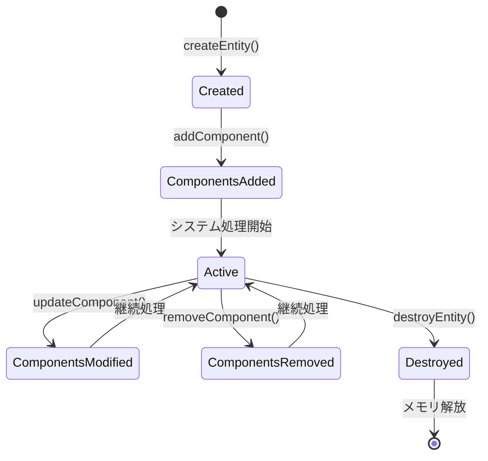

# ECSエンティティ設計

> [!info] 概要
> Entity Component System (ECS) におけるエンティティの設計と管理方法を詳細に説明します。

## エンティティ設計原則

### 🎯 基本概念

> [!warning] 純粋なECS原則
> エンティティは単純な識別子のみ。データもロジックも一切持たない。

```typescript
// ✅ 正しいエンティティ設計
type EntityId = string;

// エンティティは単純な文字列ID
const ideaEntity: EntityId = "idea_1";
const themeEntity: EntityId = "theme_center";

// ❌ 間違ったエンティティ設計
class BadEntity {
  id: string;
  position: Position; // データを持ってはいけない
  update(): void;     // ロジックを持ってはいけない
}
```

### 🏗️ エンティティアーキテクチャ

```mermaid
graph TB
    subgraph "Entity Layer"
        E1[EntityId: "idea_1"]
        E2[EntityId: "idea_2"]
        E3[EntityId: "theme_center"]
    end
    
    subgraph "Component Storage"
        PC[Position Components]
        TC[Text Components]
        VC[Visual Components]
    end
    
    subgraph "World Management"
        EM[Entity Manager]
        CM[Component Manager]
        SM[System Manager]
    end
    
    E1 --> EM
    E2 --> EM
    E3 --> EM
    
    EM --> CM
    CM --> PC
    CM --> TC
    CM --> VC
    
    SM --> EM
    SM --> CM
```

## エンティティ管理システム

### 🏊 EntityPool

> [!note] 責務
> エンティティIDの効率的な生成と再利用

```typescript
// ecs/core/EntityPool.ts
class EntityPool {
  private availableIds: EntityId[] = [];
  private nextId: number = 1;
  private activeEntities: Set<EntityId> = new Set();
  
  acquire(): EntityId {
    let id: EntityId;
    
    if (this.availableIds.length > 0) {
      id = this.availableIds.pop()!;
    } else {
      id = `entity_${this.nextId++}`;
    }
    
    this.activeEntities.add(id);
    return id;
  }
  
  release(id: EntityId): void {
    if (this.activeEntities.has(id)) {
      this.activeEntities.delete(id);
      this.availableIds.push(id);
    }
  }
  
  isActive(id: EntityId): boolean {
    return this.activeEntities.has(id);
  }
  
  getActiveEntities(): EntityId[] {
    return Array.from(this.activeEntities);
  }
  
  getStats(): EntityPoolStats {
    return {
      active: this.activeEntities.size,
      available: this.availableIds.length,
      total: this.nextId - 1
    };
  }
}

interface EntityPoolStats {
  active: number;
  available: number;
  total: number;
}
```

### 🏭 EntityFactory

> [!note] 責務
> エンティティとコンポーネントの組み合わせパターンを定義

```typescript
// ecs/core/EntityFactory.ts
interface EntityBlueprint {
  readonly name: string;
  readonly components: ComponentType[];
  create(entityId: EntityId, world: World, ...args: any[]): void;
}

class EntityFactory {
  private blueprints: Map<string, EntityBlueprint> = new Map();
  
  registerBlueprint(blueprint: EntityBlueprint): void {
    this.blueprints.set(blueprint.name, blueprint);
  }
  
  create(blueprintName: string, world: World, ...args: any[]): EntityId {
    const blueprint = this.blueprints.get(blueprintName);
    if (!blueprint) {
      throw new Error(`Unknown blueprint: ${blueprintName}`);
    }
    
    const entityId = world.createEntity();
    blueprint.create(entityId, world, ...args);
    
    return entityId;
  }
  
  getBlueprint(name: string): EntityBlueprint | undefined {
    return this.blueprints.get(name);
  }
  
  listBlueprints(): string[] {
    return Array.from(this.blueprints.keys());
  }
}
```

## エンティティブループリント

### 💡 IdeaBlueprint

> [!note] 責務
> アイデアノードエンティティの構成定義

```typescript
// ecs/blueprints/IdeaBlueprint.ts
export const IdeaBlueprint: EntityBlueprint = {
  name: 'idea',
  components: [
    ComponentTypes.POSITION,
    ComponentTypes.TEXT,
    ComponentTypes.VISUAL,
    ComponentTypes.ANIMATION,
    ComponentTypes.INTERACTION
  ],
  
  create(entityId: EntityId, world: World, text: string, position?: { x: number; y: number }): void {
    // テキストコンポーネント
    world.addComponent(entityId, createTextComponent(text, {
      fontSize: 14,
      color: '#1F2937',
      maxLength: 100,
      isEditable: false
    }));
    
    // 位置コンポーネント
    world.addComponent(entityId, createPositionComponent(
      position?.x || 0, 
      position?.y || 0,
      0, // angle
      0, // radius (PhyllotaxisSystemが計算)
      1, // scale
      1  // zIndex
    ));
    
    // 視覚コンポーネント
    world.addComponent(entityId, createVisualComponent('leaf', '#10B981', '#059669', {
      opacity: 0.9,
      cssClasses: ['idea-leaf', 'hover-effect']
    }));
    
    // アニメーションコンポーネント
    world.addComponent(entityId, createAnimationComponent('fadeIn', 600, 'ease-out'));
    
    // インタラクションコンポーネント
    world.addComponent(entityId, createInteractionComponent({
      clickable: true,
      hoverable: true,
      selectable: true,
      ariaLabel: `アイデア: ${text}`
    }));
  }
};
```

### 🎯 ThemeBlueprint

> [!note] 責務
> 中心テーマエンティティの構成定義

```typescript
// ecs/blueprints/ThemeBlueprint.ts
export const ThemeBlueprint: EntityBlueprint = {
  name: 'theme',
  components: [
    ComponentTypes.POSITION,
    ComponentTypes.TEXT,
    ComponentTypes.VISUAL,
    ComponentTypes.INTERACTION
  ],
  
  create(entityId: EntityId, world: World, theme: string): void {
    // テキストコンポーネント（大きなフォント）
    world.addComponent(entityId, createTextComponent(theme, {
      fontSize: 18,
      fontFamily: 'Inter, sans-serif',
      color: '#111827',
      alignment: 'center',
      isEditable: true,
      maxLength: 50
    }));
    
    // 位置コンポーネント（中心固定）
    world.addComponent(entityId, createPositionComponent(
      0,   // x (中心)
      0,   // y (中心)
      0,   // angle
      0,   // radius
      1.5, // scale (大きく表示)
      10   // zIndex (最前面)
    ));
    
    // 視覚コンポーネント（円形）
    world.addComponent(entityId, createVisualComponent('circle', '#F9FAFB', '#E5E7EB', {
      strokeWidth: 3,
      cssClasses: ['center-theme', 'editable']
    }));
    
    // インタラクションコンポーネント
    world.addComponent(entityId, createInteractionComponent({
      clickable: true,
      hoverable: true,
      draggable: false,
      cursor: 'text',
      ariaLabel: '中心テーマ'
    }));
  }
};
```

## エンティティクエリシステム

### 🔍 EntityQuery

> [!note] 責務
> 効率的なエンティティ検索とフィルタリング

```typescript
// ecs/core/EntityQuery.ts
interface QueryFilter {
  all?: ComponentType[];      // すべて必要
  any?: ComponentType[];      // いずれか必要
  none?: ComponentType[];     // 持ってはいけない
}

class EntityQuery {
  private world: World;
  private cachedResults: Map<string, EntityId[]> = new Map();
  private cacheVersion: number = 0;
  
  constructor(world: World) {
    this.world = world;
  }
  
  find(filter: QueryFilter): EntityId[] {
    const cacheKey = this.createCacheKey(filter);
    
    // キャッシュチェック
    if (this.cachedResults.has(cacheKey) && this.isCacheValid()) {
      return this.cachedResults.get(cacheKey)!;
    }
    
    const results = this.executeQuery(filter);
    this.cachedResults.set(cacheKey, results);
    
    return results;
  }
  
  private executeQuery(filter: QueryFilter): EntityId[] {
    const allEntities = this.world.getAllEntities();
    
    return allEntities.filter(entityId => {
      // all条件: すべてのコンポーネントを持つ
      if (filter.all && !filter.all.every(type => 
        this.world.hasComponent(entityId, type)
      )) {
        return false;
      }
      
      // any条件: いずれかのコンポーネントを持つ
      if (filter.any && !filter.any.some(type => 
        this.world.hasComponent(entityId, type)
      )) {
        return false;
      }
      
      // none条件: 指定されたコンポーネントを持たない
      if (filter.none && filter.none.some(type => 
        this.world.hasComponent(entityId, type)
      )) {
        return false;
      }
      
      return true;
    });
  }
  
  private createCacheKey(filter: QueryFilter): string {
    const parts = [
      filter.all?.sort().join(',') || '',
      filter.any?.sort().join(',') || '',
      filter.none?.sort().join(',') || ''
    ];
    return `${parts.join('|')}`;
  }
  
  private isCacheValid(): boolean {
    return this.world.getVersion() === this.cacheVersion;
  }
  
  invalidateCache(): void {
    this.cachedResults.clear();
    this.cacheVersion = this.world.getVersion();
  }
  
  // 便利メソッド
  withComponents(...types: ComponentType[]): EntityId[] {
    return this.find({ all: types });
  }
  
  withAnyComponent(...types: ComponentType[]): EntityId[] {
    return this.find({ any: types });
  }
  
  withoutComponents(...types: ComponentType[]): EntityId[] {
    return this.find({ none: types });
  }
}
```

### 🔨 QueryBuilder

> [!note] 責務
> 流暢なAPIによるクエリ構築

```typescript
// ecs/core/QueryBuilder.ts
class QueryBuilder {
  private filter: QueryFilter = {};
  
  static create(): QueryBuilder {
    return new QueryBuilder();
  }
  
  withAll(...types: ComponentType[]): QueryBuilder {
    this.filter.all = [...(this.filter.all || []), ...types];
    return this;
  }
  
  withAny(...types: ComponentType[]): QueryBuilder {
    this.filter.any = [...(this.filter.any || []), ...types];
    return this;
  }
  
  without(...types: ComponentType[]): QueryBuilder {
    this.filter.none = [...(this.filter.none || []), ...types];
    return this;
  }
  
  build(): QueryFilter {
    return { ...this.filter };
  }
}

// 使用例
const renderableEntities = query.find(
  QueryBuilder.create()
    .withAll(ComponentTypes.POSITION, ComponentTypes.VISUAL)
    .without(ComponentTypes.HIDDEN)
    .build()
);

const animatingEntities = query.find(
  QueryBuilder.create()
    .withAll(ComponentTypes.ANIMATION)
    .build()
).filter(entityId => {
  const animation = world.getComponent<IAnimationComponent>(entityId, ComponentTypes.ANIMATION);
  return animation?.isAnimating;
});
```

## エンティティライフサイクル

### 🔄 ライフサイクル管理



### 📊 エンティティ統計

```typescript
// ecs/core/EntityStats.ts
interface EntityStats {
  totalEntities: number;
  activeEntities: number;
  entitiesByBlueprint: Map<string, number>;
  componentDistribution: Map<ComponentType, number>;
  memoryUsage: {
    entities: number;
    components: number;
    total: number;
  };
}

class EntityStatsCollector {
  constructor(private world: World, private entityFactory: EntityFactory) {}
  
  collect(): EntityStats {
    const allEntities = this.world.getAllEntities();
    const entitiesByBlueprint = new Map<string, number>();
    const componentDistribution = new Map<ComponentType, number>();
    
    // ブループリント別統計
    this.entityFactory.listBlueprints().forEach(blueprintName => {
      const blueprint = this.entityFactory.getBlueprint(blueprintName);
      if (blueprint) {
        const count = allEntities.filter(entityId => 
          blueprint.components.every(type => 
            this.world.hasComponent(entityId, type)
          )
        ).length;
        entitiesByBlueprint.set(blueprintName, count);
      }
    });
    
    // コンポーネント分布統計
    Object.values(ComponentTypes).forEach(type => {
      const count = allEntities.filter(entityId => 
        this.world.hasComponent(entityId, type)
      ).length;
      componentDistribution.set(type, count);
    });
    
    return {
      totalEntities: allEntities.length,
      activeEntities: allEntities.length,
      entitiesByBlueprint,
      componentDistribution,
      memoryUsage: this.calculateMemoryUsage(allEntities)
    };
  }
  
  private calculateMemoryUsage(entities: EntityId[]): EntityStats['memoryUsage'] {
    // 概算メモリ使用量計算
    const entitySize = 50; // bytes per entity ID
    const componentSize = 200; // bytes per component (average)
    
    const entitiesMemory = entities.length * entitySize;
    const componentsMemory = entities.reduce((total, entityId) => {
      const componentCount = Object.values(ComponentTypes).filter(type =>
        this.world.hasComponent(entityId, type)
      ).length;
      return total + (componentCount * componentSize);
    }, 0);
    
    return {
      entities: entitiesMemory,
      components: componentsMemory,
      total: entitiesMemory + componentsMemory
    };
  }
}
```

## テスト戦略

### 🧪 エンティティテスト

```typescript
describe('EntityPool', () => {
  let pool: EntityPool;
  
  beforeEach(() => {
    pool = new EntityPool();
  });
  
  it('should generate unique entity IDs', () => {
    const id1 = pool.acquire();
    const id2 = pool.acquire();
    
    expect(id1).not.toBe(id2);
    expect(pool.isActive(id1)).toBe(true);
    expect(pool.isActive(id2)).toBe(true);
  });
  
  it('should reuse released IDs', () => {
    const id1 = pool.acquire();
    pool.release(id1);
    
    const id2 = pool.acquire();
    expect(id2).toBe(id1);
  });
  
  it('should track statistics correctly', () => {
    const id1 = pool.acquire();
    const id2 = pool.acquire();
    
    const stats = pool.getStats();
    expect(stats.active).toBe(2);
    expect(stats.total).toBe(2);
    
    pool.release(id1);
    const updatedStats = pool.getStats();
    expect(updatedStats.active).toBe(1);
    expect(updatedStats.available).toBe(1);
  });
});

describe('EntityFactory', () => {
  let factory: EntityFactory;
  let world: World;
  
  beforeEach(() => {
    factory = new EntityFactory();
    world = new World();
    factory.registerBlueprint(IdeaBlueprint);
    factory.registerBlueprint(ThemeBlueprint);
  });
  
  it('should create entities from blueprints', () => {
    const entityId = factory.create('idea', world, 'Test Idea');
    
    expect(world.hasEntity(entityId)).toBe(true);
    expect(world.hasComponent(entityId, ComponentTypes.TEXT)).toBe(true);
    expect(world.hasComponent(entityId, ComponentTypes.POSITION)).toBe(true);
    expect(world.hasComponent(entityId, ComponentTypes.VISUAL)).toBe(true);
  });
  
  it('should throw error for unknown blueprint', () => {
    expect(() => {
      factory.create('unknown', world);
    }).toThrow('Unknown blueprint: unknown');
  });
});

describe('EntityQuery', () => {
  let world: World;
  let query: EntityQuery;
  
  beforeEach(() => {
    world = new World();
    query = new EntityQuery(world);
    
    // テストエンティティを作成
    const entity1 = world.createEntity();
    world.addComponent(entity1, createPositionComponent());
    world.addComponent(entity1, createTextComponent('test'));
    
    const entity2 = world.createEntity();
    world.addComponent(entity2, createPositionComponent());
    world.addComponent(entity2, createVisualComponent());
  });
  
  it('should find entities with all required components', () => {
    const results = query.withComponents(ComponentTypes.POSITION);
    expect(results).toHaveLength(2);
  });
  
  it('should find entities with any of the specified components', () => {
    const results = query.withAnyComponent(ComponentTypes.TEXT, ComponentTypes.VISUAL);
    expect(results).toHaveLength(2);
  });
  
  it('should exclude entities with specified components', () => {
    const results = query.withoutComponents(ComponentTypes.TEXT);
    expect(results).toHaveLength(1);
  });
});
```

## 関連文書

> [!info] ECS設計文書
> - [[overview|ECS概要]]
> - [[world|World設計]]
> - [[components|コンポーネント設計]]
> - [[systems|システム設計]]
> - [[integration|React統合とパフォーマンス]]

> [!note] アーキテクチャ文書
> - [[system-overview|システム概要図]]
> - [[component-diagram|コンポーネント関係図]]

> [!info] 設計決定記録
> - [[0004-ecs-architecture|ADR-0004: ECSアーキテクチャ採用]]