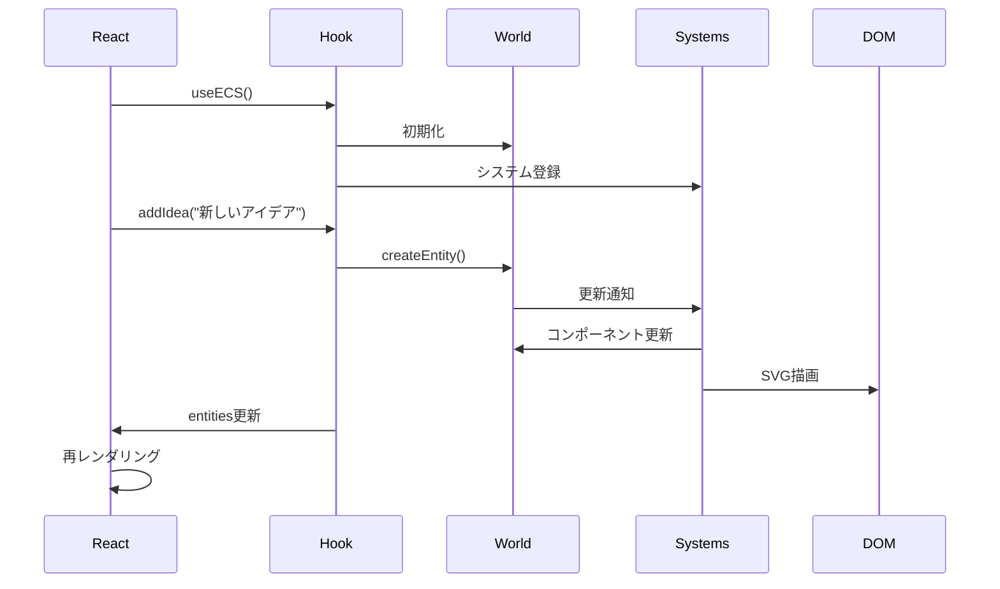

# ECS React統合とパフォーマンス

> [!info] 概要
> ECSアーキテクチャとReactの統合方法、およびパフォーマンス最適化戦略を説明します。

## React統合アーキテクチャ

### 🎣 useECS Hook

> [!note] 責務
> ReactコンポーネントとECSの統合

```typescript
// hooks/useECS.ts
export const useECS = (svgRef: RefObject<SVGSVGElement>) => {
  const [world] = useState(() => new World(eventBus));
  const [systemManager] = useState(() => new SystemManager());
  const [entities, setEntities] = useState<EntityId[]>([]);
  
  useEffect(() => {
    if (!svgRef.current) return;
    
    // システムの初期化
    const systems = [
      new PhyllotaxisSystem(phyllotaxisConfig, eventBus),
      new AnimationSystem(eventBus),
      new RenderSystem(svgRef.current)
    ];
    
    systems.forEach(system => systemManager.addSystem(system));
    systemManager.start();
    
    return () => systemManager.stop();
  }, [svgRef.current]);
  
  const addIdea = useCallback((text: string) => {
    const entityId = world.createEntityFromBlueprint('idea', text);
    setEntities(world.getAllEntities());
  }, [world]);
  
  return { entities, addIdea, world, systemManager };
};
```

### 🔄 データフロー統合



## パフォーマンス最適化

### 🚀 システム最適化

#### 条件付き実行
```typescript
class OptimizedSystem extends BaseSystem {
  private lastUpdateTime = 0;
  private updateInterval = 16; // 60fps
  
  update(entities: EntityId[], world: World, deltaTime: number): void {
    const now = performance.now();
    if (now - this.lastUpdateTime < this.updateInterval) {
      return; // フレームスキップ
    }
    
    this.lastUpdateTime = now;
    this.doUpdate(entities, world, deltaTime);
  }
  
  protected abstract doUpdate(entities: EntityId[], world: World, deltaTime: number): void;
}
```

#### バッチ処理
```typescript
class BatchedRenderSystem extends BaseSystem {
  private renderQueue: EntityId[] = [];
  private batchTimeout: NodeJS.Timeout | null = null;
  
  update(entities: EntityId[], world: World, deltaTime: number): void {
    // 変更されたエンティティをキューに追加
    const changedEntities = this.getChangedEntities(entities, world);
    this.renderQueue.push(...changedEntities);
    
    if (!this.batchTimeout) {
      this.batchTimeout = setTimeout(() => {
        this.flushRenderQueue(world);
      }, 16);
    }
  }
  
  private flushRenderQueue(world: World): void {
    const uniqueEntities = [...new Set(this.renderQueue)];
    uniqueEntities.forEach(entityId => this.renderEntity(entityId, world));
    
    this.renderQueue = [];
    this.batchTimeout = null;
  }
}
```

### 📊 メモリ最適化

#### オブジェクトプール
```typescript
class ComponentPool<T extends IComponent> {
  private pool: T[] = [];
  private createFn: () => T;
  
  constructor(createFn: () => T, initialSize = 50) {
    this.createFn = createFn;
    for (let i = 0; i < initialSize; i++) {
      this.pool.push(createFn());
    }
  }
  
  acquire(): T {
    return this.pool.pop() || this.createFn();
  }
  
  release(component: T): void {
    this.resetComponent(component);
    this.pool.push(component);
  }
}

// 使用例
const positionPool = new ComponentPool(() => createPositionComponent(), 100);
const animationPool = new ComponentPool(() => createAnimationComponent(), 50);
```

### ⚡ React最適化

#### メモ化戦略
```typescript
// コンポーネントのメモ化
const PhyllotaxisMap = React.memo(() => {
  const svgRef = useRef<SVGSVGElement>(null);
  const { entities, addIdea } = useECS(svgRef);
  
  return (
    <div className="phyllotaxis-container">
      <svg ref={svgRef} className="phyllotaxis-svg" />
      <AddIdeaForm onAddIdea={addIdea} />
    </div>
  );
});

// 計算結果のメモ化
const usePhyllotaxisPositions = (entityCount: number, config: PhyllotaxisConfig) => {
  return useMemo(() => {
    return Array.from({ length: entityCount }, (_, index) => 
      calculatePhyllotaxisPosition(index, config)
    );
  }, [entityCount, config.radiusScale, config.centerX, config.centerY]);
};
```

## パフォーマンス指標

### 📈 目標値

| 指標 | 目標値 | 測定方法 |
|------|--------|----------|
| システム更新時間 | < 16ms | Performance API |
| エンティティ作成時間 | < 1ms | Performance API |
| 描画更新時間 | < 8ms | Performance API |
| メモリ使用量 | < 50MB | DevTools Memory |
| FPS | 60fps | DevTools Performance |

### 🔍 プロファイリング

```typescript
class PerformanceProfiler {
  private metrics: Map<string, number[]> = new Map();
  
  measure<T>(name: string, fn: () => T): T {
    const start = performance.now();
    const result = fn();
    const end = performance.now();
    
    const duration = end - start;
    const existing = this.metrics.get(name) || [];
    existing.push(duration);
    this.metrics.set(name, existing);
    
    return result;
  }
  
  getStats(name: string) {
    const measurements = this.metrics.get(name) || [];
    if (measurements.length === 0) return null;
    
    const avg = measurements.reduce((a, b) => a + b) / measurements.length;
    const max = Math.max(...measurements);
    const min = Math.min(...measurements);
    
    return { avg, max, min, count: measurements.length };
  }
}

// 使用例
const profiler = new PerformanceProfiler();

class ProfiledPhyllotaxisSystem extends PhyllotaxisSystem {
  update(entities: EntityId[], world: World, deltaTime: number): void {
    profiler.measure('PhyllotaxisSystem.update', () => {
      super.update(entities, world, deltaTime);
    });
  }
}
```

## 関連文書

> [!info] ECS設計文書
> - [[overview|ECS概要]]
> - [[components|ECSコンポーネント設計]]
> - [[systems|ECSシステム設計]]

> [!note] アーキテクチャ文書
> - [[../system-overview|システム概要図]]
> - [[../component-diagram|コンポーネント関係図]]

> [!info] 実装ガイド
> - [[../../design|設計書]]
> - [[../../tasks|実装計画]]