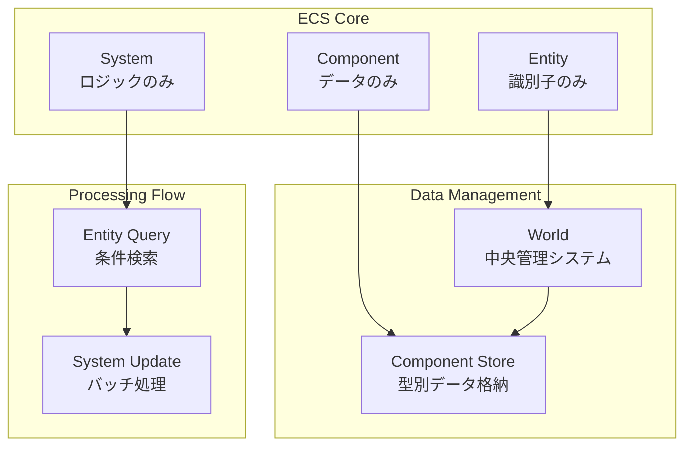
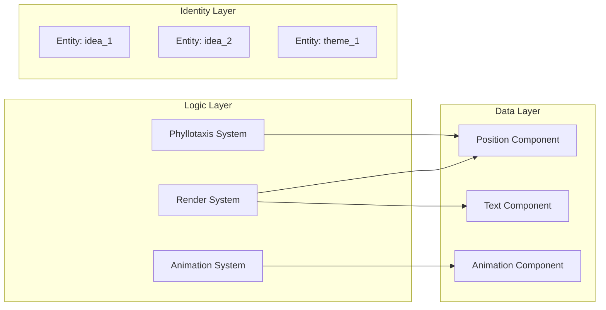
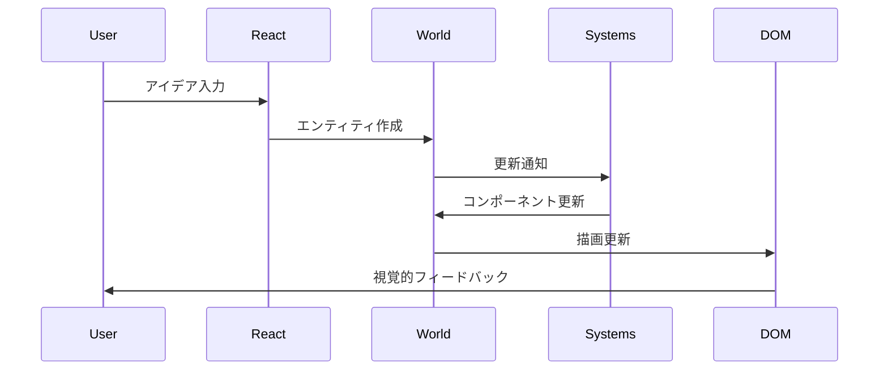
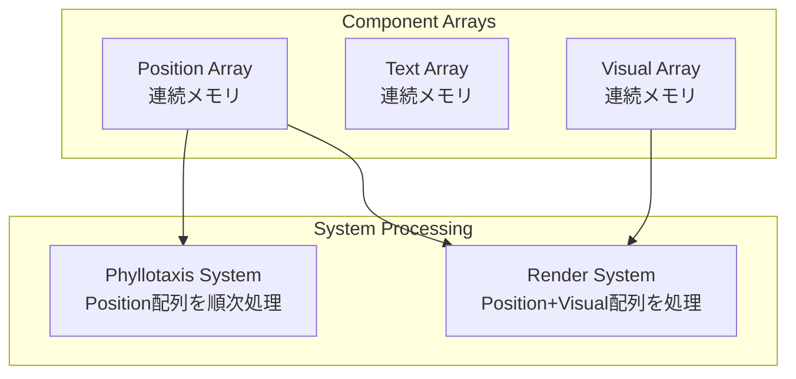

# ECS概要

> [!info] 概要
> Entity Component System (ECS) アーキテクチャパターンの基本概念とPhyllotaxis Plannerでの採用理由を説明します。

## ECSアーキテクチャとは

### 🎯 基本概念



> [!note] ECSの三要素
> - **Entity**: 単純な識別子（文字列ID）
> - **Component**: データのみを保持（メソッドなし）
> - **System**: ロジックのみを実装（状態なし）

### 🏗️ 従来のOOPとの違い

#### 従来のオブジェクト指向
```typescript
// ❌ 従来のアプローチ（避けるべき）
class IdeaNode {
  position: Position;
  text: string;
  animation: AnimationState;
  
  updatePosition() { /* ロジック */ }
  animate() { /* ロジック */ }
  render() { /* ロジック */ }
}
```

#### ECSアプローチ
```typescript
// ✅ ECSアプローチ
type EntityId = string;

interface IPositionComponent {
  type: 'position';
  x: number;
  y: number;
}

interface ITextComponent {
  type: 'text';
  content: string;
}

class PhyllotaxisSystem {
  update(entities: EntityId[], world: World) {
    // ロジックのみ実装
  }
}
```

## 設計原則

### 🎨 データ指向設計

> [!tip] 原則1: データとロジックの完全分離
> - コンポーネント = データのみ
> - システム = ロジックのみ
> - エンティティ = 識別子のみ



### 🔄 合成による設計

> [!tip] 原則2: 継承より合成
> - エンティティは必要なコンポーネントを組み合わせ
> - 新しい機能は新しいコンポーネント追加で実現
> - 柔軟な機能の組み合わせが可能

```typescript
// アイデアエンティティの構成例
const ideaEntity = {
  id: 'idea_1',
  components: [
    { type: 'position', x: 100, y: 150 },
    { type: 'text', content: 'My Idea' },
    { type: 'visual', shape: 'leaf', color: '#10B981' },
    { type: 'animation', isAnimating: false },
    { type: 'interaction', clickable: true }
  ]
};
```

### ⚡ パフォーマンス指向

> [!tip] 原則3: メモリ効率とキャッシュ効率
> - 同じ型のコンポーネントを連続メモリに配置
> - システムは必要なコンポーネントのみを処理
> - バッチ処理による効率的な更新

## Phyllotaxis Plannerでの適用

### 🌿 ドメインモデリング

#### エンティティ設計
```typescript
// アイデアノード
type IdeaEntity = EntityId; // "idea_1", "idea_2", ...

// 中心テーマ
type ThemeEntity = EntityId; // "theme_center"
```

#### コンポーネント設計
```typescript
// 位置情報
interface IPositionComponent {
  type: 'position';
  x: number;
  y: number;
  angle: number;
  radius: number;
}

// テキスト情報
interface ITextComponent {
  type: 'text';
  content: string;
  maxLength: number;
  fontSize: number;
}

// 視覚表現
interface IVisualComponent {
  type: 'visual';
  shape: 'leaf' | 'circle';
  fillColor: string;
  strokeColor: string;
  opacity: number;
}

// アニメーション状態
interface IAnimationComponent {
  type: 'animation';
  isAnimating: boolean;
  duration: number;
  progress: number;
}
```

#### システム設計
```typescript
// フィロタキシス配置計算
class PhyllotaxisSystem {
  requiredComponents = ['position', 'text'];
  
  update(entities: EntityId[], world: World) {
    // 黄金角による位置計算
  }
}

// アニメーション制御
class AnimationSystem {
  requiredComponents = ['animation', 'position'];
  
  update(entities: EntityId[], world: World) {
    // アニメーション状態更新
  }
}

// SVG描画
class RenderSystem {
  requiredComponents = ['position', 'visual'];
  
  update(entities: EntityId[], world: World) {
    // DOM要素の更新
  }
}
```

### 🔄 データフロー



## 実装アーキテクチャ

### 🏗️ World設計

> [!note] 責務
> ECSの中央管理システム

```typescript
class World {
  private entities: Set<EntityId> = new Set();
  private components: Map<ComponentType, Map<EntityId, IComponent>> = new Map();
  private systems: System[] = [];
  
  // エンティティ管理
  createEntity(): EntityId;
  destroyEntity(id: EntityId): void;
  
  // コンポーネント管理
  addComponent<T extends IComponent>(entityId: EntityId, component: T): void;
  getComponent<T extends IComponent>(entityId: EntityId, type: ComponentType): T | undefined;
  removeComponent(entityId: EntityId, type: ComponentType): void;
  
  // システム実行
  update(deltaTime: number): void;
}
```

### 🔍 クエリシステム

> [!note] 責務
> 効率的なエンティティ検索

```typescript
interface QueryFilter {
  all?: ComponentType[];    // すべて必要
  any?: ComponentType[];    // いずれか必要
  none?: ComponentType[];   // 持ってはいけない
}

class EntityQuery {
  find(filter: QueryFilter): EntityId[];
  
  // 便利メソッド
  withComponents(...types: ComponentType[]): EntityId[];
  withoutComponents(...types: ComponentType[]): EntityId[];
}
```

### 🎭 エンティティファクトリ

> [!note] 責務
> エンティティとコンポーネントの組み合わせパターン定義

```typescript
interface EntityBlueprint {
  name: string;
  create(entityId: EntityId, world: World, ...args: any[]): void;
}

const IdeaBlueprint: EntityBlueprint = {
  name: 'idea',
  create(entityId: EntityId, world: World, text: string) {
    world.addComponent(entityId, createTextComponent(text));
    world.addComponent(entityId, createPositionComponent());
    world.addComponent(entityId, createVisualComponent('leaf'));
    world.addComponent(entityId, createAnimationComponent());
  }
};
```

## パフォーマンス特性

### 🚀 最適化戦略

#### メモリレイアウト


#### バッチ処理
```typescript
// システムは配列を一括処理
class PhyllotaxisSystem {
  update(entities: EntityId[], world: World) {
    // 必要なコンポーネントを持つエンティティのみフィルタ
    const processableEntities = entities.filter(id => 
      world.hasComponent(id, 'position') && 
      world.hasComponent(id, 'text')
    );
    
    // バッチ処理で効率的に更新
    processableEntities.forEach((entityId, index) => {
      const position = world.getComponent(entityId, 'position');
      const newPos = this.calculatePosition(index);
      Object.assign(position, newPos);
    });
  }
}
```

### 📊 パフォーマンス指標

| 操作 | 目標時間 | 説明 |
|------|----------|------|
| エンティティ作成 | < 1ms | ID生成とコンポーネント追加 |
| コンポーネント取得 | < 0.1ms | Map検索による高速アクセス |
| システム更新 | < 16ms | 60fps維持のための制限 |
| 全体更新ループ | < 16ms | すべてのシステム実行時間 |

## テスト戦略

### 🧪 単体テスト

```typescript
describe('World', () => {
  it('should create and manage entities', () => {
    const world = new World();
    const entityId = world.createEntity();
    
    expect(world.hasEntity(entityId)).toBe(true);
    
    world.destroyEntity(entityId);
    expect(world.hasEntity(entityId)).toBe(false);
  });
});

describe('PhyllotaxisSystem', () => {
  it('should calculate correct positions', () => {
    const world = new World();
    const system = new PhyllotaxisSystem();
    
    const entityId = world.createEntity();
    world.addComponent(entityId, createPositionComponent());
    world.addComponent(entityId, createTextComponent('test'));
    
    system.update([entityId], world, 16);
    
    const position = world.getComponent(entityId, 'position');
    expect(position.x).toBeGreaterThan(0);
  });
});
```

### 🔗 統合テスト

```typescript
describe('ECS Integration', () => {
  it('should handle complete idea addition flow', () => {
    const world = new World();
    const systems = [
      new PhyllotaxisSystem(),
      new AnimationSystem(),
      new RenderSystem(mockSvgElement)
    ];
    
    // アイデア追加
    const entityId = world.createEntityFromBlueprint('idea', 'Test Idea');
    
    // システム実行
    systems.forEach(system => {
      system.update(world.getAllEntities(), world, 16);
    });
    
    // 結果検証
    const position = world.getComponent(entityId, 'position');
    const animation = world.getComponent(entityId, 'animation');
    
    expect(position.x).toBeDefined();
    expect(animation.isAnimating).toBe(true);
  });
});
```

## 関連文書

> [!info] ECS設計文書
> - [[world|World設計]]
> - [[entities|エンティティ設計]]
> - [[components|コンポーネント設計]]
> - [[systems|システム設計]]
> - [[integration|React統合とパフォーマンス]]

> [!note] アーキテクチャ文書
> - [[system-overview|システム概要図]]
> - [[component-diagram|コンポーネント関係図]]
> - [[data-flow|データフロー図]]

> [!info] 設計決定記録
> - [[0004-ecs-architecture|ADR-0004: ECSアーキテクチャ採用]]
> - [[0003-phyllotaxis-algorithm|ADR-0003: フィロタキシスアルゴリズム]]

> [!tip] 学習リソース
> - [ECS Architecture Pattern](https://en.wikipedia.org/wiki/Entity_component_system)
> - [Data-Oriented Design](https://www.dataorienteddesign.com/dodbook/)
> - [Game Programming Patterns](https://gameprogrammingpatterns.com/component.html)