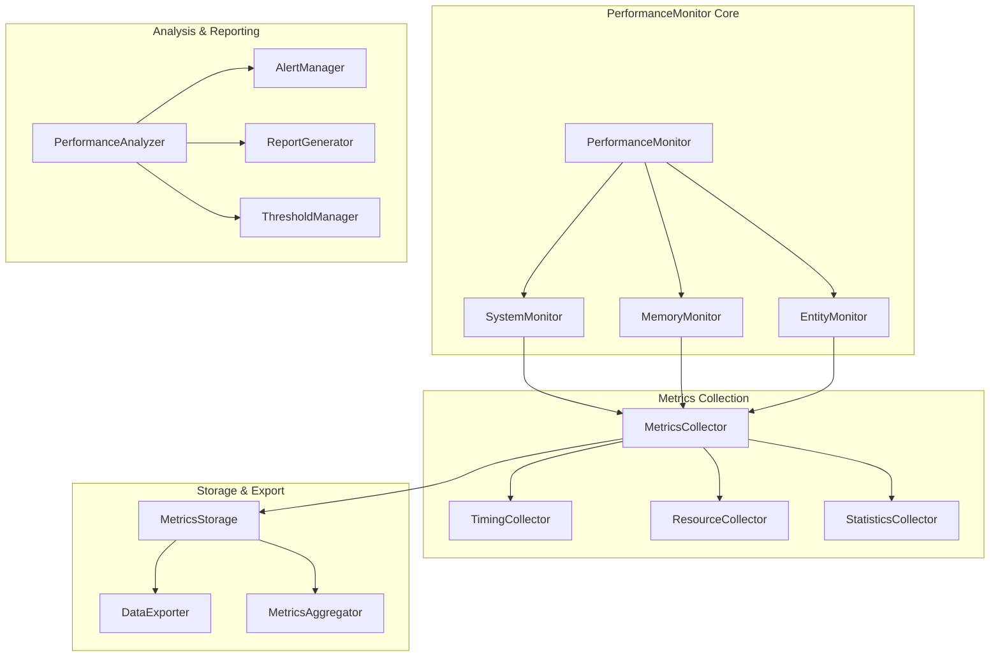

# PerformanceMonitor設計

> [!info] 概要
> ECSアーキテクチャにおけるシステム性能監視とパフォーマンス最適化のための設計と実装詳細を説明します。

## 🎯 設計目標

### 監視要件
- **リアルタイム監視**: システム実行時間の即座な計測
- **メモリ追跡**: エンティティ・コンポーネントのメモリ使用量監視
- **ボトルネック検出**: 性能問題の自動検出とアラート
- **統計レポート**: 詳細なパフォーマンス統計の提供

### パフォーマンス要件
- **低オーバーヘッド**: 監視自体が性能に与える影響を最小限に
- **非侵入的**: 既存システムへの影響なし
- **スケーラブル**: 大量のシステム・エンティティに対応

## 🏗️ アーキテクチャ設計

### システム構成



### クラス設計

```typescript
// PerformanceMonitor メインクラス
export class PerformanceMonitor {
  private world: IWorld;
  private systemMonitor: SystemMonitor;
  private memoryMonitor: MemoryMonitor;
  private entityMonitor: EntityMonitor;
  private metricsCollector: MetricsCollector;
  private performanceAnalyzer: PerformanceAnalyzer;
  private alertManager: AlertManager;
  private isEnabled: boolean;

  constructor(world: IWorld, options: PerformanceMonitorOptions = {}) {
    this.world = world;
    this.systemMonitor = new SystemMonitor(world);
    this.memoryMonitor = new MemoryMonitor(world);
    this.entityMonitor = new EntityMonitor(world);
    this.metricsCollector = new MetricsCollector(options.metricsOptions);
    this.performanceAnalyzer = new PerformanceAnalyzer(options.analysisOptions);
    this.alertManager = new AlertManager(options.alertOptions);
    this.isEnabled = options.enabled !== false;
    
    this.setupMonitoring();
  }
}
```

## ⏱️ システム監視設計

### SystemMonitor実装

```typescript
export class SystemMonitor {
  private world: IWorld;
  private systemMetrics: Map<string, SystemMetrics>;
  private executionHistory: SystemExecutionRecord[];
  private currentExecution: Map<string, ExecutionContext>;

  constructor(world: IWorld) {
    this.world = world;
    this.systemMetrics = new Map();
    this.executionHistory = [];
    this.currentExecution = new Map();
  }

  // システム実行開始監視
  startSystemExecution(systemName: string): ExecutionToken {
    const token = this.generateExecutionToken();
    const context: ExecutionContext = {
      systemName,
      startTime: performance.now(),
      startMemory: this.getCurrentMemoryUsage(),
      token
    };

    this.currentExecution.set(token, context);
    return token;
  }

  // システム実行終了監視
  endSystemExecution(token: ExecutionToken, processedEntities: number = 0): SystemExecutionResult {
    const context = this.currentExecution.get(token);
    if (!context) {
      throw new Error(`Invalid execution token: ${token}`);
    }

    const endTime = performance.now();
    const endMemory = this.getCurrentMemoryUsage();
    const executionTime = endTime - context.startTime;
    const memoryDelta = endMemory - context.startMemory;

    // 実行記録作成
    const record: SystemExecutionRecord = {
      systemName: context.systemName,
      startTime: context.startTime,
      endTime,
      executionTime,
      processedEntities,
      memoryUsage: endMemory,
      memoryDelta,
      timestamp: new Date()
    };

    // 履歴に追加
    this.executionHistory.push(record);
    this.trimExecutionHistory();

    // メトリクス更新
    this.updateSystemMetrics(context.systemName, record);

    // 実行コンテキスト削除
    this.currentExecution.delete(token);

    return {
      executionTime,
      memoryDelta,
      processedEntities,
      performanceScore: this.calculatePerformanceScore(record)
    };
  }

  // システムメトリクス更新
  private updateSystemMetrics(systemName: string, record: SystemExecutionRecord): void {
    let metrics = this.systemMetrics.get(systemName);
    
    if (!metrics) {
      metrics = {
        systemName,
        totalExecutions: 0,
        totalExecutionTime: 0,
        averageExecutionTime: 0,
        minExecutionTime: Infinity,
        maxExecutionTime: 0,
        totalProcessedEntities: 0,
        averageProcessedEntities: 0,
        totalMemoryUsage: 0,
        averageMemoryUsage: 0,
        lastExecution: null,
        performanceScore: 100,
        alertCount: 0
      };
      this.systemMetrics.set(systemName, metrics);
    }

    // 統計更新
    metrics.totalExecutions++;
    metrics.totalExecutionTime += record.executionTime;
    metrics.averageExecutionTime = metrics.totalExecutionTime / metrics.totalExecutions;
    metrics.minExecutionTime = Math.min(metrics.minExecutionTime, record.executionTime);
    metrics.maxExecutionTime = Math.max(metrics.maxExecutionTime, record.executionTime);
    
    metrics.totalProcessedEntities += record.processedEntities;
    metrics.averageProcessedEntities = metrics.totalProcessedEntities / metrics.totalExecutions;
    
    metrics.totalMemoryUsage += record.memoryUsage;
    metrics.averageMemoryUsage = metrics.totalMemoryUsage / metrics.totalExecutions;
    
    metrics.lastExecution = record;
    metrics.performanceScore = this.calculateSystemPerformanceScore(metrics);
  }

  // パフォーマンススコア計算
  private calculatePerformanceScore(record: SystemExecutionRecord): number {
    // 基準値との比較でスコア算出
    const baseExecutionTime = 1.0; // 1ms を基準
    const baseMemoryUsage = 1024 * 1024; // 1MB を基準

    const timeScore = Math.max(0, 100 - (record.executionTime / baseExecutionTime) * 10);
    const memoryScore = Math.max(0, 100 - (record.memoryUsage / baseMemoryUsage) * 10);
    const entityEfficiency = record.processedEntities > 0 
      ? Math.min(100, (record.processedEntities / record.executionTime) * 10)
      : 50;

    return (timeScore + memoryScore + entityEfficiency) / 3;
  }

  // システム全体のパフォーマンススコア計算
  private calculateSystemPerformanceScore(metrics: SystemMetrics): number {
    const recentExecutions = this.getRecentExecutions(metrics.systemName, 10);
    if (recentExecutions.length === 0) return 100;

    const scores = recentExecutions.map(record => this.calculatePerformanceScore(record));
    return scores.reduce((sum, score) => sum + score, 0) / scores.length;
  }

  // 最近の実行記録取得
  getRecentExecutions(systemName: string, count: number = 50): SystemExecutionRecord[] {
    return this.executionHistory
      .filter(record => record.systemName === systemName)
      .slice(-count);
  }

  // システムメトリクス取得
  getSystemMetrics(systemName?: string): SystemMetrics[] {
    if (systemName) {
      const metrics = this.systemMetrics.get(systemName);
      return metrics ? [metrics] : [];
    }
    return Array.from(this.systemMetrics.values());
  }

  // 遅いシステム検出
  getSlowSystems(threshold: number = 5.0): SystemMetrics[] {
    return Array.from(this.systemMetrics.values())
      .filter(metrics => metrics.averageExecutionTime > threshold)
      .sort((a, b) => b.averageExecutionTime - a.averageExecutionTime);
  }

  // メモリ使用量の多いシステム検出
  getMemoryIntensiveSystems(threshold: number = 10 * 1024 * 1024): SystemMetrics[] {
    return Array.from(this.systemMetrics.values())
      .filter(metrics => metrics.averageMemoryUsage > threshold)
      .sort((a, b) => b.averageMemoryUsage - a.averageMemoryUsage);
  }

  // 実行履歴のトリミング
  private trimExecutionHistory(): void {
    const maxHistorySize = 1000;
    if (this.executionHistory.length > maxHistorySize) {
      this.executionHistory = this.executionHistory.slice(-maxHistorySize);
    }
  }

  // 実行トークン生成
  private generateExecutionToken(): ExecutionToken {
    return `exec_${Date.now()}_${Math.random().toString(36).substr(2, 9)}`;
  }

  // 現在のメモリ使用量取得
  private getCurrentMemoryUsage(): number {
    if (typeof performance !== 'undefined' && performance.memory) {
      return performance.memory.usedJSHeapSize;
    }
    return 0;
  }

  // 統計リセット
  resetStats(): void {
    this.systemMetrics.clear();
    this.executionHistory = [];
    this.currentExecution.clear();
  }
}

// 型定義
type ExecutionToken = string;

interface ExecutionContext {
  systemName: string;
  startTime: number;
  startMemory: number;
  token: ExecutionToken;
}

interface SystemExecutionRecord {
  systemName: string;
  startTime: number;
  endTime: number;
  executionTime: number;
  processedEntities: number;
  memoryUsage: number;
  memoryDelta: number;
  timestamp: Date;
}

interface SystemExecutionResult {
  executionTime: number;
  memoryDelta: number;
  processedEntities: number;
  performanceScore: number;
}

interface SystemMetrics {
  systemName: string;
  totalExecutions: number;
  totalExecutionTime: number;
  averageExecutionTime: number;
  minExecutionTime: number;
  maxExecutionTime: number;
  totalProcessedEntities: number;
  averageProcessedEntities: number;
  totalMemoryUsage: number;
  averageMemoryUsage: number;
  lastExecution: SystemExecutionRecord | null;
  performanceScore: number;
  alertCount: number;
}
```

## 💾 メモリ監視設計

### MemoryMonitor実装

```typescript
export class MemoryMonitor {
  private world: IWorld;
  private memorySnapshots: MemorySnapshot[];
  private memoryAlerts: MemoryAlert[];
  private monitoringInterval: NodeJS.Timeout | null;

  constructor(world: IWorld, options: MemoryMonitorOptions = {}) {
    this.world = world;
    this.memorySnapshots = [];
    this.memoryAlerts = [];
    this.monitoringInterval = null;

    if (options.enableContinuousMonitoring) {
      this.startContinuousMonitoring(options.monitoringInterval || 1000);
    }
  }

  // メモリスナップショット取得
  takeSnapshot(): MemorySnapshot {
    const timestamp = Date.now();
    const worldStats = this.world.getPerformanceStats();
    
    const snapshot: MemorySnapshot = {
      timestamp,
      totalMemory: this.getTotalMemoryUsage(),
      heapUsed: this.getHeapUsage(),
      heapTotal: this.getHeapTotal(),
      entityCount: worldStats.entityCount,
      componentCount: worldStats.componentCount,
      estimatedEntityMemory: this.estimateEntityMemory(),
      estimatedComponentMemory: this.estimateComponentMemory(),
      memoryPerEntity: worldStats.entityCount > 0 
        ? this.estimateEntityMemory() / worldStats.entityCount 
        : 0,
      memoryPerComponent: worldStats.componentCount > 0 
        ? this.estimateComponentMemory() / worldStats.componentCount 
        : 0,
      fragmentationRatio: this.calculateFragmentationRatio()
    };

    this.memorySnapshots.push(snapshot);
    this.trimSnapshots();
    
    // メモリアラートチェック
    this.checkMemoryAlerts(snapshot);

    return snapshot;
  }

  // 継続的監視開始
  startContinuousMonitoring(interval: number = 1000): void {
    if (this.monitoringInterval) {
      clearInterval(this.monitoringInterval);
    }

    this.monitoringInterval = setInterval(() => {
      this.takeSnapshot();
    }, interval);
  }

  // 継続的監視停止
  stopContinuousMonitoring(): void {
    if (this.monitoringInterval) {
      clearInterval(this.monitoringInterval);
      this.monitoringInterval = null;
    }
  }

  // メモリ使用量推移取得
  getMemoryTrend(duration: number = 60000): MemoryTrend {
    const cutoffTime = Date.now() - duration;
    const recentSnapshots = this.memorySnapshots
      .filter(snapshot => snapshot.timestamp >= cutoffTime)
      .sort((a, b) => a.timestamp - b.timestamp);

    if (recentSnapshots.length < 2) {
      return {
        trend: 'stable',
        changeRate: 0,
        peakMemory: 0,
        averageMemory: 0,
        snapshots: recentSnapshots
      };
    }

    const first = recentSnapshots[0];
    const last = recentSnapshots[recentSnapshots.length - 1];
    const timeDiff = last.timestamp - first.timestamp;
    const memoryDiff = last.totalMemory - first.totalMemory;
    
    const changeRate = timeDiff > 0 ? (memoryDiff / timeDiff) * 1000 : 0; // per second
    const peakMemory = Math.max(...recentSnapshots.map(s => s.totalMemory));
    const averageMemory = recentSnapshots.reduce((sum, s) => sum + s.totalMemory, 0) / recentSnapshots.length;

    let trend: 'increasing' | 'decreasing' | 'stable';
    if (Math.abs(changeRate) < 1024) { // 1KB/s 未満は安定
      trend = 'stable';
    } else if (changeRate > 0) {
      trend = 'increasing';
    } else {
      trend = 'decreasing';
    }

    return {
      trend,
      changeRate,
      peakMemory,
      averageMemory,
      snapshots: recentSnapshots
    };
  }

  // メモリリーク検出
  detectMemoryLeaks(): MemoryLeakReport {
    const trend = this.getMemoryTrend(300000); // 5分間
    const isLeaking = trend.trend === 'increasing' && trend.changeRate > 1024; // 1KB/s以上の増加

    const suspiciousPatterns: string[] = [];
    
    if (isLeaking) {
      suspiciousPatterns.push('Continuous memory increase detected');
    }

    // エンティティ数とメモリ使用量の相関チェック
    const entityMemoryCorrelation = this.calculateEntityMemoryCorrelation();
    if (entityMemoryCorrelation < 0.7) {
      suspiciousPatterns.push('Poor correlation between entity count and memory usage');
    }

    // フラグメンテーション率チェック
    const latestSnapshot = this.memorySnapshots[this.memorySnapshots.length - 1];
    if (latestSnapshot && latestSnapshot.fragmentationRatio > 0.3) {
      suspiciousPatterns.push('High memory fragmentation detected');
    }

    return {
      isLeaking,
      confidence: this.calculateLeakConfidence(trend, suspiciousPatterns),
      suspiciousPatterns,
      recommendation: this.generateMemoryRecommendations(trend, suspiciousPatterns),
      trend
    };
  }

  // メモリ最適化提案
  getOptimizationSuggestions(): MemoryOptimizationSuggestion[] {
    const suggestions: MemoryOptimizationSuggestion[] = [];
    const latestSnapshot = this.memorySnapshots[this.memorySnapshots.length - 1];
    
    if (!latestSnapshot) return suggestions;

    // エンティティあたりのメモリ使用量チェック
    if (latestSnapshot.memoryPerEntity > 1024) { // 1KB/entity
      suggestions.push({
        type: 'entity-optimization',
        priority: 'high',
        description: 'High memory usage per entity detected',
        recommendation: 'Consider optimizing component data structures or reducing component count per entity',
        estimatedSaving: latestSnapshot.estimatedEntityMemory * 0.2
      });
    }

    // コンポーネントあたりのメモリ使用量チェック
    if (latestSnapshot.memoryPerComponent > 512) { // 512B/component
      suggestions.push({
        type: 'component-optimization',
        priority: 'medium',
        description: 'High memory usage per component detected',
        recommendation: 'Consider using more efficient data types or component pooling',
        estimatedSaving: latestSnapshot.estimatedComponentMemory * 0.15
      });
    }

    // フラグメンテーションチェック
    if (latestSnapshot.fragmentationRatio > 0.25) {
      suggestions.push({
        type: 'fragmentation-reduction',
        priority: 'medium',
        description: 'High memory fragmentation detected',
        recommendation: 'Consider implementing object pooling or periodic garbage collection',
        estimatedSaving: latestSnapshot.totalMemory * latestSnapshot.fragmentationRatio * 0.5
      });
    }

    return suggestions.sort((a, b) => {
      const priorityOrder = { high: 3, medium: 2, low: 1 };
      return priorityOrder[b.priority] - priorityOrder[a.priority];
    });
  }

  // プライベートメソッド
  private getTotalMemoryUsage(): number {
    if (typeof performance !== 'undefined' && performance.memory) {
      return performance.memory.usedJSHeapSize;
    }
    return 0;
  }

  private getHeapUsage(): number {
    if (typeof performance !== 'undefined' && performance.memory) {
      return performance.memory.usedJSHeapSize;
    }
    return 0;
  }

  private getHeapTotal(): number {
    if (typeof performance !== 'undefined' && performance.memory) {
      return performance.memory.totalJSHeapSize;
    }
    return 0;
  }

  private estimateEntityMemory(): number {
    // エンティティ管理のメモリ使用量推定
    const entityStats = this.world.getEntityStats();
    return entityStats.total * 64; // 64 bytes per entity (推定)
  }

  private estimateComponentMemory(): number {
    // コンポーネントのメモリ使用量推定
    const componentStats = this.world.getComponentStats();
    return Object.values(componentStats).reduce((total, count) => total + count * 256, 0); // 256 bytes per component (推定)
  }

  private calculateFragmentationRatio(): number {
    const heapUsed = this.getHeapUsage();
    const heapTotal = this.getHeapTotal();
    
    if (heapTotal === 0) return 0;
    
    // 簡易的なフラグメンテーション率計算
    return Math.max(0, (heapTotal - heapUsed) / heapTotal - 0.1); // 10%のバッファを考慮
  }

  private calculateEntityMemoryCorrelation(): number {
    if (this.memorySnapshots.length < 10) return 1.0;

    const recent = this.memorySnapshots.slice(-20);
    const entityCounts = recent.map(s => s.entityCount);
    const memoryUsages = recent.map(s => s.totalMemory);

    return this.calculateCorrelation(entityCounts, memoryUsages);
  }

  private calculateCorrelation(x: number[], y: number[]): number {
    const n = x.length;
    if (n === 0) return 0;

    const sumX = x.reduce((a, b) => a + b, 0);
    const sumY = y.reduce((a, b) => a + b, 0);
    const sumXY = x.reduce((sum, xi, i) => sum + xi * y[i], 0);
    const sumXX = x.reduce((sum, xi) => sum + xi * xi, 0);
    const sumYY = y.reduce((sum, yi) => sum + yi * yi, 0);

    const numerator = n * sumXY - sumX * sumY;
    const denominator = Math.sqrt((n * sumXX - sumX * sumX) * (n * sumYY - sumY * sumY));

    return denominator === 0 ? 0 : numerator / denominator;
  }

  private calculateLeakConfidence(trend: MemoryTrend, patterns: string[]): number {
    let confidence = 0;

    if (trend.trend === 'increasing') {
      confidence += 0.4;
    }

    if (trend.changeRate > 2048) { // 2KB/s
      confidence += 0.3;
    }

    confidence += patterns.length * 0.1;

    return Math.min(1.0, confidence);
  }

  private generateMemoryRecommendations(trend: MemoryTrend, patterns: string[]): string[] {
    const recommendations: string[] = [];

    if (trend.trend === 'increasing') {
      recommendations.push('Monitor entity and component creation/destruction patterns');
      recommendations.push('Consider implementing object pooling for frequently created/destroyed objects');
    }

    if (patterns.includes('High memory fragmentation detected')) {
      recommendations.push('Implement periodic garbage collection or memory compaction');
    }

    if (patterns.includes('Poor correlation between entity count and memory usage')) {
      recommendations.push('Investigate potential memory leaks in component management');
    }

    return recommendations;
  }

  private checkMemoryAlerts(snapshot: MemorySnapshot): void {
    // メモリ使用量アラート
    const memoryThreshold = 100 * 1024 * 1024; // 100MB
    if (snapshot.totalMemory > memoryThreshold) {
      this.memoryAlerts.push({
        type: 'high-memory-usage',
        severity: 'warning',
        message: `High memory usage detected: ${(snapshot.totalMemory / 1024 / 1024).toFixed(2)}MB`,
        timestamp: snapshot.timestamp,
        value: snapshot.totalMemory,
        threshold: memoryThreshold
      });
    }

    // フラグメンテーションアラート
    if (snapshot.fragmentationRatio > 0.3) {
      this.memoryAlerts.push({
        type: 'high-fragmentation',
        severity: 'info',
        message: `High memory fragmentation: ${(snapshot.fragmentationRatio * 100).toFixed(1)}%`,
        timestamp: snapshot.timestamp,
        value: snapshot.fragmentationRatio,
        threshold: 0.3
      });
    }

    this.trimAlerts();
  }

  private trimSnapshots(): void {
    const maxSnapshots = 1000;
    if (this.memorySnapshots.length > maxSnapshots) {
      this.memorySnapshots = this.memorySnapshots.slice(-maxSnapshots);
    }
  }

  private trimAlerts(): void {
    const maxAlerts = 100;
    if (this.memoryAlerts.length > maxAlerts) {
      this.memoryAlerts = this.memoryAlerts.slice(-maxAlerts);
    }
  }

  // 統計リセット
  resetStats(): void {
    this.memorySnapshots = [];
    this.memoryAlerts = [];
  }

  // アラート取得
  getAlerts(severity?: 'info' | 'warning' | 'error'): MemoryAlert[] {
    if (severity) {
      return this.memoryAlerts.filter(alert => alert.severity === severity);
    }
    return [...this.memoryAlerts];
  }
}

// 型定義
interface MemorySnapshot {
  timestamp: number;
  totalMemory: number;
  heapUsed: number;
  heapTotal: number;
  entityCount: number;
  componentCount: number;
  estimatedEntityMemory: number;
  estimatedComponentMemory: number;
  memoryPerEntity: number;
  memoryPerComponent: number;
  fragmentationRatio: number;
}

interface MemoryTrend {
  trend: 'increasing' | 'decreasing' | 'stable';
  changeRate: number; // bytes per second
  peakMemory: number;
  averageMemory: number;
  snapshots: MemorySnapshot[];
}

interface MemoryLeakReport {
  isLeaking: boolean;
  confidence: number;
  suspiciousPatterns: string[];
  recommendation: string[];
  trend: MemoryTrend;
}

interface MemoryOptimizationSuggestion {
  type: 'entity-optimization' | 'component-optimization' | 'fragmentation-reduction';
  priority: 'high' | 'medium' | 'low';
  description: string;
  recommendation: string;
  estimatedSaving: number;
}

interface MemoryAlert {
  type: string;
  severity: 'info' | 'warning' | 'error';
  message: string;
  timestamp: number;
  value: number;
  threshold: number;
}

interface MemoryMonitorOptions {
  enableContinuousMonitoring?: boolean;
  monitoringInterval?: number;
}
```

## 🏃‍♂️ エンティティ監視設計

### EntityMonitor実装

```typescript
export class EntityMonitor {
  private world: IWorld;
  private entityLifecycleStats: EntityLifecycleStats;
  private componentUsageStats: Map<ComponentType, ComponentUsageStats>;
  private entityCreationHistory: EntityCreationRecord[];
  private entityDestructionHistory: EntityDestructionRecord[];

  constructor(world: IWorld) {
    this.world = world;
    this.entityLifecycleStats = this.initializeLifecycleStats();
    this.componentUsageStats = new Map();
    this.entityCreationHistory = [];
    this.entityDestructionHistory = [];

    this.setupLifecycleListeners();
  }

  // エンティティ作成記録
  recordEntityCreation(entityId: EntityId): void {
    const record: EntityCreationRecord = {
      entityId,
      timestamp: Date.now(),
      componentCount: 0,
      memoryEstimate: this.estimateEntityMemory(entityId)
    };

    this.entityCreationHistory.push(record);
    this.trimCreationHistory();

    // 統計更新
    this.entityLifecycleStats.totalCreated++;
    this.entityLifecycleStats.currentActive++;
    this.entityLifecycleStats.creationRate = this.calculateCreationRate();
  }

  // エンティティ削除記録
  recordEntityDestruction(entityId: EntityId): void {
    const record: EntityDestructionRecord = {
      entityId,
      timestamp: Date.now(),
      lifespan: this.calculateEntityLifespan(entityId),
      componentCount: this.getEntityComponentCount(entityId)
    };

    this.entityDestructionHistory.push(record);
    this.trimDestructionHistory();

    // 統計更新
    this.entityLifecycleStats.totalDestroyed++;
    this.entityLifecycleStats.currentActive--;
    this.entityLifecycleStats.destructionRate = this.calculateDestructionRate();
    this.entityLifecycleStats.averageLifespan = this.calculateAverageLifespan();
  }

  // コンポーネント使用統計更新
  recordComponentUsage(componentType: ComponentType, operation: 'add' | 'remove'): void {
    let stats = this.componentUsageStats.get(componentType);
    
    if (!stats) {
      stats = {
        componentType,
        totalAdded: 0,
        totalRemoved: 0,
        currentCount: 0,
        peakCount: 0,
        averageLifespan: 0,
        additionRate: 0,
        removalRate: 0
      };
      this.componentUsageStats.set(componentType, stats);
    }

    if (operation === 'add') {
      stats.totalAdded++;
      stats.currentCount++;
      stats.peakCount = Math.max(stats.peakCount, stats.currentCount);
    } else {
      stats.totalRemoved++;
      stats.currentCount--;
    }

    stats.additionRate = this.calculateComponentAdditionRate(componentType);
    stats.removalRate = this.calculateComponentRemovalRate(componentType);
  }

  // エンティティ統計取得
  getEntityStats(): EntityLifecycleStats {
    return { ...this.entityLifecycleStats };
  }

  // コンポーネント統計取得
  getComponentUsageStats(componentType?: ComponentType): ComponentUsageStats[] {
    if (componentType) {
      const stats = this.componentUsageStats.get(componentType);
      return stats ? [stats] : [];
    }
    return Array.from(this.componentUsageStats.values());
  }

  // エンティティ作成パターン分析
  analyzeCreationPatterns(): EntityCreationAnalysis {
    const recentCreations = this.entityCreationHistory.slice(-100);
    
    if (recentCreations.length < 2) {
      return {
        pattern: 'insufficient-data',
        burstDetected: false,
        averageInterval: 0,
        peakCreationRate: 0,
        recommendations: []
      };
    }

    // 作成間隔分析
    const intervals = [];
    for (let i = 1; i < recentCreations.length; i++) {
      intervals.push(recentCreations[i].timestamp - recentCreations[i - 1].timestamp);
    }

    const averageInterval = intervals.reduce((sum, interval) => sum + interval, 0) / intervals.length;
    const intervalVariance = this.calculateVariance(intervals);
    
    // バースト検出
    const shortIntervals = intervals.filter(interval => interval < averageInterval * 0.1);
    const burstDetected = shortIntervals.length > intervals.length * 0.2;

    // パターン判定
    let pattern: EntityCreationPattern;
    if (intervalVariance < averageInterval * 0.1) {
      pattern = 'steady';
    } else if (burstDetected) {
      pattern = 'bursty';
    } else {
      pattern = 'irregular';
    }

    const peakCreationRate = Math.min(...intervals.filter(i => i > 0));

    return {
      pattern,
      burstDetected,
      averageInterval,
      peakCreationRate: 1000 / peakCreationRate, // entities per second
      recommendations: this.generateCreationRecommendations(pattern, burstDetected)
    };
  }

  // メモリ効率分析
  analyzeMemoryEfficiency(): MemoryEfficiencyAnalysis {
    const currentEntities = this.world.getAllEntities();
    const totalMemory = currentEntities.reduce((sum, entityId) => 
      sum + this.estimateEntityMemory(entityId), 0);
    
    const averageMemoryPerEntity = currentEntities.length > 0 
      ? totalMemory / currentEntities.length 
      : 0;

    // コンポーネント別メモリ使用量
    const componentMemoryUsage = new Map<ComponentType, number>();
    Object.values(ComponentTypes).forEach(componentType => {
      const entities = this.world.getEntitiesWithComponents(componentType);
      componentMemoryUsage.set(componentType, entities.length * this.estimateComponentMemory(componentType));
    });

    // 効率性評価
    const efficiency = this.calculateMemoryEfficiency(averageMemoryPerEntity);
    
    return {
      totalMemoryUsage: totalMemory,
      averageMemoryPerEntity,
      componentMemoryBreakdown: Object.fromEntries(componentMemoryUsage),
      efficiency,
      recommendations: this.generateMemoryEfficiencyRecommendations(efficiency, componentMemoryUsage)
    };
  }

  // パフォーマンス影響分析
  analyzePerformanceImpact(): PerformanceImpactAnalysis {
    const entityCount = this.world.getAllEntities().length;
    const componentStats = this.world.getComponentStats();
    const totalComponents = Object.values(componentStats).reduce((sum, count) => sum + count, 0);

    // エンティティ密度計算
    const entityDensity = entityCount > 0 ? totalComponents / entityCount : 0;

    // パフォーマンス予測
    const predictedQueryTime = this.predictQueryPerformance(entityCount, entityDensity);
    const predictedUpdateTime = this.predictUpdatePerformance(entityCount, entityDensity);

    // ボトルネック識別
    const bottlenecks = this.identifyBottlenecks(entityCount, componentStats);

    return {
      entityCount,
      componentCount: totalComponents,
      entityDensity,
      predictedQueryTime,
      predictedUpdateTime,
      bottlenecks,
      recommendations: this.generatePerformanceRecommendations(bottlenecks)
    };
  }

  // プライベートメソッド
  private setupLifecycleListeners(): void {
    // World のライフサイクルイベントをリッスン（実装は後で）
  }

  private initializeLifecycleStats(): EntityLifecycleStats {
    return {
      totalCreated: 0,
      totalDestroyed: 0,
      currentActive: 0,
      peakActive: 0,
      creationRate: 0,
      destructionRate: 0,
      averageLifespan: 0
    };
  }

  private calculateCreationRate(): number {
    const recentCreations = this.entityCreationHistory.slice(-10);
    if (recentCreations.length < 2) return 0;

    const timeSpan = recentCreations[recentCreations.length - 1].timestamp - recentCreations[0].timestamp;
    return timeSpan > 0 ? (recentCreations.length - 1) / (timeSpan / 1000) : 0;
  }

  private calculateDestructionRate(): number {
    const recentDestructions = this.entityDestructionHistory.slice(-10);
    if (recentDestructions.length < 2) return 0;

    const timeSpan = recentDestructions[recentDestructions.length - 1].timestamp - recentDestructions[0].timestamp;
    return timeSpan > 0 ? (recentDestructions.length - 1) / (timeSpan / 1000) : 0;
  }

  private calculateAverageLifespan(): number {
    const recentDestructions = this.entityDestructionHistory.slice(-50);
    if (recentDestructions.length === 0) return 0;

    const totalLifespan = recentDestructions.reduce((sum, record) => sum + record.lifespan, 0);
    return totalLifespan / recentDestructions.length;
  }

  private calculateEntityLifespan(entityId: EntityId): number {
    const creationRecord = this.entityCreationHistory.find(record => record.entityId === entityId);
    return creationRecord ? Date.now() - creationRecord.timestamp : 0;
  }

  private getEntityComponentCount(entityId: EntityId): number {
    return Object.values(ComponentTypes).filter(type => 
      this.world.hasComponent(entityId, type)
    ).length;
  }

  private estimateEntityMemory(entityId: EntityId): number {
    const componentCount = this.getEntityComponentCount(entityId);
    return 64 + componentCount * 128; // 基本64バイト + コンポーネントあたり128バイト
  }

  private estimateComponentMemory(componentType: ComponentType): number {
    // コンポーネントタイプ別のメモリ使用量推定
    switch (componentType) {
      case ComponentTypes.POSITION: return 32;
      case ComponentTypes.TEXT: return 256;
      case ComponentTypes.VISUAL: return 128;
      case ComponentTypes.ANIMATION: return 64;
      default: return 128;
    }
  }

  private calculateVariance(values: number[]): number {
    if (values.length === 0) return 0;
    
    const mean = values.reduce((sum, value) => sum + value, 0) / values.length;
    const squaredDiffs = values.map(value => Math.pow(value - mean, 2));
    return squaredDiffs.reduce((sum, diff) => sum + diff, 0) / values.length;
  }

  private calculateComponentAdditionRate(componentType: ComponentType): number {
    // 実装は統計データに基づく
    return 0;
  }

  private calculateComponentRemovalRate(componentType: ComponentType): number {
    // 実装は統計データに基づく
    return 0;
  }

  private calculateMemoryEfficiency(averageMemoryPerEntity: number): number {
    // 基準値との比較で効率性を計算
    const baselineMemory = 512; // 512バイトを基準
    return Math.max(0, Math.min(100, (baselineMemory / averageMemoryPerEntity) * 100));
  }

  private predictQueryPerformance(entityCount: number, entityDensity: number): number {
    // 簡易的なパフォーマンス予測
    return entityCount * 0.01 + entityDensity * 0.005;
  }

  private predictUpdatePerformance(entityCount: number, entityDensity: number): number {
    // 簡易的なパフォーマンス予測
    return entityCount * 0.02 + entityDensity * 0.01;
  }

  private identifyBottlenecks(entityCount: number, componentStats: Record<ComponentType, number>): string[] {
    const bottlenecks: string[] = [];

    if (entityCount > 100) {
      bottlenecks.push('High entity count may impact query performance');
    }

    Object.entries(componentStats).forEach(([componentType, count]) => {
      if (count > entityCount * 0.8) {
        bottlenecks.push(`High usage of ${componentType} components`);
      }
    });

    return bottlenecks;
  }

  private generateCreationRecommendations(pattern: EntityCreationPattern, burstDetected: boolean): string[] {
    const recommendations: string[] = [];

    if (pattern === 'bursty' || burstDetected) {
      recommendations.push('Consider implementing entity pooling to handle creation bursts');
      recommendations.push('Monitor memory usage during creation bursts');
    }

    if (pattern === 'irregular') {
      recommendations.push('Analyze entity creation triggers for optimization opportunities');
    }

    return recommendations;
  }

  private generateMemoryEfficiencyRecommendations(efficiency: number, componentMemoryUsage: Map<ComponentType, number>): string[] {
    const recommendations: string[] = [];

    if (efficiency < 50) {
      recommendations.push('Consider optimizing component data structures');
      recommendations.push('Implement component pooling for frequently used components');
    }

    // 最もメモリを使用しているコンポーネントを特定
    const sortedComponents = Array.from(componentMemoryUsage.entries())
      .sort((a, b) => b[1] - a[1]);

    if (sortedComponents.length > 0) {
      recommendations.push(`Focus optimization efforts on ${sortedComponents[0][0]} components`);
    }

    return recommendations;
  }

  private generatePerformanceRecommendations(bottlenecks: string[]): string[] {
    const recommendations: string[] = [];

    bottlenecks.forEach(bottleneck => {
      if (bottleneck.includes('entity count')) {
        recommendations.push('Consider implementing spatial partitioning for large entity counts');
      }
      if (bottleneck.includes('components')) {
        recommendations.push('Optimize component access patterns and consider component archetype systems');
      }
    });

    return recommendations;
  }

  private trimCreationHistory(): void {
    const maxHistory = 1000;
    if (this.entityCreationHistory.length > maxHistory) {
      this.entityCreationHistory = this.entityCreationHistory.slice(-maxHistory);
    }
  }

  private trimDestructionHistory(): void {
    const maxHistory = 1000;
    if (this.entityDestructionHistory.length > maxHistory) {
      this.entityDestructionHistory = this.entityDestructionHistory.slice(-maxHistory);
    }
  }

  // 統計リセット
  resetStats(): void {
    this.entityLifecycleStats = this.initializeLifecycleStats();
    this.componentUsageStats.clear();
    this.entityCreationHistory = [];
    this.entityDestructionHistory = [];
  }
}

// 型定義
interface EntityLifecycleStats {
  totalCreated: number;
  totalDestroyed: number;
  currentActive: number;
  peakActive: number;
  creationRate: number; // entities per second
  destructionRate: number; // entities per second
  averageLifespan: number; // milliseconds
}

interface ComponentUsageStats {
  componentType: ComponentType;
  totalAdded: number;
  totalRemoved: number;
  currentCount: number;
  peakCount: number;
  averageLifespan: number;
  additionRate: number;
  removalRate: number;
}

interface EntityCreationRecord {
  entityId: EntityId;
  timestamp: number;
  componentCount: number;
  memoryEstimate: number;
}

interface EntityDestructionRecord {
  entityId: EntityId;
  timestamp: number;
  lifespan: number;
  componentCount: number;
}

type EntityCreationPattern = 'steady' | 'bursty' | 'irregular' | 'insufficient-data';

interface EntityCreationAnalysis {
  pattern: EntityCreationPattern;
  burstDetected: boolean;
  averageInterval: number;
  peakCreationRate: number;
  recommendations: string[];
}

interface MemoryEfficiencyAnalysis {
  totalMemoryUsage: number;
  averageMemoryPerEntity: number;
  componentMemoryBreakdown: Record<string, number>;
  efficiency: number; // 0-100
  recommendations: string[];
}

interface PerformanceImpactAnalysis {
  entityCount: number;
  componentCount: number;
  entityDensity: number; // components per entity
  predictedQueryTime: number;
  predictedUpdateTime: number;
  bottlenecks: string[];
  recommendations: string[];
}
```

## 📊 統合レポート設計

### ReportGenerator実装

```typescript
export class ReportGenerator {
  private performanceMonitor: PerformanceMonitor;

  constructor(performanceMonitor: PerformanceMonitor) {
    this.performanceMonitor = performanceMonitor;
  }

  // 総合パフォーマンスレポート生成
  generateComprehensiveReport(): PerformanceReport {
    const systemMetrics = this.performanceMonitor.getSystemMonitor().getSystemMetrics();
    const memoryTrend = this.performanceMonitor.getMemoryMonitor().getMemoryTrend();
    const entityStats = this.performanceMonitor.getEntityMonitor().getEntityStats();
    const memoryLeakReport = this.performanceMonitor.getMemoryMonitor().detectMemoryLeaks();

    return {
      timestamp: new Date(),
      summary: this.generateSummary(systemMetrics, memoryTrend, entityStats),
      systemPerformance: this.generateSystemPerformanceSection(systemMetrics),
      memoryAnalysis: this.generateMemoryAnalysisSection(memoryTrend, memoryLeakReport),
      entityAnalysis: this.generateEntityAnalysisSection(entityStats),
      recommendations: this.generateOverallRecommendations(),
      alerts: this.collectAllAlerts()
    };
  }

  // HTMLレポート生成
  generateHTMLReport(): string {
    const report = this.generateComprehensiveReport();
    
    return `
<!DOCTYPE html>
<html>
<head>
    <title>ECS Performance Report</title>
    <style>
        body { font-family: Arial, sans-serif; margin: 20px; }
        .summary { background: #f0f8ff; padding: 15px; border-radius: 5px; margin-bottom: 20px; }
        .section { margin-bottom: 30px; }
        .metric { display: inline-block; margin: 10px; padding: 10px; background: #f9f9f9; border-radius: 3px; }
        .alert { padding: 10px; margin: 5px 0; border-radius: 3px; }
        .alert.warning { background: #fff3cd; border-left: 4px solid #ffc107; }
        .alert.error { background: #f8d7da; border-left: 4px solid #dc3545; }
        .recommendation { background: #d4edda; padding: 10px; margin: 5px 0; border-radius: 3px; border-left: 4px solid #28a745; }
    </style>
</head>
<body>
    <h1>ECS Performance Report</h1>
    <p>Generated: ${report.timestamp.toISOString()}</p>
    
    <div class="summary">
        <h2>Summary</h2>
        <p>${report.summary}</p>
    </div>
    
    <div class="section">
        <h2>System Performance</h2>
        ${this.renderSystemMetrics(report.systemPerformance)}
    </div>
    
    <div class="section">
        <h2>Memory Analysis</h2>
        ${this.renderMemoryAnalysis(report.memoryAnalysis)}
    </div>
    
    <div class="section">
        <h2>Entity Analysis</h2>
        ${this.renderEntityAnalysis(report.entityAnalysis)}
    </div>
    
    <div class="section">
        <h2>Recommendations</h2>
        ${report.recommendations.map(rec => `<div class="recommendation">${rec}</div>`).join('')}
    </div>
    
    <div class="section">
        <h2>Alerts</h2>
        ${report.alerts.map(alert => `<div class="alert ${alert.severity}">${alert.message}</div>`).join('')}
    </div>
</body>
</html>
    `;
  }

  // プライベートメソッド
  private generateSummary(systemMetrics: SystemMetrics[], memoryTrend: MemoryTrend, entityStats: EntityLifecycleStats): string {
    const totalSystems = systemMetrics.length;
    const avgPerformanceScore = systemMetrics.reduce((sum, m) => sum + m.performanceScore, 0) / totalSystems;
    const memoryStatus = memoryTrend.trend;
    const entityCount = entityStats.currentActive;

    return `Performance monitoring shows ${totalSystems} active systems with an average performance score of ${avgPerformanceScore.toFixed(1)}/100. Memory usage is ${memoryStatus} with ${entityCount} active entities.`;
  }

  private generateSystemPerformanceSection(systemMetrics: SystemMetrics[]): any {
    return {
      totalSystems: systemMetrics.length,
      averagePerformanceScore: systemMetrics.reduce((sum, m) => sum + m.performanceScore, 0) / systemMetrics.length,
      slowestSystems: systemMetrics.sort((a, b) => b.averageExecutionTime - a.averageExecutionTime).slice(0, 3),
      fastestSystems: systemMetrics.sort((a, b) => a.averageExecutionTime - b.averageExecutionTime).slice(0, 3)
    };
  }

  private generateMemoryAnalysisSection(memoryTrend: MemoryTrend, memoryLeakReport: any): any {
    return {
      currentTrend: memoryTrend.trend,
      changeRate: memoryTrend.changeRate,
      peakMemory: memoryTrend.peakMemory,
      leakDetection: memoryLeakReport
    };
  }

  private generateEntityAnalysisSection(entityStats: EntityLifecycleStats): any {
    return {
      activeEntities: entityStats.currentActive,
      creationRate: entityStats.creationRate,
      destructionRate: entityStats.destructionRate,
      averageLifespan: entityStats.averageLifespan
    };
  }

  private generateOverallRecommendations(): string[] {
    // 各監視システムからの推奨事項を統合
    return [
      'Monitor system execution times regularly',
      'Implement entity pooling for better memory management',
      'Consider query optimization for large entity counts'
    ];
  }

  private collectAllAlerts(): any[] {
    // 各監視システムからのアラートを収集
    return [];
  }

  private renderSystemMetrics(systemPerformance: any): string {
    return `
        <div class="metric">Total Systems: ${systemPerformance.totalSystems}</div>
        <div class="metric">Avg Performance Score: ${systemPerformance.averagePerformanceScore.toFixed(1)}</div>
    `;
  }

  private renderMemoryAnalysis(memoryAnalysis: any): string {
    return `
        <div class="metric">Memory Trend: ${memoryAnalysis.currentTrend}</div>
        <div class="metric">Change Rate: ${memoryAnalysis.changeRate.toFixed(2)} bytes/sec</div>
    `;
  }

  private renderEntityAnalysis(entityAnalysis: any): string {
    return `
        <div class="metric">Active Entities: ${entityAnalysis.activeEntities}</div>
        <div class="metric">Creation Rate: ${entityAnalysis.creationRate.toFixed(2)}/sec</div>
    `;
  }
}

interface PerformanceReport {
  timestamp: Date;
  summary: string;
  systemPerformance: any;
  memoryAnalysis: any;
  entityAnalysis: any;
  recommendations: string[];
  alerts: any[];
}
```

## 🔧 設定とオプション

### PerformanceMonitorOptions

```typescript
export interface PerformanceMonitorOptions {
  enabled?: boolean;
  
  metricsOptions?: {
    maxHistorySize?: number;
    aggregationInterval?: number;
    enableDetailedMetrics?: boolean;
  };

  analysisOptions?: {
    enableLeakDetection?: boolean;
    enableBottleneckDetection?: boolean;
    performanceThresholds?: {
      slowSystemThreshold?: number;
      highMemoryThreshold?: number;
      highEntityCountThreshold?: number;
    };
  };

  alertOptions?: {
    enableAlerts?: boolean;
    alertThresholds?: {
      systemExecutionTime?: number;
      memoryUsage?: number;
      entityCreationRate?: number;
    };
  };

  reportOptions?: {
    enableAutoReports?: boolean;
    reportInterval?: number;
    reportFormat?: 'json' | 'html' | 'csv';
  };
}
```

## 関連文書

> [!info] 関連設計文書
> - [[world|World設計]]
> - [[systems|システム設計]]
> - [[query-system|QuerySystem設計]]

> [!note] API仕様書
> - [[../../../api/ecs-performance-monitor|PerformanceMonitor API仕様]]