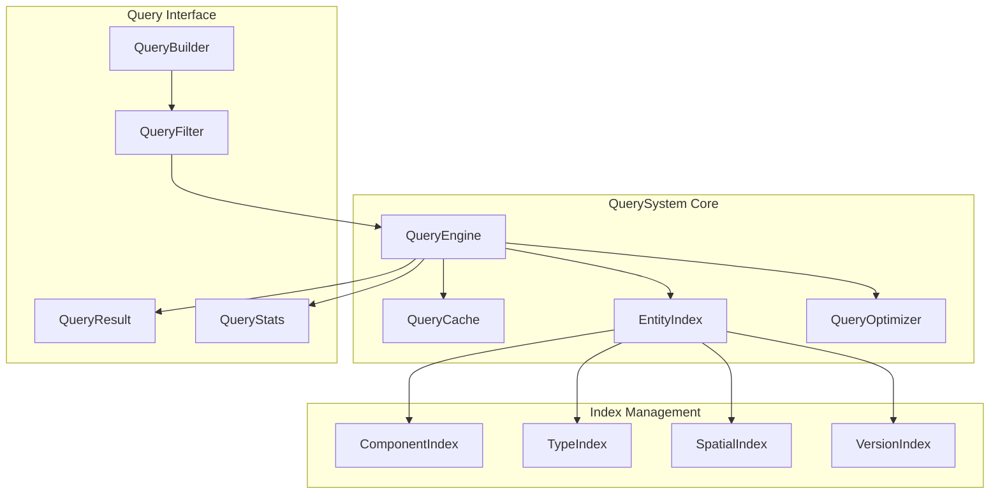

# QuerySystem設計

> [!info] 概要
> ECSアーキテクチャにおける高性能なエンティティクエリシステムの設計と実装詳細を説明します。

## 🎯 設計目標

### パフォーマンス要件
- **大量エンティティ対応**: 50個以上のエンティティでも高速クエリ
- **キャッシュ効率**: 頻繁なクエリのキャッシュによる高速化
- **メモリ効率**: 最小限のメモリ使用量でのインデックス管理

### 機能要件
- **柔軟なクエリ**: 複雑な条件でのエンティティ検索
- **リアルタイム更新**: エンティティ変更時の自動インデックス更新
- **型安全性**: TypeScriptによる完全な型安全性

## 🏗️ アーキテクチャ設計

### システム構成



### クラス設計

```typescript
// QuerySystem メインクラス
export class QuerySystem {
  private world: IWorld;
  private queryEngine: QueryEngine;
  private queryCache: QueryCache;
  private entityIndex: EntityIndex;
  private queryOptimizer: QueryOptimizer;
  private queryStats: QueryStats;

  constructor(world: IWorld, options: QuerySystemOptions = {}) {
    this.world = world;
    this.queryEngine = new QueryEngine(world);
    this.queryCache = new QueryCache(options.cacheOptions);
    this.entityIndex = new EntityIndex(world);
    this.queryOptimizer = new QueryOptimizer();
    this.queryStats = new QueryStats();
    
    this.setupIndexListeners();
  }
}
```

## 🔍 クエリインターフェース設計

### QueryFilter定義

```typescript
// 基本クエリフィルター
export interface QueryFilter {
  // 必須コンポーネント（AND条件）
  all?: ComponentType[];
  
  // いずれかのコンポーネント（OR条件）
  any?: ComponentType[];
  
  // 除外コンポーネント（NOT条件）
  none?: ComponentType[];
  
  // カスタム条件関数
  where?: (entityId: EntityId, components: Map<ComponentType, IComponent>) => boolean;
  
  // 結果制限
  limit?: number;
  offset?: number;
  
  // ソート条件
  orderBy?: QueryOrderBy[];
}

// ソート条件
export interface QueryOrderBy {
  component: ComponentType;
  property: string;
  direction: 'asc' | 'desc';
}

// 高度なクエリフィルター
export interface AdvancedQueryFilter extends QueryFilter {
  // 空間クエリ（位置ベース）
  spatial?: SpatialQuery;
  
  // 範囲クエリ
  range?: RangeQuery[];
  
  // テキスト検索
  text?: TextQuery[];
  
  // 時間範囲
  timeRange?: TimeRangeQuery;
}

// 空間クエリ
export interface SpatialQuery {
  type: 'circle' | 'rectangle' | 'polygon';
  center?: { x: number; y: number };
  radius?: number;
  bounds?: { x1: number; y1: number; x2: number; y2: number };
  points?: { x: number; y: number }[];
}

// 範囲クエリ
export interface RangeQuery {
  component: ComponentType;
  property: string;
  min?: number;
  max?: number;
}

// テキスト検索
export interface TextQuery {
  component: ComponentType;
  property: string;
  text: string;
  mode: 'exact' | 'contains' | 'startsWith' | 'endsWith' | 'regex';
  caseSensitive?: boolean;
}

// 時間範囲クエリ
export interface TimeRangeQuery {
  component: ComponentType;
  property: string;
  from?: Date;
  to?: Date;
}
```

### QueryBuilder設計

```typescript
// 流暢なインターフェースによるクエリ構築
export class QueryBuilder {
  private filter: QueryFilter = {};

  // 必須コンポーネント指定
  withComponents(...components: ComponentType[]): QueryBuilder {
    this.filter.all = [...(this.filter.all || []), ...components];
    return this;
  }

  // いずれかのコンポーネント指定
  withAnyComponent(...components: ComponentType[]): QueryBuilder {
    this.filter.any = [...(this.filter.any || []), ...components];
    return this;
  }

  // 除外コンポーネント指定
  withoutComponents(...components: ComponentType[]): QueryBuilder {
    this.filter.none = [...(this.filter.none || []), ...components];
    return this;
  }

  // カスタム条件追加
  where(predicate: (entityId: EntityId, components: Map<ComponentType, IComponent>) => boolean): QueryBuilder {
    const existingWhere = this.filter.where;
    this.filter.where = existingWhere 
      ? (entityId, components) => existingWhere(entityId, components) && predicate(entityId, components)
      : predicate;
    return this;
  }

  // 空間クエリ
  withinCircle(center: { x: number; y: number }, radius: number): QueryBuilder {
    this.filter = {
      ...this.filter,
      spatial: { type: 'circle', center, radius }
    } as AdvancedQueryFilter;
    return this;
  }

  // 範囲クエリ
  withRange(component: ComponentType, property: string, min?: number, max?: number): QueryBuilder {
    const advancedFilter = this.filter as AdvancedQueryFilter;
    advancedFilter.range = [...(advancedFilter.range || []), { component, property, min, max }];
    return this;
  }

  // テキスト検索
  withText(component: ComponentType, property: string, text: string, mode: TextQuery['mode'] = 'contains'): QueryBuilder {
    const advancedFilter = this.filter as AdvancedQueryFilter;
    advancedFilter.text = [...(advancedFilter.text || []), { component, property, text, mode }];
    return this;
  }

  // ソート指定
  orderBy(component: ComponentType, property: string, direction: 'asc' | 'desc' = 'asc'): QueryBuilder {
    this.filter.orderBy = [...(this.filter.orderBy || []), { component, property, direction }];
    return this;
  }

  // 結果制限
  limit(count: number): QueryBuilder {
    this.filter.limit = count;
    return this;
  }

  // オフセット指定
  offset(count: number): QueryBuilder {
    this.filter.offset = count;
    return this;
  }

  // クエリ実行
  execute(querySystem: QuerySystem): QueryResult {
    return querySystem.query(this.filter);
  }

  // フィルター取得
  build(): QueryFilter {
    return { ...this.filter };
  }
}
```

## 🗂️ インデックス管理設計

### EntityIndex実装

```typescript
export class EntityIndex {
  private world: IWorld;
  
  // コンポーネント別インデックス
  private componentIndex: Map<ComponentType, Set<EntityId>>;
  
  // 複合インデックス（よく使われる組み合わせ）
  private compositeIndex: Map<string, Set<EntityId>>;
  
  // 空間インデックス（位置ベース）
  private spatialIndex: SpatialIndex;
  
  // バージョン管理
  private version: number = 0;
  private lastWorldVersion: number = 0;

  constructor(world: IWorld) {
    this.world = world;
    this.componentIndex = new Map();
    this.compositeIndex = new Map();
    this.spatialIndex = new SpatialIndex();
    
    this.initializeIndexes();
    this.setupUpdateListeners();
  }

  // インデックス初期化
  private initializeIndexes(): void {
    // 全エンティティをスキャンしてインデックスを構築
    const entities = this.world.getAllEntities();
    
    entities.forEach(entityId => {
      this.addEntityToIndex(entityId);
    });
    
    this.lastWorldVersion = this.world.getVersion();
  }

  // エンティティをインデックスに追加
  private addEntityToIndex(entityId: EntityId): void {
    // コンポーネント別インデックス更新
    Object.values(ComponentTypes).forEach(componentType => {
      if (this.world.hasComponent(entityId, componentType)) {
        this.addToComponentIndex(componentType, entityId);
      }
    });

    // 空間インデックス更新
    this.updateSpatialIndex(entityId);
    
    // 複合インデックス更新
    this.updateCompositeIndexes(entityId);
  }

  // エンティティをインデックスから削除
  private removeEntityFromIndex(entityId: EntityId): void {
    // 全インデックスから削除
    this.componentIndex.forEach(entitySet => {
      entitySet.delete(entityId);
    });
    
    this.compositeIndex.forEach(entitySet => {
      entitySet.delete(entityId);
    });
    
    this.spatialIndex.remove(entityId);
  }

  // コンポーネント別インデックス更新
  private addToComponentIndex(componentType: ComponentType, entityId: EntityId): void {
    if (!this.componentIndex.has(componentType)) {
      this.componentIndex.set(componentType, new Set());
    }
    this.componentIndex.get(componentType)!.add(entityId);
  }

  // 空間インデックス更新
  private updateSpatialIndex(entityId: EntityId): void {
    const positionComponent = this.world.getComponent<IPositionComponent>(entityId, ComponentTypes.POSITION);
    if (positionComponent) {
      this.spatialIndex.update(entityId, positionComponent.x, positionComponent.y);
    }
  }

  // 複合インデックス更新
  private updateCompositeIndexes(entityId: EntityId): void {
    // よく使われる組み合わせのインデックスを事前計算
    const commonCombinations = [
      [ComponentTypes.POSITION, ComponentTypes.TEXT],
      [ComponentTypes.POSITION, ComponentTypes.VISUAL],
      [ComponentTypes.TEXT, ComponentTypes.VISUAL],
      [ComponentTypes.POSITION, ComponentTypes.TEXT, ComponentTypes.VISUAL]
    ];

    commonCombinations.forEach(combination => {
      if (combination.every(type => this.world.hasComponent(entityId, type))) {
        const key = combination.sort().join('|');
        if (!this.compositeIndex.has(key)) {
          this.compositeIndex.set(key, new Set());
        }
        this.compositeIndex.get(key)!.add(entityId);
      }
    });
  }

  // インデックス更新リスナー設定
  private setupUpdateListeners(): void {
    // World変更監視は後で実装
  }

  // インデックス同期チェック
  checkSync(): boolean {
    return this.lastWorldVersion === this.world.getVersion();
  }

  // インデックス強制更新
  forceUpdate(): void {
    this.componentIndex.clear();
    this.compositeIndex.clear();
    this.spatialIndex.clear();
    this.initializeIndexes();
    this.version++;
  }

  // コンポーネント別エンティティ取得
  getEntitiesWithComponent(componentType: ComponentType): Set<EntityId> {
    return this.componentIndex.get(componentType) || new Set();
  }

  // 複合インデックスからエンティティ取得
  getEntitiesWithComponents(componentTypes: ComponentType[]): Set<EntityId> {
    const key = componentTypes.sort().join('|');
    return this.compositeIndex.get(key) || new Set();
  }

  // 空間クエリ
  getEntitiesInArea(query: SpatialQuery): Set<EntityId> {
    return this.spatialIndex.query(query);
  }

  // インデックス統計
  getIndexStats(): IndexStats {
    return {
      version: this.version,
      componentIndexSize: this.componentIndex.size,
      compositeIndexSize: this.compositeIndex.size,
      spatialIndexSize: this.spatialIndex.size(),
      totalIndexedEntities: Array.from(this.componentIndex.values())
        .reduce((total, set) => total + set.size, 0),
      syncStatus: this.checkSync()
    };
  }
}

export interface IndexStats {
  version: number;
  componentIndexSize: number;
  compositeIndexSize: number;
  spatialIndexSize: number;
  totalIndexedEntities: number;
  syncStatus: boolean;
}
```

### SpatialIndex実装

```typescript
// 空間インデックス（簡易版QuadTree）
export class SpatialIndex {
  private root: QuadTreeNode;
  private entityPositions: Map<EntityId, { x: number; y: number }>;

  constructor(bounds: { x: number; y: number; width: number; height: number } = { x: 0, y: 0, width: 1000, height: 1000 }) {
    this.root = new QuadTreeNode(bounds, 0);
    this.entityPositions = new Map();
  }

  // エンティティ位置更新
  update(entityId: EntityId, x: number, y: number): void {
    // 既存位置から削除
    if (this.entityPositions.has(entityId)) {
      this.remove(entityId);
    }

    // 新しい位置に追加
    this.entityPositions.set(entityId, { x, y });
    this.root.insert(entityId, x, y);
  }

  // エンティティ削除
  remove(entityId: EntityId): void {
    const position = this.entityPositions.get(entityId);
    if (position) {
      this.root.remove(entityId, position.x, position.y);
      this.entityPositions.delete(entityId);
    }
  }

  // 空間クエリ実行
  query(spatialQuery: SpatialQuery): Set<EntityId> {
    switch (spatialQuery.type) {
      case 'circle':
        return this.queryCircle(spatialQuery.center!, spatialQuery.radius!);
      case 'rectangle':
        return this.queryRectangle(spatialQuery.bounds!);
      default:
        return new Set();
    }
  }

  // 円形範囲クエリ
  private queryCircle(center: { x: number; y: number }, radius: number): Set<EntityId> {
    const bounds = {
      x1: center.x - radius,
      y1: center.y - radius,
      x2: center.x + radius,
      y2: center.y + radius
    };

    const candidates = this.queryRectangle(bounds);
    const result = new Set<EntityId>();

    candidates.forEach(entityId => {
      const position = this.entityPositions.get(entityId);
      if (position) {
        const distance = Math.sqrt(
          Math.pow(position.x - center.x, 2) + Math.pow(position.y - center.y, 2)
        );
        if (distance <= radius) {
          result.add(entityId);
        }
      }
    });

    return result;
  }

  // 矩形範囲クエリ
  private queryRectangle(bounds: { x1: number; y1: number; x2: number; y2: number }): Set<EntityId> {
    const result = new Set<EntityId>();
    this.root.queryRange(bounds, result);
    return result;
  }

  // インデックスサイズ
  size(): number {
    return this.entityPositions.size;
  }

  // インデックスクリア
  clear(): void {
    this.entityPositions.clear();
    this.root.clear();
  }
}

// QuadTreeノード（簡易実装）
class QuadTreeNode {
  private bounds: { x: number; y: number; width: number; height: number };
  private level: number;
  private entities: Map<EntityId, { x: number; y: number }>;
  private children: QuadTreeNode[] | null;
  private readonly MAX_ENTITIES = 10;
  private readonly MAX_LEVELS = 5;

  constructor(bounds: { x: number; y: number; width: number; height: number }, level: number) {
    this.bounds = bounds;
    this.level = level;
    this.entities = new Map();
    this.children = null;
  }

  // エンティティ挿入
  insert(entityId: EntityId, x: number, y: number): void {
    if (!this.contains(x, y)) {
      return;
    }

    if (this.entities.size < this.MAX_ENTITIES || this.level >= this.MAX_LEVELS) {
      this.entities.set(entityId, { x, y });
      return;
    }

    if (this.children === null) {
      this.split();
    }

    this.children!.forEach(child => {
      child.insert(entityId, x, y);
    });
  }

  // エンティティ削除
  remove(entityId: EntityId, x: number, y: number): void {
    if (this.entities.has(entityId)) {
      this.entities.delete(entityId);
      return;
    }

    if (this.children !== null) {
      this.children.forEach(child => {
        child.remove(entityId, x, y);
      });
    }
  }

  // 範囲クエリ
  queryRange(queryBounds: { x1: number; y1: number; x2: number; y2: number }, result: Set<EntityId>): void {
    if (!this.intersects(queryBounds)) {
      return;
    }

    this.entities.forEach((position, entityId) => {
      if (position.x >= queryBounds.x1 && position.x <= queryBounds.x2 &&
          position.y >= queryBounds.y1 && position.y <= queryBounds.y2) {
        result.add(entityId);
      }
    });

    if (this.children !== null) {
      this.children.forEach(child => {
        child.queryRange(queryBounds, result);
      });
    }
  }

  // 点が範囲内かチェック
  private contains(x: number, y: number): boolean {
    return x >= this.bounds.x && x < this.bounds.x + this.bounds.width &&
           y >= this.bounds.y && y < this.bounds.y + this.bounds.height;
  }

  // 範囲が交差するかチェック
  private intersects(queryBounds: { x1: number; y1: number; x2: number; y2: number }): boolean {
    return !(queryBounds.x2 < this.bounds.x || 
             queryBounds.x1 > this.bounds.x + this.bounds.width ||
             queryBounds.y2 < this.bounds.y || 
             queryBounds.y1 > this.bounds.y + this.bounds.height);
  }

  // ノード分割
  private split(): void {
    const halfWidth = this.bounds.width / 2;
    const halfHeight = this.bounds.height / 2;
    const x = this.bounds.x;
    const y = this.bounds.y;

    this.children = [
      new QuadTreeNode({ x, y, width: halfWidth, height: halfHeight }, this.level + 1),
      new QuadTreeNode({ x: x + halfWidth, y, width: halfWidth, height: halfHeight }, this.level + 1),
      new QuadTreeNode({ x, y: y + halfHeight, width: halfWidth, height: halfHeight }, this.level + 1),
      new QuadTreeNode({ x: x + halfWidth, y: y + halfHeight, width: halfWidth, height: halfHeight }, this.level + 1)
    ];
  }

  // ノードクリア
  clear(): void {
    this.entities.clear();
    if (this.children !== null) {
      this.children.forEach(child => child.clear());
      this.children = null;
    }
  }
}
```

## 🚀 キャッシュシステム設計

### QueryCache実装

```typescript
export class QueryCache {
  private cache: Map<string, CacheEntry>;
  private accessOrder: string[]; // LRU管理用
  private maxSize: number;
  private ttl: number; // Time To Live (ms)

  constructor(options: QueryCacheOptions = {}) {
    this.cache = new Map();
    this.accessOrder = [];
    this.maxSize = options.maxSize || 100;
    this.ttl = options.ttl || 5000; // 5秒
  }

  // キャッシュ取得
  get(queryKey: string): EntityId[] | null {
    const entry = this.cache.get(queryKey);
    
    if (!entry) {
      return null;
    }

    // TTL チェック
    if (Date.now() - entry.timestamp > this.ttl) {
      this.delete(queryKey);
      return null;
    }

    // LRU更新
    this.updateAccessOrder(queryKey);
    
    return entry.result;
  }

  // キャッシュ設定
  set(queryKey: string, result: EntityId[]): void {
    // サイズ制限チェック
    if (this.cache.size >= this.maxSize && !this.cache.has(queryKey)) {
      this.evictLRU();
    }

    const entry: CacheEntry = {
      result: [...result],
      timestamp: Date.now(),
      accessCount: 1
    };

    this.cache.set(queryKey, entry);
    this.updateAccessOrder(queryKey);
  }

  // キャッシュ削除
  delete(queryKey: string): void {
    this.cache.delete(queryKey);
    const index = this.accessOrder.indexOf(queryKey);
    if (index > -1) {
      this.accessOrder.splice(index, 1);
    }
  }

  // キャッシュクリア
  clear(): void {
    this.cache.clear();
    this.accessOrder = [];
  }

  // 無効化（World変更時）
  invalidate(): void {
    this.clear();
  }

  // LRU削除
  private evictLRU(): void {
    if (this.accessOrder.length > 0) {
      const oldestKey = this.accessOrder[0];
      this.delete(oldestKey);
    }
  }

  // アクセス順序更新
  private updateAccessOrder(queryKey: string): void {
    const index = this.accessOrder.indexOf(queryKey);
    if (index > -1) {
      this.accessOrder.splice(index, 1);
    }
    this.accessOrder.push(queryKey);
  }

  // キャッシュ統計
  getStats(): CacheStats {
    const now = Date.now();
    let validEntries = 0;
    let expiredEntries = 0;

    this.cache.forEach(entry => {
      if (now - entry.timestamp <= this.ttl) {
        validEntries++;
      } else {
        expiredEntries++;
      }
    });

    return {
      totalEntries: this.cache.size,
      validEntries,
      expiredEntries,
      maxSize: this.maxSize,
      hitRate: this.calculateHitRate()
    };
  }

  // ヒット率計算
  private calculateHitRate(): number {
    // 実装は統計収集機能と連携
    return 0;
  }
}

interface CacheEntry {
  result: EntityId[];
  timestamp: number;
  accessCount: number;
}

interface QueryCacheOptions {
  maxSize?: number;
  ttl?: number;
}

interface CacheStats {
  totalEntries: number;
  validEntries: number;
  expiredEntries: number;
  maxSize: number;
  hitRate: number;
}
```

## ⚡ クエリ最適化設計

### QueryOptimizer実装

```typescript
export class QueryOptimizer {
  private optimizationRules: OptimizationRule[];
  private queryStats: Map<string, QueryPerformanceStats>;

  constructor() {
    this.optimizationRules = this.createOptimizationRules();
    this.queryStats = new Map();
  }

  // クエリ最適化
  optimize(filter: QueryFilter, entityIndex: EntityIndex): OptimizedQuery {
    let optimizedFilter = { ...filter };
    
    // 最適化ルール適用
    this.optimizationRules.forEach(rule => {
      if (rule.condition(optimizedFilter)) {
        optimizedFilter = rule.transform(optimizedFilter);
      }
    });

    // 実行計画生成
    const executionPlan = this.createExecutionPlan(optimizedFilter, entityIndex);

    return {
      filter: optimizedFilter,
      executionPlan,
      estimatedCost: this.estimateCost(executionPlan, entityIndex)
    };
  }

  // 最適化ルール作成
  private createOptimizationRules(): OptimizationRule[] {
    return [
      // ルール1: 最も選択性の高いコンポーネントを最初に処理
      {
        name: 'selectivity-optimization',
        condition: (filter) => filter.all && filter.all.length > 1,
        transform: (filter) => {
          if (filter.all) {
            // 選択性の高い順にソート（実装は統計情報に基づく）
            const sortedComponents = [...filter.all].sort((a, b) => 
              this.getComponentSelectivity(a) - this.getComponentSelectivity(b)
            );
            return { ...filter, all: sortedComponents };
          }
          return filter;
        }
      },

      // ルール2: 空間クエリの最適化
      {
        name: 'spatial-optimization',
        condition: (filter) => 'spatial' in filter,
        transform: (filter) => {
          // 空間クエリを最初に実行するように調整
          return filter;
        }
      },

      // ルール3: 範囲クエリの最適化
      {
        name: 'range-optimization',
        condition: (filter) => 'range' in filter,
        transform: (filter) => {
          // 範囲クエリの順序最適化
          return filter;
        }
      }
    ];
  }

  // 実行計画生成
  private createExecutionPlan(filter: QueryFilter, entityIndex: EntityIndex): ExecutionStep[] {
    const steps: ExecutionStep[] = [];

    // ステップ1: 最も選択性の高いフィルターから開始
    if (filter.all && filter.all.length > 0) {
      const primaryComponent = filter.all[0];
      steps.push({
        type: 'component-filter',
        component: primaryComponent,
        estimatedResults: entityIndex.getEntitiesWithComponent(primaryComponent).size
      });

      // 残りのコンポーネントでフィルタリング
      filter.all.slice(1).forEach(component => {
        steps.push({
          type: 'intersect',
          component,
          estimatedResults: Math.min(
            steps[steps.length - 1].estimatedResults,
            entityIndex.getEntitiesWithComponent(component).size
          )
        });
      });
    }

    // ステップ2: 空間フィルター
    if ('spatial' in filter) {
      steps.push({
        type: 'spatial-filter',
        spatial: (filter as AdvancedQueryFilter).spatial!,
        estimatedResults: this.estimateSpatialResults((filter as AdvancedQueryFilter).spatial!)
      });
    }

    // ステップ3: カスタム条件
    if (filter.where) {
      steps.push({
        type: 'custom-filter',
        estimatedResults: Math.floor(steps[steps.length - 1]?.estimatedResults * 0.5) || 10
      });
    }

    // ステップ4: ソート
    if (filter.orderBy && filter.orderBy.length > 0) {
      steps.push({
        type: 'sort',
        orderBy: filter.orderBy,
        estimatedResults: steps[steps.length - 1]?.estimatedResults || 0
      });
    }

    return steps;
  }

  // コスト見積もり
  private estimateCost(executionPlan: ExecutionStep[], entityIndex: EntityIndex): number {
    return executionPlan.reduce((totalCost, step) => {
      switch (step.type) {
        case 'component-filter':
          return totalCost + 1; // インデックスアクセスは低コスト
        case 'intersect':
          return totalCost + step.estimatedResults * 0.1;
        case 'spatial-filter':
          return totalCost + step.estimatedResults * 0.5;
        case 'custom-filter':
          return totalCost + step.estimatedResults * 2; // カスタム条件は高コスト
        case 'sort':
          return totalCost + step.estimatedResults * Math.log2(step.estimatedResults);
        default:
          return totalCost + step.estimatedResults;
      }
    }, 0);
  }

  // コンポーネント選択性取得
  private getComponentSelectivity(component: ComponentType): number {
    // 実装は統計情報に基づく
    // 選択性が高い（エンティティ数が少ない）ほど小さい値を返す
    return 1.0;
  }

  // 空間クエリ結果見積もり
  private estimateSpatialResults(spatial: SpatialQuery): number {
    // 簡易的な見積もり
    switch (spatial.type) {
      case 'circle':
        return Math.floor(Math.PI * Math.pow(spatial.radius || 100, 2) / 10000);
      case 'rectangle':
        const bounds = spatial.bounds!;
        return Math.floor((bounds.x2 - bounds.x1) * (bounds.y2 - bounds.y1) / 10000);
      default:
        return 10;
    }
  }

  // クエリ統計記録
  recordQueryStats(queryKey: string, executionTime: number, resultCount: number): void {
    const existing = this.queryStats.get(queryKey);
    if (existing) {
      existing.executionCount++;
      existing.totalExecutionTime += executionTime;
      existing.averageExecutionTime = existing.totalExecutionTime / existing.executionCount;
      existing.lastResultCount = resultCount;
    } else {
      this.queryStats.set(queryKey, {
        executionCount: 1,
        totalExecutionTime: executionTime,
        averageExecutionTime: executionTime,
        lastResultCount: resultCount
      });
    }
  }

  // 統計情報取得
  getQueryStats(): Map<string, QueryPerformanceStats> {
    return new Map(this.queryStats);
  }
}

interface OptimizationRule {
  name: string;
  condition: (filter: QueryFilter) => boolean;
  transform: (filter: QueryFilter) => QueryFilter;
}

interface OptimizedQuery {
  filter: QueryFilter;
  executionPlan: ExecutionStep[];
  estimatedCost: number;
}

interface ExecutionStep {
  type: 'component-filter' | 'intersect' | 'spatial-filter' | 'custom-filter' | 'sort';
  component?: ComponentType;
  spatial?: SpatialQuery;
  orderBy?: QueryOrderBy[];
  estimatedResults: number;
}

interface QueryPerformanceStats {
  executionCount: number;
  totalExecutionTime: number;
  averageExecutionTime: number;
  lastResultCount: number;
}
```

## 📊 クエリ結果とパフォーマンス

### QueryResult設計

```typescript
export interface QueryResult {
  entities: EntityId[];
  totalCount: number;
  executionTime: number;
  fromCache: boolean;
  queryStats: QueryExecutionStats;
}

export interface QueryExecutionStats {
  stepsExecuted: number;
  entitiesScanned: number;
  indexHits: number;
  cacheHit: boolean;
  optimizationApplied: string[];
}
```

## 🔧 設定とオプション

### QuerySystemOptions

```typescript
export interface QuerySystemOptions {
  // キャッシュ設定
  cacheOptions?: {
    maxSize?: number;
    ttl?: number;
    enabled?: boolean;
  };

  // インデックス設定
  indexOptions?: {
    enableSpatialIndex?: boolean;
    enableCompositeIndex?: boolean;
    spatialBounds?: { x: number; y: number; width: number; height: number };
  };

  // 最適化設定
  optimizationOptions?: {
    enableOptimization?: boolean;
    collectStats?: boolean;
    maxExecutionTime?: number;
  };

  // デバッグ設定
  debugOptions?: {
    enableLogging?: boolean;
    logSlowQueries?: boolean;
    slowQueryThreshold?: number;
  };
}
```

## 🧪 テスト戦略

### テスト項目
1. **基本クエリテスト**: 各種フィルター条件の動作確認
2. **パフォーマンステスト**: 大量データでの性能測定
3. **キャッシュテスト**: キャッシュ機能の正確性確認
4. **インデックステスト**: インデックス更新の整合性確認
5. **最適化テスト**: クエリ最適化の効果測定

### ベンチマーク目標
- **50エンティティ**: < 1ms
- **100エンティティ**: < 5ms
- **500エンティティ**: < 20ms

## 関連文書

> [!info] 関連設計文書
> - [[world|World設計]]
> - [[entities|エンティティ設計]]
> - [[components|コンポーネント設計]]

> [!note] API仕様書
> - [[../../../api/ecs-query-system|QuerySystem API仕様]]