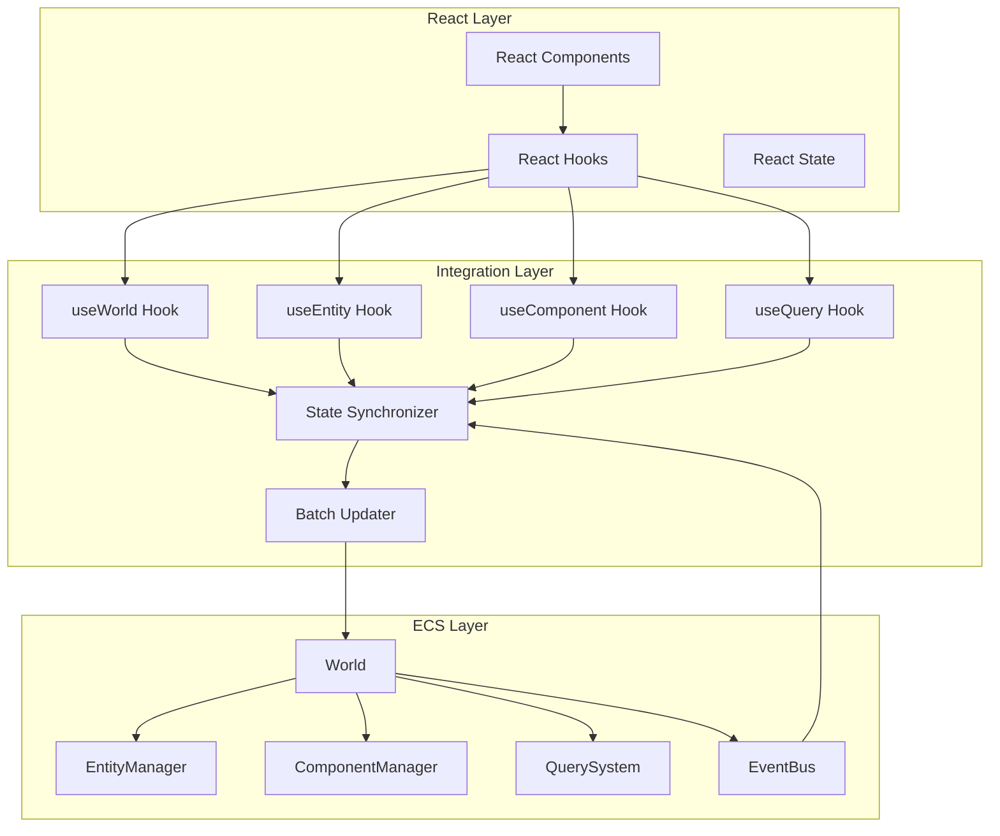

# React統合設計

> [!info] 概要
> ECSアーキテクチャとReactの統合設計、カスタムフック、状態同期、パフォーマンス最適化の詳細を説明します。

## 🎯 設計目標

### 統合要件
- **シームレス統合**: ECSとReactの自然な連携
- **状態同期**: ECS状態とReact状態の効率的な同期
- **パフォーマンス**: 不要な再レンダリングの最小化
- **開発体験**: 直感的で使いやすいAPI

### 技術要件
- **型安全性**: TypeScriptによる完全な型安全性
- **リアクティブ**: ECS変更の自動的なUI反映
- **メモリ効率**: メモリリークの防止
- **テスタビリティ**: 単体テスト可能な設計

## 🏗️ アーキテクチャ設計

### 統合アーキテクチャ概要



### 主要コンポーネント設計

```typescript
// React統合の中核となるコンテキスト
export interface ECSContext {
  world: World;
  eventBus: EventBus;
  stateSynchronizer: StateSynchronizer;
  batchUpdater: BatchUpdater;
}

// React統合プロバイダー
export const ECSProvider: React.FC<{
  children: React.ReactNode;
  world?: World;
  eventBus?: EventBus;
}> = ({ children, world, eventBus }) => {
  const ecsContext = useECSContext(world, eventBus);
  
  return (
    <ECSContextProvider value={ecsContext}>
      {children}
    </ECSContextProvider>
  );
};
```

## 🎣 useWorld フック設計

### 基本実装

```typescript
export interface UseWorldOptions {
  // 自動同期設定
  autoSync?: boolean;
  syncInterval?: number;
  
  // バッチ更新設定
  enableBatching?: boolean;
  batchDelay?: number;
  
  // パフォーマンス設定
  enableMemoization?: boolean;
  memoizationTTL?: number;
  
  // デバッグ設定
  enableDebug?: boolean;
  debugLevel?: 'info' | 'warn' | 'error';
}

export interface UseWorldResult {
  // World インスタンス
  world: World;
  
  // 基本統計
  stats: WorldStats;
  version: number;
  
  // エンティティ操作
  entities: EntityId[];
  createEntity: () => EntityId;
  destroyEntity: (entityId: EntityId) => boolean;
  
  // コンポーネント操作
  addComponent: <T extends IComponent>(entityId: EntityId, component: T) => void;
  removeComponent: (entityId: EntityId, componentType: ComponentType) => boolean;
  getComponent: <T extends IComponent>(entityId: EntityId, componentType: ComponentType) => T | undefined;
  
  // クエリ操作
  query: (filter: QueryFilter) => EntityId[];
  queryBuilder: () => QueryBuilder;
  
  // バッチ操作
  batchUpdate: (operations: () => void) => void;
  
  // 状態管理
  isLoading: boolean;
  error: Error | null;
  
  // パフォーマンス
  performanceStats: PerformanceStats;
}

export const useWorld = (options: UseWorldOptions = {}): UseWorldResult => {
  const ecsContext = useContext(ECSContextProvider);
  if (!ecsContext) {
    throw new Error('useWorld must be used within ECSProvider');
  }

  const { world, eventBus, stateSynchronizer, batchUpdater } = ecsContext;
  
  // 状態管理
  const [entities, setEntities] = useState<EntityId[]>([]);
  const [version, setVersion] = useState(0);
  const [stats, setStats] = useState<WorldStats>(() => world.getPerformanceStats());
  const [isLoading, setIsLoading] = useState(false);
  const [error, setError] = useState<Error | null>(null);

  // 自動同期設定
  const syncIntervalRef = useRef<NodeJS.Timeout | null>(null);
  
  useEffect(() => {
    if (options.autoSync !== false) {
      const interval = options.syncInterval || 100;
      
      syncIntervalRef.current = setInterval(() => {
        syncWithWorld();
      }, interval);
      
      return () => {
        if (syncIntervalRef.current) {
          clearInterval(syncIntervalRef.current);
        }
      };
    }
  }, [options.autoSync, options.syncInterval]);

  // World同期
  const syncWithWorld = useCallback(() => {
    try {
      const currentVersion = world.getVersion();
      if (currentVersion !== version) {
        setEntities(world.getAllEntities());
        setVersion(currentVersion);
        setStats(world.getPerformanceStats());
      }
    } catch (err) {
      setError(err instanceof Error ? err : new Error(String(err)));
    }
  }, [world, version]);

  // イベントリスナー設定
  useEffect(() => {
    const unsubscribers: (() => void)[] = [];

    // エンティティ変更イベント
    unsubscribers.push(
      eventBus.on(LifecycleEvents.AFTER_CREATE, () => {
        if (options.autoSync !== false) {
          syncWithWorld();
        }
      })
    );

    unsubscribers.push(
      eventBus.on(LifecycleEvents.AFTER_DESTROY, () => {
        if (options.autoSync !== false) {
          syncWithWorld();
        }
      })
    );

    // コンポーネント変更イベント
    unsubscribers.push(
      eventBus.on(LifecycleEvents.COMPONENT_ADDED, () => {
        if (options.autoSync !== false) {
          syncWithWorld();
        }
      })
    );

    unsubscribers.push(
      eventBus.on(LifecycleEvents.COMPONENT_REMOVED, () => {
        if (options.autoSync !== false) {
          syncWithWorld();
        }
      })
    );

    return () => {
      unsubscribers.forEach(unsubscribe => unsubscribe());
    };
  }, [eventBus, syncWithWorld, options.autoSync]);

  // エンティティ操作
  const createEntity = useCallback(() => {
    setIsLoading(true);
    try {
      const entityId = world.createEntity();
      if (options.autoSync === false) {
        syncWithWorld();
      }
      return entityId;
    } catch (err) {
      setError(err instanceof Error ? err : new Error(String(err)));
      throw err;
    } finally {
      setIsLoading(false);
    }
  }, [world, syncWithWorld, options.autoSync]);

  const destroyEntity = useCallback((entityId: EntityId) => {
    setIsLoading(true);
    try {
      const result = world.destroyEntity(entityId);
      if (options.autoSync === false) {
        syncWithWorld();
      }
      return result;
    } catch (err) {
      setError(err instanceof Error ? err : new Error(String(err)));
      return false;
    } finally {
      setIsLoading(false);
    }
  }, [world, syncWithWorld, options.autoSync]);

  // コンポーネント操作
  const addComponent = useCallback(<T extends IComponent>(entityId: EntityId, component: T) => {
    setIsLoading(true);
    try {
      world.addComponent(entityId, component);
      if (options.autoSync === false) {
        syncWithWorld();
      }
    } catch (err) {
      setError(err instanceof Error ? err : new Error(String(err)));
      throw err;
    } finally {
      setIsLoading(false);
    }
  }, [world, syncWithWorld, options.autoSync]);

  const removeComponent = useCallback((entityId: EntityId, componentType: ComponentType) => {
    setIsLoading(true);
    try {
      const result = world.removeComponent(entityId, componentType);
      if (options.autoSync === false) {
        syncWithWorld();
      }
      return result;
    } catch (err) {
      setError(err instanceof Error ? err : new Error(String(err)));
      return false;
    } finally {
      setIsLoading(false);
    }
  }, [world, syncWithWorld, options.autoSync]);

  const getComponent = useCallback(<T extends IComponent>(entityId: EntityId, componentType: ComponentType): T | undefined => {
    try {
      return world.getComponent<T>(entityId, componentType);
    } catch (err) {
      setError(err instanceof Error ? err : new Error(String(err)));
      return undefined;
    }
  }, [world]);

  // クエリ操作
  const query = useCallback((filter: QueryFilter) => {
    try {
      return world.getEntitiesWithComponents(...(filter.all || []));
    } catch (err) {
      setError(err instanceof Error ? err : new Error(String(err)));
      return [];
    }
  }, [world]);

  const queryBuilder = useCallback(() => {
    return new QueryBuilder();
  }, []);

  // バッチ操作
  const batchUpdate = useCallback((operations: () => void) => {
    if (options.enableBatching !== false) {
      batchUpdater.batch(operations);
    } else {
      operations();
    }
    
    if (options.autoSync === false) {
      syncWithWorld();
    }
  }, [batchUpdater, syncWithWorld, options.enableBatching, options.autoSync]);

  // 初期同期
  useEffect(() => {
    syncWithWorld();
  }, []);

  return {
    world,
    stats,
    version,
    entities,
    createEntity,
    destroyEntity,
    addComponent,
    removeComponent,
    getComponent,
    query,
    queryBuilder,
    batchUpdate,
    isLoading,
    error,
    performanceStats: stats
  };
};

interface WorldStats {
  entityCount: number;
  componentCount: number;
  systemCount: number;
  version: number;
  memoryUsage: number;
}
```

## 🔍 useEntity フック設計

### 個別エンティティ管理

```typescript
export interface UseEntityOptions {
  // 自動同期
  autoSync?: boolean;
  
  // コンポーネントフィルター
  watchComponents?: ComponentType[];
  
  // パフォーマンス
  enableMemoization?: boolean;
}

export interface UseEntityResult {
  // エンティティ情報
  entityId: EntityId;
  exists: boolean;
  
  // コンポーネント管理
  components: Map<ComponentType, IComponent>;
  hasComponent: (componentType: ComponentType) => boolean;
  getComponent: <T extends IComponent>(componentType: ComponentType) => T | undefined;
  addComponent: <T extends IComponent>(component: T) => void;
  removeComponent: (componentType: ComponentType) => boolean;
  
  // 状態
  isLoading: boolean;
  error: Error | null;
}

export const useEntity = (entityId: EntityId, options: UseEntityOptions = {}): UseEntityResult => {
  const { world, eventBus } = useContext(ECSContextProvider);
  
  const [components, setComponents] = useState<Map<ComponentType, IComponent>>(new Map());
  const [exists, setExists] = useState(false);
  const [isLoading, setIsLoading] = useState(false);
  const [error, setError] = useState<Error | null>(null);

  // エンティティ同期
  const syncEntity = useCallback(() => {
    try {
      const entityExists = world.hasEntity(entityId);
      setExists(entityExists);
      
      if (entityExists) {
        const entityComponents = new Map<ComponentType, IComponent>();
        
        Object.values(ComponentTypes).forEach(componentType => {
          if (world.hasComponent(entityId, componentType)) {
            const component = world.getComponent(entityId, componentType);
            if (component) {
              entityComponents.set(componentType, component);
            }
          }
        });
        
        setComponents(entityComponents);
      } else {
        setComponents(new Map());
      }
    } catch (err) {
      setError(err instanceof Error ? err : new Error(String(err)));
    }
  }, [world, entityId]);

  // イベントリスナー設定
  useEffect(() => {
    if (options.autoSync !== false) {
      const unsubscribers: (() => void)[] = [];

      // エンティティ固有のイベントをフィルタリング
      unsubscribers.push(
        eventBus.on(LifecycleEvents.AFTER_DESTROY, (data) => {
          if (data.entityId === entityId) {
            syncEntity();
          }
        })
      );

      unsubscribers.push(
        eventBus.on(LifecycleEvents.COMPONENT_ADDED, (data) => {
          if (data.entityId === entityId) {
            if (!options.watchComponents || options.watchComponents.includes(data.componentType)) {
              syncEntity();
            }
          }
        })
      );

      unsubscribers.push(
        eventBus.on(LifecycleEvents.COMPONENT_REMOVED, (data) => {
          if (data.entityId === entityId) {
            if (!options.watchComponents || options.watchComponents.includes(data.componentType)) {
              syncEntity();
            }
          }
        })
      );

      return () => {
        unsubscribers.forEach(unsubscribe => unsubscribe());
      };
    }
  }, [eventBus, entityId, syncEntity, options.autoSync, options.watchComponents]);

  // コンポーネント操作
  const hasComponent = useCallback((componentType: ComponentType) => {
    return components.has(componentType);
  }, [components]);

  const getComponent = useCallback(<T extends IComponent>(componentType: ComponentType): T | undefined => {
    return components.get(componentType) as T | undefined;
  }, [components]);

  const addComponent = useCallback(<T extends IComponent>(component: T) => {
    setIsLoading(true);
    try {
      world.addComponent(entityId, component);
      if (options.autoSync === false) {
        syncEntity();
      }
    } catch (err) {
      setError(err instanceof Error ? err : new Error(String(err)));
      throw err;
    } finally {
      setIsLoading(false);
    }
  }, [world, entityId, syncEntity, options.autoSync]);

  const removeComponent = useCallback((componentType: ComponentType) => {
    setIsLoading(true);
    try {
      const result = world.removeComponent(entityId, componentType);
      if (options.autoSync === false) {
        syncEntity();
      }
      return result;
    } catch (err) {
      setError(err instanceof Error ? err : new Error(String(err)));
      return false;
    } finally {
      setIsLoading(false);
    }
  }, [world, entityId, syncEntity, options.autoSync]);

  // 初期同期
  useEffect(() => {
    syncEntity();
  }, [syncEntity]);

  return {
    entityId,
    exists,
    components,
    hasComponent,
    getComponent,
    addComponent,
    removeComponent,
    isLoading,
    error
  };
};
```

## 🧩 useComponent フック設計

### コンポーネント特化管理

```typescript
export interface UseComponentOptions<T extends IComponent> {
  // デフォルト値
  defaultValue?: Partial<T>;
  
  // 自動作成
  autoCreate?: boolean;
  
  // 変更検知
  deepWatch?: boolean;
  
  // バリデーション
  validator?: (component: T) => boolean;
}

export interface UseComponentResult<T extends IComponent> {
  // コンポーネント値
  component: T | undefined;
  exists: boolean;
  
  // 操作
  update: (updates: Partial<T>) => void;
  replace: (newComponent: T) => void;
  remove: () => boolean;
  
  // 状態
  isLoading: boolean;
  error: Error | null;
}

export const useComponent = <T extends IComponent>(
  entityId: EntityId,
  componentType: ComponentType,
  options: UseComponentOptions<T> = {}
): UseComponentResult<T> => {
  const { world, eventBus } = useContext(ECSContextProvider);
  
  const [component, setComponent] = useState<T | undefined>(undefined);
  const [exists, setExists] = useState(false);
  const [isLoading, setIsLoading] = useState(false);
  const [error, setError] = useState<Error | null>(null);

  // コンポーネント同期
  const syncComponent = useCallback(() => {
    try {
      const currentComponent = world.getComponent<T>(entityId, componentType);
      setComponent(currentComponent);
      setExists(!!currentComponent);
      
      // 自動作成
      if (!currentComponent && options.autoCreate && options.defaultValue) {
        const newComponent = { type: componentType, ...options.defaultValue } as T;
        world.addComponent(entityId, newComponent);
        setComponent(newComponent);
        setExists(true);
      }
    } catch (err) {
      setError(err instanceof Error ? err : new Error(String(err)));
    }
  }, [world, entityId, componentType, options.autoCreate, options.defaultValue]);

  // イベントリスナー設定
  useEffect(() => {
    const unsubscribers: (() => void)[] = [];

    unsubscribers.push(
      eventBus.on(LifecycleEvents.COMPONENT_ADDED, (data) => {
        if (data.entityId === entityId && data.componentType === componentType) {
          syncComponent();
        }
      })
    );

    unsubscribers.push(
      eventBus.on(LifecycleEvents.COMPONENT_REMOVED, (data) => {
        if (data.entityId === entityId && data.componentType === componentType) {
          syncComponent();
        }
      })
    );

    return () => {
      unsubscribers.forEach(unsubscribe => unsubscribe());
    };
  }, [eventBus, entityId, componentType, syncComponent]);

  // コンポーネント操作
  const update = useCallback((updates: Partial<T>) => {
    if (!component) return;
    
    setIsLoading(true);
    try {
      const updatedComponent = { ...component, ...updates };
      
      // バリデーション
      if (options.validator && !options.validator(updatedComponent)) {
        throw new Error('Component validation failed');
      }
      
      world.removeComponent(entityId, componentType);
      world.addComponent(entityId, updatedComponent);
      
      setComponent(updatedComponent);
    } catch (err) {
      setError(err instanceof Error ? err : new Error(String(err)));
      throw err;
    } finally {
      setIsLoading(false);
    }
  }, [component, world, entityId, componentType, options.validator]);

  const replace = useCallback((newComponent: T) => {
    setIsLoading(true);
    try {
      // バリデーション
      if (options.validator && !options.validator(newComponent)) {
        throw new Error('Component validation failed');
      }
      
      if (exists) {
        world.removeComponent(entityId, componentType);
      }
      world.addComponent(entityId, newComponent);
      
      setComponent(newComponent);
      setExists(true);
    } catch (err) {
      setError(err instanceof Error ? err : new Error(String(err)));
      throw err;
    } finally {
      setIsLoading(false);
    }
  }, [world, entityId, componentType, exists, options.validator]);

  const remove = useCallback(() => {
    setIsLoading(true);
    try {
      const result = world.removeComponent(entityId, componentType);
      if (result) {
        setComponent(undefined);
        setExists(false);
      }
      return result;
    } catch (err) {
      setError(err instanceof Error ? err : new Error(String(err)));
      return false;
    } finally {
      setIsLoading(false);
    }
  }, [world, entityId, componentType]);

  // 初期同期
  useEffect(() => {
    syncComponent();
  }, [syncComponent]);

  return {
    component,
    exists,
    update,
    replace,
    remove,
    isLoading,
    error
  };
};
```

## 🔍 useQuery フック設計

### リアクティブクエリ

```typescript
export interface UseQueryOptions {
  // 自動更新
  autoUpdate?: boolean;
  updateInterval?: number;
  
  // キャッシュ
  enableCache?: boolean;
  cacheKey?: string;
  
  // パフォーマンス
  debounceMs?: number;
  throttleMs?: number;
  
  // ページネーション
  pagination?: {
    page: number;
    pageSize: number;
  };
}

export interface UseQueryResult {
  // 結果
  entities: EntityId[];
  totalCount: number;
  
  // 状態
  isLoading: boolean;
  error: Error | null;
  
  // 操作
  refetch: () => void;
  
  // メタデータ
  executionTime: number;
  fromCache: boolean;
}

export const useQuery = (filter: QueryFilter, options: UseQueryOptions = {}): UseQueryResult => {
  const { world, eventBus } = useContext(ECSContextProvider);
  
  const [entities, setEntities] = useState<EntityId[]>([]);
  const [totalCount, setTotalCount] = useState(0);
  const [isLoading, setIsLoading] = useState(false);
  const [error, setError] = useState<Error | null>(null);
  const [executionTime, setExecutionTime] = useState(0);
  const [fromCache, setFromCache] = useState(false);

  // クエリ実行
  const executeQuery = useCallback(async () => {
    setIsLoading(true);
    setError(null);
    
    try {
      const startTime = performance.now();
      
      // 基本的なクエリ実行（QuerySystemが実装されたら置き換え）
      let result: EntityId[] = [];
      
      if (filter.all) {
        result = world.getEntitiesWithComponents(...filter.all);
      } else {
        result = world.getAllEntities();
      }
      
      // フィルタリング
      if (filter.none) {
        result = result.filter(entityId => 
          !filter.none!.some(componentType => world.hasComponent(entityId, componentType))
        );
      }
      
      if (filter.any) {
        result = result.filter(entityId =>
          filter.any!.some(componentType => world.hasComponent(entityId, componentType))
        );
      }
      
      // カスタム条件
      if (filter.where) {
        result = result.filter(entityId => {
          const components = new Map<ComponentType, IComponent>();
          Object.values(ComponentTypes).forEach(componentType => {
            const component = world.getComponent(entityId, componentType);
            if (component) {
              components.set(componentType, component);
            }
          });
          return filter.where!(entityId, components);
        });
      }
      
      // ページネーション
      if (options.pagination) {
        const { page, pageSize } = options.pagination;
        const startIndex = page * pageSize;
        const endIndex = startIndex + pageSize;
        result = result.slice(startIndex, endIndex);
      }
      
      // 制限
      if (filter.limit) {
        result = result.slice(0, filter.limit);
      }
      
      const endTime = performance.now();
      
      setEntities(result);
      setTotalCount(result.length);
      setExecutionTime(endTime - startTime);
      setFromCache(false);
      
    } catch (err) {
      setError(err instanceof Error ? err : new Error(String(err)));
    } finally {
      setIsLoading(false);
    }
  }, [world, filter, options.pagination]);

  // デバウンス/スロットル処理
  const debouncedExecuteQuery = useMemo(() => {
    if (options.debounceMs) {
      return debounce(executeQuery, options.debounceMs);
    }
    if (options.throttleMs) {
      return throttle(executeQuery, options.throttleMs);
    }
    return executeQuery;
  }, [executeQuery, options.debounceMs, options.throttleMs]);

  // 自動更新
  useEffect(() => {
    if (options.autoUpdate !== false) {
      const interval = options.updateInterval || 1000;
      
      const intervalId = setInterval(() => {
        debouncedExecuteQuery();
      }, interval);
      
      return () => clearInterval(intervalId);
    }
  }, [debouncedExecuteQuery, options.autoUpdate, options.updateInterval]);

  // イベントリスナー設定
  useEffect(() => {
    if (options.autoUpdate !== false) {
      const unsubscribers: (() => void)[] = [];

      // 関連するイベントでクエリを再実行
      unsubscribers.push(
        eventBus.on(LifecycleEvents.AFTER_CREATE, () => {
          debouncedExecuteQuery();
        })
      );

      unsubscribers.push(
        eventBus.on(LifecycleEvents.AFTER_DESTROY, () => {
          debouncedExecuteQuery();
        })
      );

      unsubscribers.push(
        eventBus.on(LifecycleEvents.COMPONENT_ADDED, () => {
          debouncedExecuteQuery();
        })
      );

      unsubscribers.push(
        eventBus.on(LifecycleEvents.COMPONENT_REMOVED, () => {
          debouncedExecuteQuery();
        })
      );

      return () => {
        unsubscribers.forEach(unsubscribe => unsubscribe());
      };
    }
  }, [eventBus, debouncedExecuteQuery, options.autoUpdate]);

  // 初期実行
  useEffect(() => {
    debouncedExecuteQuery();
  }, []);

  return {
    entities,
    totalCount,
    isLoading,
    error,
    refetch: executeQuery,
    executionTime,
    fromCache
  };
};

// ユーティリティ関数
function debounce<T extends (...args: any[]) => any>(func: T, wait: number): T {
  let timeout: NodeJS.Timeout;
  return ((...args: any[]) => {
    clearTimeout(timeout);
    timeout = setTimeout(() => func(...args), wait);
  }) as T;
}

function throttle<T extends (...args: any[]) => any>(func: T, limit: number): T {
  let inThrottle: boolean;
  return ((...args: any[]) => {
    if (!inThrottle) {
      func(...args);
      inThrottle = true;
      setTimeout(() => inThrottle = false, limit);
    }
  }) as T;
}
```

## 🔄 状態同期システム設計

### StateSynchronizer実装

```typescript
export class StateSynchronizer {
  private world: World;
  private eventBus: EventBus;
  private subscribers: Map<string, SyncSubscriber>;
  private syncQueue: SyncOperation[];
  private isProcessing: boolean;

  constructor(world: World, eventBus: EventBus) {
    this.world = world;
    this.eventBus = eventBus;
    this.subscribers = new Map();
    this.syncQueue = [];
    this.isProcessing = false;

    this.setupEventListeners();
  }

  // 同期購読者登録
  subscribe(key: string, subscriber: SyncSubscriber): () => void {
    this.subscribers.set(key, subscriber);
    
    return () => {
      this.subscribers.delete(key);
    };
  }

  // 同期操作をキューに追加
  enqueueSyncOperation(operation: SyncOperation): void {
    this.syncQueue.push(operation);
    this.processSyncQueue();
  }

  // 同期キュー処理
  private async processSyncQueue(): Promise<void> {
    if (this.isProcessing || this.syncQueue.length === 0) {
      return;
    }

    this.isProcessing = true;

    try {
      while (this.syncQueue.length > 0) {
        const operation = this.syncQueue.shift()!;
        await this.processSyncOperation(operation);
      }
    } finally {
      this.isProcessing = false;
    }
  }

  // 個別同期操作処理
  private async processSyncOperation(operation: SyncOperation): Promise<void> {
    try {
      switch (operation.type) {
        case 'entity-created':
          this.notifySubscribers('entity-created', operation.data);
          break;
        case 'entity-destroyed':
          this.notifySubscribers('entity-destroyed', operation.data);
          break;
        case 'component-added':
          this.notifySubscribers('component-added', operation.data);
          break;
        case 'component-removed':
          this.notifySubscribers('component-removed', operation.data);
          break;
        case 'component-updated':
          this.notifySubscribers('component-updated', operation.data);
          break;
      }
    } catch (error) {
      console.error('Sync operation failed:', error);
    }
  }

  // 購読者への通知
  private notifySubscribers(eventType: string, data: any): void {
    this.subscribers.forEach((subscriber, key) => {
      try {
        if (subscriber.eventTypes.includes(eventType)) {
          subscriber.callback(eventType, data);
        }
      } catch (error) {
        console.error(`Subscriber ${key} failed to handle ${eventType}:`, error);
      }
    });
  }

  // イベントリスナー設定
  private setupEventListeners(): void {
    this.eventBus.on(LifecycleEvents.AFTER_CREATE, (data) => {
      this.enqueueSyncOperation({
        type: 'entity-created',
        data,
        timestamp: Date.now()
      });
    });

    this.eventBus.on(LifecycleEvents.AFTER_DESTROY, (data) => {
      this.enqueueSyncOperation({
        type: 'entity-destroyed',
        data,
        timestamp: Date.now()
      });
    });

    this.eventBus.on(LifecycleEvents.COMPONENT_ADDED, (data) => {
      this.enqueueSyncOperation({
        type: 'component-added',
        data,
        timestamp: Date.now()
      });
    });

    this.eventBus.on(LifecycleEvents.COMPONENT_REMOVED, (data) => {
      this.enqueueSyncOperation({
        type: 'component-removed',
        data,
        timestamp: Date.now()
      });
    });
  }

  // 統計情報取得
  getStats(): SyncStats {
    return {
      subscriberCount: this.subscribers.size,
      queueLength: this.syncQueue.length,
      isProcessing: this.isProcessing
    };
  }
}

interface SyncSubscriber {
  eventTypes: string[];
  callback: (eventType: string, data: any) => void;
}

interface SyncOperation {
  type: 'entity-created' | 'entity-destroyed' | 'component-added' | 'component-removed' | 'component-updated';
  data: any;
  timestamp: number;
}

interface SyncStats {
  subscriberCount: number;
  queueLength: number;
  isProcessing: boolean;
}
```

## 📦 バッチ更新システム設計

### BatchUpdater実装

```typescript
export class BatchUpdater {
  private world: World;
  private batchQueue: BatchOperation[];
  private batchTimeout: NodeJS.Timeout | null;
  private batchDelay: number;
  private maxBatchSize: number;

  constructor(world: World, options: BatchUpdaterOptions = {}) {
    this.world = world;
    this.batchQueue = [];
    this.batchTimeout = null;
    this.batchDelay = options.batchDelay || 16; // ~60fps
    this.maxBatchSize = options.maxBatchSize || 100;
  }

  // バッチ操作追加
  batch(operation: () => void): void {
    this.batchQueue.push({
      operation,
      timestamp: Date.now()
    });

    this.scheduleBatchExecution();
  }

  // バッチ実行スケジュール
  private scheduleBatchExecution(): void {
    // 既存のタイマーをクリア
    if (this.batchTimeout) {
      clearTimeout(this.batchTimeout);
    }

    // 最大バッチサイズに達した場合は即座に実行
    if (this.batchQueue.length >= this.maxBatchSize) {
      this.executeBatch();
      return;
    }

    // 遅延実行をスケジュール
    this.batchTimeout = setTimeout(() => {
      this.executeBatch();
    }, this.batchDelay);
  }

  // バッチ実行
  private executeBatch(): void {
    if (this.batchQueue.length === 0) {
      return;
    }

    const operations = [...this.batchQueue];
    this.batchQueue = [];
    this.batchTimeout = null;

    // World のバッチ更新機能を使用
    this.world.batchUpdate(() => {
      operations.forEach(({ operation }) => {
        try {
          operation();
        } catch (error) {
          console.error('Batch operation failed:', error);
        }
      });
    });
  }

  // 強制実行
  flush(): void {
    if (this.batchTimeout) {
      clearTimeout(this.batchTimeout);
      this.batchTimeout = null;
    }
    this.executeBatch();
  }

  // 統計情報取得
  getStats(): BatchStats {
    return {
      queueLength: this.batchQueue.length,
      batchDelay: this.batchDelay,
      maxBatchSize: this.maxBatchSize,
      hasPendingBatch: this.batchTimeout !== null
    };
  }
}

interface BatchOperation {
  operation: () => void;
  timestamp: number;
}

interface BatchUpdaterOptions {
  batchDelay?: number;
  maxBatchSize?: number;
}

interface BatchStats {
  queueLength: number;
  batchDelay: number;
  maxBatchSize: number;
  hasPendingBatch: boolean;
}
```

## 🎨 高レベルコンポーネント設計

### EntityRenderer コンポーネント

```typescript
export interface EntityRendererProps {
  entityId: EntityId;
  children: (entity: UseEntityResult) => React.ReactNode;
  fallback?: React.ReactNode;
  errorBoundary?: React.ComponentType<{ error: Error; entityId: EntityId }>;
}

export const EntityRenderer: React.FC<EntityRendererProps> = ({
  entityId,
  children,
  fallback,
  errorBoundary: ErrorBoundary
}) => {
  const entity = useEntity(entityId);

  if (entity.error && ErrorBoundary) {
    return <ErrorBoundary error={entity.error} entityId={entityId} />;
  }

  if (entity.isLoading) {
    return <>{fallback || <div>Loading entity...</div>}</>;
  }

  if (!entity.exists) {
    return <>{fallback || <div>Entity not found</div>}</>;
  }

  return <>{children(entity)}</>;
};
```

### QueryRenderer コンポーネント

```typescript
export interface QueryRendererProps {
  filter: QueryFilter;
  children: (result: UseQueryResult) => React.ReactNode;
  fallback?: React.ReactNode;
  emptyState?: React.ReactNode;
  errorBoundary?: React.ComponentType<{ error: Error; filter: QueryFilter }>;
  options?: UseQueryOptions;
}

export const QueryRenderer: React.FC<QueryRendererProps> = ({
  filter,
  children,
  fallback,
  emptyState,
  errorBoundary: ErrorBoundary,
  options
}) => {
  const queryResult = useQuery(filter, options);

  if (queryResult.error && ErrorBoundary) {
    return <ErrorBoundary error={queryResult.error} filter={filter} />;
  }

  if (queryResult.isLoading) {
    return <>{fallback || <div>Loading...</div>}</>;
  }

  if (queryResult.entities.length === 0) {
    return <>{emptyState || <div>No entities found</div>}</>;
  }

  return <>{children(queryResult)}</>;
};
```

## 🧪 テスト戦略

### フックのテスト

```typescript
// useWorld フックのテスト例
describe('useWorld', () => {
  let world: World;
  let eventBus: EventBus;

  beforeEach(() => {
    eventBus = new EventBusImpl();
    world = new World(eventBus);
  });

  it('should provide world instance and basic operations', () => {
    const { result } = renderHook(() => useWorld(), {
      wrapper: ({ children }) => (
        <ECSProvider world={world} eventBus={eventBus}>
          {children}
        </ECSProvider>
      )
    });

    expect(result.current.world).toBe(world);
    expect(typeof result.current.createEntity).toBe('function');
    expect(typeof result.current.destroyEntity).toBe('function');
  });

  it('should sync with world changes', async () => {
    const { result } = renderHook(() => useWorld({ autoSync: true }), {
      wrapper: ({ children }) => (
        <ECSProvider world={world} eventBus={eventBus}>
          {children}
        </ECSProvider>
      )
    });

    const initialEntityCount = result.current.entities.length;

    act(() => {
      result.current.createEntity();
    });

    await waitFor(() => {
      expect(result.current.entities.length).toBe(initialEntityCount + 1);
    });
  });
});
```

## 📊 パフォーマンス最適化

### メモ化戦略

```typescript
// コンポーネントのメモ化
export const MemoizedEntityRenderer = React.memo(EntityRenderer, (prevProps, nextProps) => {
  return prevProps.entityId === nextProps.entityId;
});

// フックの結果メモ化
export const useMemoizedQuery = (filter: QueryFilter, options: UseQueryOptions = {}) => {
  const queryResult = useQuery(filter, options);
  
  return useMemo(() => queryResult, [
    queryResult.entities.length,
    queryResult.totalCount,
    queryResult.isLoading,
    queryResult.error
  ]);
};
```

### 仮想化対応

```typescript
export interface VirtualizedEntityListProps {
  entities: EntityId[];
  itemHeight: number;
  containerHeight: number;
  renderItem: (entityId: EntityId, index: number) => React.ReactNode;
}

export const VirtualizedEntityList: React.FC<VirtualizedEntityListProps> = ({
  entities,
  itemHeight,
  containerHeight,
  renderItem
}) => {
  const [scrollTop, setScrollTop] = useState(0);
  
  const visibleStart = Math.floor(scrollTop / itemHeight);
  const visibleEnd = Math.min(
    visibleStart + Math.ceil(containerHeight / itemHeight) + 1,
    entities.length
  );
  
  const visibleEntities = entities.slice(visibleStart, visibleEnd);
  
  return (
    <div
      style={{ height: containerHeight, overflow: 'auto' }}
      onScroll={(e) => setScrollTop(e.currentTarget.scrollTop)}
    >
      <div style={{ height: entities.length * itemHeight, position: 'relative' }}>
        {visibleEntities.map((entityId, index) => (
          <div
            key={entityId}
            style={{
              position: 'absolute',
              top: (visibleStart + index) * itemHeight,
              height: itemHeight,
              width: '100%'
            }}
          >
            {renderItem(entityId, visibleStart + index)}
          </div>
        ))}
      </div>
    </div>
  );
};
```

## 関連文書

> [!info] 関連設計文書
> - [[world|World設計]]
> - [[query-system|QuerySystem設計]]
> - [[performance-monitor|PerformanceMonitor設計]]

> [!note] API仕様書
> - [[../../../api/react-integration|React統合 API仕様]]