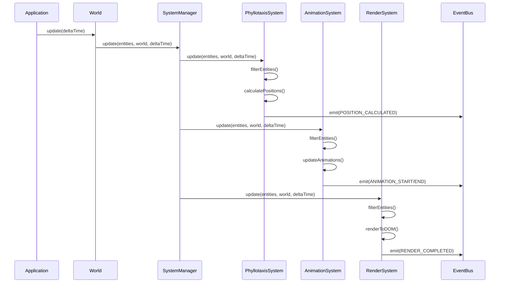
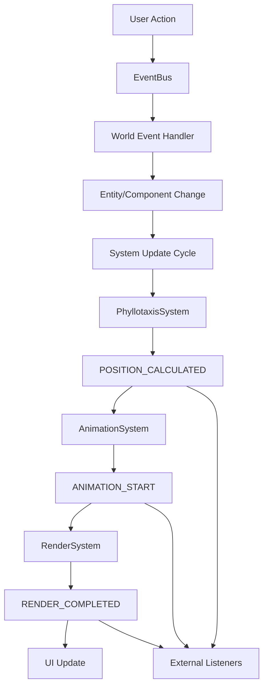

# ECSシステム設計

> [!info] 概要
> Phyllotaxis PlannerのECSアーキテクチャにおけるシステム設計の詳細を説明します。

## システム実行フロー設計

### 🔄 実行サイクル概要



### 🎯 システム設計原則

> [!warning] ステートレス設計
> システムはロジックのみを実装し、状態やデータは一切持たない

```typescript
// ✅ 正しいシステム設計
class PhyllotaxisSystem extends BaseSystem {
  readonly name = 'PhyllotaxisSystem';
  readonly requiredComponents = [ComponentTypes.POSITION, ComponentTypes.TEXT];
  
  constructor(
    private config: PhyllotaxisConfig,
    private eventBus: EventBus,
    priority: number = 1
  ) {
    super(priority);
  }
  
  update(entities: EntityId[], world: IWorld, deltaTime: number): void {
    // 1. エンティティフィルタリング
    const processableEntities = this.filterEntities(entities, world);
    
    // 2. ロジック実行
    this.processEntities(processableEntities, world);
    
    // 3. イベント発火
    this.emitEvents(processableEntities, world);
  }
}

// ❌ 間違ったシステム設計
class BadSystem {
  private data: any[] = []; // 状態を持ってはいけない
  private cache: Map<string, any> = new Map(); // キャッシュも禁止
}
```

### ⚡ システム実行フェーズ

各システムの `update()` メソッドは以下の3フェーズで構成：

#### **Phase 1: エンティティフィルタリング**
```typescript
protected filterEntities(entities: EntityId[], world: IWorld): EntityId[] {
  return entities.filter(entityId => 
    this.requiredComponents.every(type => 
      world.hasComponent(entityId, type)
    )
  );
}
```

#### **Phase 2: ロジック実行**
```typescript
private processEntities(entities: EntityId[], world: IWorld): void {
  entities.forEach((entityId, index) => {
    // コンポーネント取得
    const components = this.getRequiredComponents(entityId, world);
    
    // ビジネスロジック実行
    this.executeBusinessLogic(components, index);
    
    // コンポーネント更新
    this.updateComponents(entityId, world, components);
  });
}
```

#### **Phase 3: イベント発火**
```typescript
private emitEvents(entities: EntityId[], world: IWorld): void {
  // システム処理完了イベント
  this.eventBus.emit(SystemEvents.SYSTEM_PROCESSED, {
    systemName: this.name,
    processedEntities: entities.length,
    timestamp: Date.now()
  });
  
  // 個別エンティティイベント
  entities.forEach(entityId => {
    this.emitEntitySpecificEvents(entityId, world);
  });
}
```

### ⚙️ システム基底インターフェース

```typescript
// ecs/core/System.ts
export interface ISystem {
  readonly name: string;
  readonly requiredComponents: ComponentType[];
  readonly priority: number;
  
  update(entities: EntityId[], world: IWorld, deltaTime: number): void;
}

export abstract class BaseSystem implements ISystem {
  abstract readonly name: string;
  abstract readonly requiredComponents: ComponentType[];
  readonly priority: number;

  constructor(priority: number = 0) {
    this.priority = priority;
  }

  abstract update(entities: EntityId[], world: IWorld, deltaTime: number): void;

  /**
   * 必要なコンポーネントを持つエンティティのみをフィルタリング
   */
  protected filterEntities(entities: EntityId[], world: IWorld): EntityId[] {
    return entities.filter(entityId => 
      this.requiredComponents.every(type => 
        world.hasComponent(entityId, type)
      )
    );
  }
}

// World インターフェース（前方宣言）
export interface IWorld {
  // エンティティ管理
  createEntity(): EntityId;
  destroyEntity(entityId: EntityId): boolean;
  hasEntity(entityId: EntityId): boolean;
  getAllEntities(): EntityId[];
  
  // コンポーネント管理
  hasComponent(entityId: EntityId, type: ComponentType): boolean;
  getComponent<T extends IComponent>(entityId: EntityId, type: ComponentType): T | undefined;
  addComponent<T extends IComponent>(entityId: EntityId, component: T): void;
  removeComponent(entityId: EntityId, type: ComponentType): void;
  
  // バージョン管理
  getVersion?(): number;
}
```

## イベント統合パターン設計

### 📡 イベントフロー概要



### 🔄 システム間イベント連携

#### **イベント発火パターン**

```typescript
// システム内でのイベント発火
class PhyllotaxisSystem extends BaseSystem {
  private emitEvents(entities: EntityId[], world: IWorld): void {
    entities.forEach((entityId, index) => {
      const position = world.getComponent<IPositionComponent>(entityId, ComponentTypes.POSITION);
      
      // 位置計算完了イベント
      this.eventBus.emit(SystemEvents.POSITION_CALCULATED, {
        entityId,
        position: { x: position.x, y: position.y },
        angle: position.angle,
        radius: position.radius,
        index
      });
    });
  }
}
```

#### **イベント受信パターン**

```typescript
// システム初期化時にイベントリスナー登録
class AnimationSystem extends BaseSystem {
  constructor(eventBus: EventBus) {
    super(2);
    this.eventBus = eventBus;
    
    // 位置計算完了時にアニメーション開始
    this.eventBus.on(SystemEvents.POSITION_CALCULATED, (data) => {
      this.startAnimation(data.entityId);
    });
  }
  
  private startAnimation(entityId: EntityId): void {
    // アニメーション開始ロジック
    this.eventBus.emit(SystemEvents.ANIMATION_START, {
      entityId,
      animationType: 'position',
      duration: 500,
      easing: 'ease-out'
    });
  }
}
```

### 🎯 イベント統合戦略

#### **1. システム内イベント**
- システム処理完了の通知
- エンティティ状態変更の通知
- エラー・警告の通知

#### **2. システム間イベント**
- 処理チェーンの連携（Position → Animation → Render）
- 条件付き処理の起動
- 状態同期

#### **3. 外部統合イベント**
- React コンポーネントへの通知
- UI 状態の更新
- ユーザーアクション処理

```typescript
// イベント統合の型安全性
interface SystemEventMap {
  [SystemEvents.POSITION_CALCULATED]: PositionCalculatedEvent;
  [SystemEvents.ANIMATION_START]: AnimationEvent;
  [SystemEvents.ANIMATION_END]: AnimationEvent;
  [SystemEvents.RENDER_COMPLETED]: RenderCompletedEvent;
  [SystemEvents.SYSTEM_ERROR]: SystemErrorEvent;
}

// 型安全なイベント発火
class BaseSystem {
  protected emitSystemEvent<K extends keyof SystemEventMap>(
    event: K,
    data: SystemEventMap[K]
  ): void {
    this.eventBus.emit(event, data);
  }
}
```

## 主要システム設計

### 🌀 PhyllotaxisSystem

> [!note] 責務
> フィロタキシス配置計算とエンティティ位置の更新

```typescript
class PhyllotaxisSystem extends BaseSystem {
  readonly name = 'PhyllotaxisSystem';
  readonly requiredComponents = [ComponentTypes.POSITION, ComponentTypes.TEXT];
  
  private config: PhyllotaxisConfig;
  private eventBus: EventBus;
  
  constructor(config: PhyllotaxisConfig, eventBus: EventBus) {
    super(1); // 高優先度
    this.config = config;
    this.eventBus = eventBus;
  }
  
  update(entities: EntityId[], world: World, deltaTime: number): void {
    const processableEntities = this.filterEntities(entities, world);
    
    // 中心テーマを除外
    const ideaEntities = processableEntities.filter(entityId => {
      const textComp = world.getComponent<ITextComponent>(entityId, ComponentTypes.TEXT);
      return textComp && textComp.fontSize <= 16; // 中心テーマは大きなフォント
    });
    
    ideaEntities.forEach((entityId, index) => {
      const position = world.getComponent<IPositionComponent>(entityId, ComponentTypes.POSITION);
      if (!position) return;
      
      const newPos = this.calculatePhyllotaxisPosition(index);
      
      if (this.hasPositionChanged(position, newPos)) {
        this.updatePosition(position, newPos);
        this.eventBus.emit(SystemEvents.POSITION_CALCULATED, {
          entityId, position: newPos, index
        });
      }
    });
  }
  
  private calculatePhyllotaxisPosition(index: number): Position {
    const angle = index * this.config.goldenAngle * (Math.PI / 180);
    const radius = Math.sqrt(index) * this.config.radiusScale + this.config.minRadius;
    
    return {
      x: this.config.centerX + radius * Math.cos(angle),
      y: this.config.centerY + radius * Math.sin(angle),
      angle: angle * (180 / Math.PI),
      radius
    };
  }
}
```

### 🎬 AnimationSystem

> [!note] 責務
> エンティティのアニメーション状態管理と更新

```typescript
class AnimationSystem extends BaseSystem {
  readonly name = 'AnimationSystem';
  readonly requiredComponents = [ComponentTypes.ANIMATION];
  
  constructor(eventBus: EventBus) {
    super(2); // 中優先度
    this.eventBus = eventBus;
  }
  
  update(entities: EntityId[], world: World, deltaTime: number): void {
    const animatingEntities = this.filterEntities(entities, world)
      .filter(entityId => {
        const animation = world.getComponent<IAnimationComponent>(entityId, ComponentTypes.ANIMATION);
        return animation?.isAnimating;
      });
    
    animatingEntities.forEach(entityId => {
      this.updateAnimation(entityId, world, deltaTime);
    });
  }
  
  private updateAnimation(entityId: EntityId, world: World, deltaTime: number): void {
    const animation = world.getComponent<IAnimationComponent>(entityId, ComponentTypes.ANIMATION);
    if (!animation || !animation.isAnimating) return;
    
    const currentTime = Date.now();
    const elapsed = currentTime - animation.startTime;
    const progress = Math.min(elapsed / animation.duration, 1);
    
    animation.progress = progress;
    
    if (progress >= 1) {
      this.completeAnimation(entityId, animation);
    } else {
      this.applyAnimationEffect(entityId, world, animation);
    }
  }
}
```

### 🎨 RenderSystem

> [!note] 責務
> エンティティのSVG描画とDOM更新

```typescript
class RenderSystem extends BaseSystem {
  readonly name = 'RenderSystem';
  readonly requiredComponents = [ComponentTypes.POSITION, ComponentTypes.VISUAL];
  
  private svgElement: SVGSVGElement;
  private entityElements: Map<EntityId, SVGGElement>;
  
  constructor(svgElement: SVGSVGElement) {
    super(3); // 低優先度（最後に実行）
    this.svgElement = svgElement;
    this.entityElements = new Map();
  }
  
  update(entities: EntityId[], world: World, deltaTime: number): void {
    const renderableEntities = this.filterEntities(entities, world);
    
    renderableEntities.forEach(entityId => {
      this.renderEntity(entityId, world);
    });
    
    this.cleanupRemovedEntities(entities);
  }
  
  private renderEntity(entityId: EntityId, world: World): void {
    const position = world.getComponent<IPositionComponent>(entityId, ComponentTypes.POSITION);
    const visual = world.getComponent<IVisualComponent>(entityId, ComponentTypes.VISUAL);
    
    if (!position || !visual || !visual.visible) return;
    
    let groupElement = this.entityElements.get(entityId);
    
    if (!groupElement) {
      groupElement = this.createEntityElement(entityId, world);
      this.entityElements.set(entityId, groupElement);
      this.svgElement.appendChild(groupElement);
    }
    
    this.updateEntityElement(groupElement, entityId, world);
  }
}
```