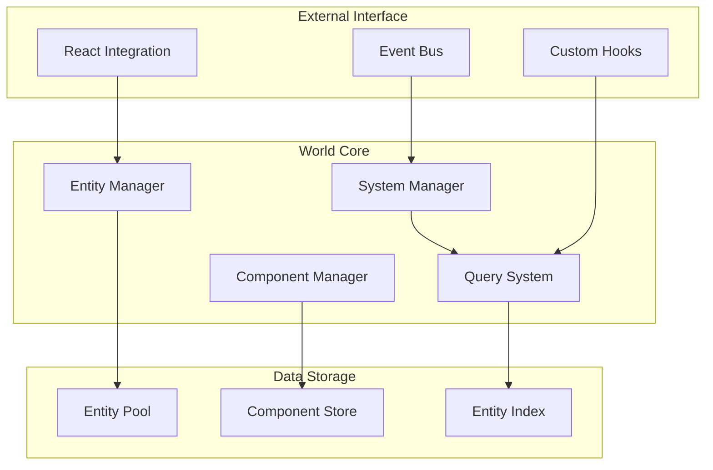

# World設計

> [!info] 概要
> ECSアーキテクチャの中核となるWorldクラスの設計と実装詳細を説明します。

## World概要

### 🌍 基本概念

> [!note] 責務
> ECSの中央管理システム。エンティティ、コンポーネント、システムを統合管理



### 🏗️ アーキテクチャ設計

```typescript
// ecs/core/World.ts
class World {
  // エンティティ管理
  private entityPool: EntityPool;
  private entities: Set<EntityId>;
  
  // コンポーネント管理
  private components: Map<ComponentType, Map<EntityId, IComponent>>;
  private componentIndex: Map<EntityId, Set<ComponentType>>;
  
  // システム管理
  private systems: System[];
  private systemManager: SystemManager;
  
  // クエリシステム
  private entityQuery: EntityQuery;
  
  // イベント統合
  private eventBus: EventBus;
  
  // バージョン管理
  private version: number = 0;
  
  constructor(eventBus: EventBus) {
    this.entityPool = new EntityPool();
    this.entities = new Set();
    this.components = new Map();
    this.componentIndex = new Map();
    this.systems = [];
    this.systemManager = new SystemManager();
    this.entityQuery = new EntityQuery(this);
    this.eventBus = eventBus;
    
    this.initializeComponentStorage();
    this.setupEventListeners();
  }
}
```

## エンティティ管理

### 🆔 エンティティライフサイクル

```typescript
class World {
  // エンティティ作成
  createEntity(): EntityId {
    const entityId = this.entityPool.acquire();
    this.entities.add(entityId);
    this.componentIndex.set(entityId, new Set());
    this.incrementVersion();
    
    this.eventBus.emit(SystemEvents.ENTITY_CREATED, { entityId });
    return entityId;
  }
  
  // エンティティ削除
  destroyEntity(entityId: EntityId): boolean {
    if (!this.entities.has(entityId)) return false;
    
    // すべてのコンポーネントを削除
    const componentTypes = this.componentIndex.get(entityId) || new Set();
    componentTypes.forEach(type => {
      this.removeComponent(entityId, type);
    });
    
    // エンティティを削除
    this.entities.delete(entityId);
    this.componentIndex.delete(entityId);
    this.entityPool.release(entityId);
    this.incrementVersion();
    
    this.eventBus.emit(SystemEvents.ENTITY_DESTROYED, { entityId });
    return true;
  }
  
  // エンティティ存在チェック
  hasEntity(entityId: EntityId): boolean {
    return this.entities.has(entityId);
  }
  
  // 全エンティティ取得
  getAllEntities(): EntityId[] {
    return Array.from(this.entities);
  }
  
  // エンティティ統計
  getEntityStats(): EntityStats {
    return {
      total: this.entities.size,
      active: this.entities.size,
      poolStats: this.entityPool.getStats()
    };
  }
}

interface EntityStats {
  total: number;
  active: number;
  poolStats: {
    active: number;
    available: number;
    total: number;
  };
}
```

## コンポーネント管理

### 🧩 コンポーネントストレージ

```typescript
class World {
  // コンポーネントストレージ初期化
  private initializeComponentStorage(): void {
    Object.values(ComponentTypes).forEach(type => {
      this.components.set(type, new Map());
    });
  }
  
  // コンポーネント追加
  addComponent<T extends IComponent>(entityId: EntityId, component: T): void {
    if (!this.entities.has(entityId)) {
      throw new Error(`Entity ${entityId} does not exist`);
    }
    
    const componentStore = this.components.get(component.type);
    if (!componentStore) {
      throw new Error(`Unknown component type: ${component.type}`);
    }
    
    // コンポーネントを追加
    componentStore.set(entityId, component);
    
    // インデックスを更新
    const entityComponents = this.componentIndex.get(entityId)!;
    entityComponents.add(component.type);
    
    this.incrementVersion();
    
    this.eventBus.emit(SystemEvents.COMPONENT_ADDED, {
      entityId,
      componentType: component.type
    });
  }
  
  // コンポーネント削除
  removeComponent(entityId: EntityId, componentType: ComponentType): boolean {
    const componentStore = this.components.get(componentType);
    if (!componentStore) return false;
    
    const removed = componentStore.delete(entityId);
    if (removed) {
      // インデックスを更新
      const entityComponents = this.componentIndex.get(entityId);
      if (entityComponents) {
        entityComponents.delete(componentType);
      }
      
      this.incrementVersion();
      
      this.eventBus.emit(SystemEvents.COMPONENT_REMOVED, {
        entityId,
        componentType
      });
    }
    
    return removed;
  }
  
  // コンポーネント取得
  getComponent<T extends IComponent>(
    entityId: EntityId, 
    componentType: ComponentType
  ): T | undefined {
    const componentStore = this.components.get(componentType);
    return componentStore?.get(entityId) as T | undefined;
  }
  
  // コンポーネント存在チェック
  hasComponent(entityId: EntityId, componentType: ComponentType): boolean {
    const entityComponents = this.componentIndex.get(entityId);
    return entityComponents?.has(componentType) || false;
  }
  
  // 複数コンポーネント存在チェック
  hasComponents(entityId: EntityId, componentTypes: ComponentType[]): boolean {
    return componentTypes.every(type => this.hasComponent(entityId, type));
  }
  
  // コンポーネント統計
  getComponentStats(): ComponentStats {
    const stats: ComponentStats = {};
    
    Object.values(ComponentTypes).forEach(type => {
      const componentStore = this.components.get(type);
      stats[type] = componentStore?.size || 0;
    });
    
    return stats;
  }
}

type ComponentStats = Record<ComponentType, number>;
```

### 🔍 効率的なデータアクセス

```typescript
class World {
  // 型別コンポーネント取得
  getComponentsOfType<T extends IComponent>(componentType: ComponentType): Map<EntityId, T> {
    const componentStore = this.components.get(componentType);
    return (componentStore as Map<EntityId, T>) || new Map();
  }
  
  // エンティティの全コンポーネント取得
  getEntityComponents(entityId: EntityId): Map<ComponentType, IComponent> {
    const result = new Map<ComponentType, IComponent>();
    const entityComponentTypes = this.componentIndex.get(entityId);
    
    if (entityComponentTypes) {
      entityComponentTypes.forEach(type => {
        const component = this.getComponent(entityId, type);
        if (component) {
          result.set(type, component);
        }
      });
    }
    
    return result;
  }
  
  // バッチコンポーネント更新
  updateComponents<T extends IComponent>(
    componentType: ComponentType,
    updateFn: (component: T, entityId: EntityId) => void
  ): void {
    const componentStore = this.getComponentsOfType<T>(componentType);
    
    componentStore.forEach((component, entityId) => {
      updateFn(component, entityId);
    });
    
    this.incrementVersion();
  }
}
```

## システム管理

### ⚙️ システム実行管理

```typescript
class World {
  // システム追加
  addSystem(system: System): void {
    this.systems.push(system);
    this.systems.sort((a, b) => a.priority - b.priority);
    this.systemManager.addSystem(system);
    
    this.eventBus.emit(SystemEvents.SYSTEM_ADDED, {
      systemName: system.name,
      priority: system.priority
    });
  }
  
  // システム削除
  removeSystem(systemName: string): boolean {
    const index = this.systems.findIndex(s => s.name === systemName);
    if (index === -1) return false;
    
    this.systems.splice(index, 1);
    this.systemManager.removeSystem(systemName);
    
    this.eventBus.emit(SystemEvents.SYSTEM_REMOVED, { systemName });
    return true;
  }
  
  // システム実行
  update(deltaTime: number): void {
    const entities = this.getAllEntities();
    
    this.systems.forEach(system => {
      try {
        const startTime = performance.now();
        system.update(entities, this, deltaTime);
        const endTime = performance.now();
        
        // パフォーマンス統計
        this.recordSystemPerformance(system.name, endTime - startTime);
      } catch (error) {
        console.error(`Error in system ${system.name}:`, error);
        this.eventBus.emit(SystemEvents.SYSTEM_ERROR, {
          systemName: system.name,
          error: error.message
        });
      }
    });
  }
  
  // システム統計
  getSystemStats(): SystemStats[] {
    return this.systems.map(system => ({
      name: system.name,
      priority: system.priority,
      requiredComponents: system.requiredComponents,
      processableEntities: this.query({ all: system.requiredComponents }).length
    }));
  }
  
  private recordSystemPerformance(systemName: string, duration: number): void {
    // パフォーマンス統計の記録（実装は省略）
  }
}

interface SystemStats {
  name: string;
  priority: number;
  requiredComponents: ComponentType[];
  processableEntities: number;
}
```

## クエリシステム統合

### 🔍 エンティティクエリ

```typescript
class World {
  // クエリ実行
  query(filter: QueryFilter): EntityId[] {
    return this.entityQuery.find(filter);
  }
  
  // 便利メソッド
  getEntitiesWithComponents(...componentTypes: ComponentType[]): EntityId[] {
    return this.entityQuery.withComponents(...componentTypes);
  }
  
  getEntitiesWithAnyComponent(...componentTypes: ComponentType[]): EntityId[] {
    return this.entityQuery.withAnyComponent(...componentTypes);
  }
  
  getEntitiesWithoutComponents(...componentTypes: ComponentType[]): EntityId[] {
    return this.entityQuery.withoutComponents(...componentTypes);
  }
  
  // 高度なクエリ
  queryWithCallback(
    filter: QueryFilter,
    callback: (entityId: EntityId, components: Map<ComponentType, IComponent>) => void
  ): void {
    const entities = this.query(filter);
    
    entities.forEach(entityId => {
      const components = this.getEntityComponents(entityId);
      callback(entityId, components);
    });
  }
  
  // クエリキャッシュ無効化
  invalidateQueryCache(): void {
    this.entityQuery.invalidateCache();
  }
}
```

## エンティティファクトリ統合

### 🏭 ブループリントベース作成

```typescript
class World {
  private entityFactory: EntityFactory;
  
  constructor(eventBus: EventBus) {
    // ... 他の初期化
    this.entityFactory = new EntityFactory();
    this.registerDefaultBlueprints();
  }
  
  // ブループリント登録
  registerBlueprint(blueprint: EntityBlueprint): void {
    this.entityFactory.registerBlueprint(blueprint);
  }
  
  // ブループリントからエンティティ作成
  createEntityFromBlueprint(blueprintName: string, ...args: any[]): EntityId {
    return this.entityFactory.create(blueprintName, this, ...args);
  }
  
  // デフォルトブループリント登録
  private registerDefaultBlueprints(): void {
    this.registerBlueprint(IdeaBlueprint);
    this.registerBlueprint(ThemeBlueprint);
  }
  
  // 利用可能なブループリント一覧
  getAvailableBlueprints(): string[] {
    return this.entityFactory.listBlueprints();
  }
}
```

## イベント統合

### 📡 イベント駆動統合

```typescript
class World {
  private setupEventListeners(): void {
    // アイデア追加イベント
    this.eventBus.on(IdeaEvents.IDEA_ADDED, (data: IdeaAddedEvent) => {
      this.createEntityFromBlueprint('idea', data.text);
    });
    
    // アイデア削除イベント
    this.eventBus.on(IdeaEvents.IDEA_REMOVED, (data: IdeaRemovedEvent) => {
      this.destroyEntity(data.id);
    });
    
    // テーマ変更イベント
    this.eventBus.on(IdeaEvents.THEME_CHANGED, (data: ThemeChangedEvent) => {
      const themeEntity = this.findThemeEntity();
      if (themeEntity) {
        const textComponent = this.getComponent<ITextComponent>(themeEntity, ComponentTypes.TEXT);
        if (textComponent) {
          textComponent.content = data.newTheme;
        }
      } else {
        this.createEntityFromBlueprint('theme', data.newTheme);
      }
    });
  }
  
  private findThemeEntity(): EntityId | undefined {
    return this.getEntitiesWithComponents(ComponentTypes.TEXT, ComponentTypes.POSITION)
      .find(entityId => {
        const textComponent = this.getComponent<ITextComponent>(entityId, ComponentTypes.TEXT);
        return textComponent && textComponent.fontSize > 16; // 中心テーマは大きなフォント
      });
  }
}
```

## パフォーマンス最適化

### 🚀 最適化戦略

```typescript
class World {
  // バージョン管理
  private version: number = 0;
  
  private incrementVersion(): void {
    this.version++;
    this.invalidateQueryCache();
  }
  
  getVersion(): number {
    return this.version;
  }
  
  // バッチ操作
  batchUpdate(operations: () => void): void {
    const oldVersion = this.version;
    
    operations();
    
    // バッチ操作中にバージョンが変更された場合のみイベント発火
    if (this.version > oldVersion) {
      this.eventBus.emit(SystemEvents.BATCH_UPDATE_COMPLETED, {
        oldVersion,
        newVersion: this.version
      });
    }
  }
  
  // メモリ最適化
  cleanup(): void {
    // 未使用のコンポーネントストレージをクリーンアップ
    this.components.forEach((componentStore, type) => {
      const activeEntities = new Set(this.entities);
      const keysToDelete: EntityId[] = [];
      
      componentStore.forEach((_, entityId) => {
        if (!activeEntities.has(entityId)) {
          keysToDelete.push(entityId);
        }
      });
      
      keysToDelete.forEach(key => componentStore.delete(key));
    });
    
    // クエリキャッシュをクリア
    this.invalidateQueryCache();
  }
  
  // パフォーマンス統計
  getPerformanceStats(): PerformanceStats {
    return {
      entityCount: this.entities.size,
      componentCount: Array.from(this.components.values())
        .reduce((total, store) => total + store.size, 0),
      systemCount: this.systems.length,
      version: this.version,
      memoryUsage: this.estimateMemoryUsage()
    };
  }
  
  private estimateMemoryUsage(): number {
    // 概算メモリ使用量（バイト）
    const entitySize = 50;
    const componentSize = 200;
    
    const entitiesMemory = this.entities.size * entitySize;
    const componentsMemory = Array.from(this.components.values())
      .reduce((total, store) => total + store.size * componentSize, 0);
    
    return entitiesMemory + componentsMemory;
  }
}

interface PerformanceStats {
  entityCount: number;
  componentCount: number;
  systemCount: number;
  version: number;
  memoryUsage: number;
}
```

## React統合

### 🎣 React Hook統合

```typescript
// hooks/useWorld.ts
export const useWorld = (eventBus: EventBus) => {
  const [world] = useState(() => new World(eventBus));
  const [entities, setEntities] = useState<EntityId[]>([]);
  const [version, setVersion] = useState(0);
  
  useEffect(() => {
    // バージョン変更監視
    const unsubscribe = eventBus.on(SystemEvents.BATCH_UPDATE_COMPLETED, () => {
      setEntities(world.getAllEntities());
      setVersion(world.getVersion());
    });
    
    return unsubscribe;
  }, [world, eventBus]);
  
  const addIdea = useCallback((text: string) => {
    world.batchUpdate(() => {
      world.createEntityFromBlueprint('idea', text);
    });
  }, [world]);
  
  const removeIdea = useCallback((entityId: EntityId) => {
    world.batchUpdate(() => {
      world.destroyEntity(entityId);
    });
  }, [world]);
  
  const setTheme = useCallback((theme: string) => {
    eventBus.emit(IdeaEvents.THEME_CHANGED, {
      oldTheme: '',
      newTheme: theme,
      timestamp: new Date()
    });
  }, [eventBus]);
  
  return {
    world,
    entities,
    version,
    addIdea,
    removeIdea,
    setTheme,
    stats: world.getPerformanceStats()
  };
};
```

## テスト戦略

### 🧪 World テスト

```typescript
describe('World', () => {
  let world: World;
  let eventBus: EventBus;
  
  beforeEach(() => {
    eventBus = new EventBus();
    world = new World(eventBus);
  });
  
  describe('Entity Management', () => {
    it('should create and destroy entities', () => {
      const entityId = world.createEntity();
      expect(world.hasEntity(entityId)).toBe(true);
      
      world.destroyEntity(entityId);
      expect(world.hasEntity(entityId)).toBe(false);
    });
    
    it('should emit events on entity lifecycle', () => {
      const createSpy = jest.fn();
      const destroySpy = jest.fn();
      
      eventBus.on(SystemEvents.ENTITY_CREATED, createSpy);
      eventBus.on(SystemEvents.ENTITY_DESTROYED, destroySpy);
      
      const entityId = world.createEntity();
      expect(createSpy).toHaveBeenCalledWith({ entityId });
      
      world.destroyEntity(entityId);
      expect(destroySpy).toHaveBeenCalledWith({ entityId });
    });
  });
  
  describe('Component Management', () => {
    it('should add and remove components', () => {
      const entityId = world.createEntity();
      const position = createPositionComponent(100, 200);
      
      world.addComponent(entityId, position);
      expect(world.hasComponent(entityId, ComponentTypes.POSITION)).toBe(true);
      
      const retrieved = world.getComponent<IPositionComponent>(entityId, ComponentTypes.POSITION);
      expect(retrieved?.x).toBe(100);
      expect(retrieved?.y).toBe(200);
      
      world.removeComponent(entityId, ComponentTypes.POSITION);
      expect(world.hasComponent(entityId, ComponentTypes.POSITION)).toBe(false);
    });
  });
  
  describe('System Management', () => {
    it('should execute systems in priority order', () => {
      const executionOrder: string[] = [];
      
      const system1 = {
        name: 'System1',
        priority: 2,
        requiredComponents: [],
        update: () => executionOrder.push('System1')
      };
      
      const system2 = {
        name: 'System2',
        priority: 1,
        requiredComponents: [],
        update: () => executionOrder.push('System2')
      };
      
      world.addSystem(system1);
      world.addSystem(system2);
      
      world.update(16);
      
      expect(executionOrder).toEqual(['System2', 'System1']);
    });
  });
  
  describe('Query System', () => {
    it('should query entities by components', () => {
      const entity1 = world.createEntity();
      const entity2 = world.createEntity();
      
      world.addComponent(entity1, createPositionComponent());
      world.addComponent(entity1, createTextComponent('test'));
      world.addComponent(entity2, createPositionComponent());
      
      const withPosition = world.getEntitiesWithComponents(ComponentTypes.POSITION);
      expect(withPosition).toHaveLength(2);
      
      const withText = world.getEntitiesWithComponents(ComponentTypes.TEXT);
      expect(withText).toHaveLength(1);
      
      const withBoth = world.getEntitiesWithComponents(ComponentTypes.POSITION, ComponentTypes.TEXT);
      expect(withBoth).toHaveLength(1);
    });
  });
  
  describe('Blueprint Integration', () => {
    it('should create entities from blueprints', () => {
      const entityId = world.createEntityFromBlueprint('idea', 'Test Idea');
      
      expect(world.hasEntity(entityId)).toBe(true);
      expect(world.hasComponent(entityId, ComponentTypes.TEXT)).toBe(true);
      expect(world.hasComponent(entityId, ComponentTypes.POSITION)).toBe(true);
      expect(world.hasComponent(entityId, ComponentTypes.VISUAL)).toBe(true);
      
      const textComponent = world.getComponent<ITextComponent>(entityId, ComponentTypes.TEXT);
      expect(textComponent?.content).toBe('Test Idea');
    });
  });
});
```

## 関連文書

> [!info] ECS設計文書
> - [[entities|エンティティ設計]]
> - [[components|コンポーネント設計]]
> - [[systems|システム設計]]
> - [[integration|React統合とパフォーマンス]]

> [!note] アーキテクチャ文書
> - [[../system-overview|システム概要図]]
> - [[../component-diagram|コンポーネント関係図]]
> - [[../data-flow|データフロー図]]

> [!info] 設計決定記録
> - [[../../adr/0004-ecs-architecture|ADR-0004: ECSアーキテクチャ採用]]