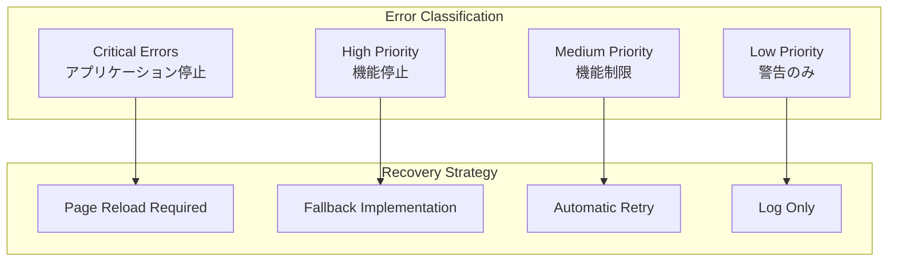

# エラーハンドリング戦略

> [!info] 概要
> Phyllotaxis Plannerの包括的なエラーハンドリング戦略を定義し、堅牢性とユーザー体験の向上を実現します。

## エラー分類

### 🚨 エラーレベル分類



### 📊 エラータイプ定義

```typescript
export enum ErrorType {
  // Critical Errors
  SYSTEM_CRASH = 'SYSTEM_CRASH',
  MEMORY_OVERFLOW = 'MEMORY_OVERFLOW',
  INFINITE_LOOP = 'INFINITE_LOOP',
  
  // High Priority Errors
  CALCULATION_FAILURE = 'CALCULATION_FAILURE',
  RENDER_FAILURE = 'RENDER_FAILURE',
  EVENT_BUS_FAILURE = 'EVENT_BUS_FAILURE',
  
  // Medium Priority Errors
  VALIDATION_ERROR = 'VALIDATION_ERROR',
  ANIMATION_ERROR = 'ANIMATION_ERROR',
  STORAGE_ERROR = 'STORAGE_ERROR',
  
  // Low Priority Errors
  PERFORMANCE_WARNING = 'PERFORMANCE_WARNING',
  DEPRECATION_WARNING = 'DEPRECATION_WARNING',
  ACCESSIBILITY_WARNING = 'ACCESSIBILITY_WARNING'
}

export interface ErrorContext {
  type: ErrorType;
  severity: 'critical' | 'high' | 'medium' | 'low';
  source: string;
  message: string;
  stack?: string;
  timestamp: Date;
  userAgent?: string;
  url?: string;
  userId?: string;
  sessionId?: string;
  recoverable: boolean;
  retryable: boolean;
  metadata?: Record<string, any>;
}
```## エラ
ー処理パターン

### 🔄 回復戦略

#### 1. フォールバック実装

```typescript
// SVG描画失敗時のフォールバック
class RenderSystem {
  private renderWithFallback(entityId: EntityId, world: World): void {
    try {
      this.renderSVGElement(entityId, world);
    } catch (error) {
      console.warn('SVG rendering failed, using fallback', error);
      this.renderFallbackElement(entityId, world);
    }
  }
  
  private renderFallbackElement(entityId: EntityId, world: World): void {
    const textComponent = world.getComponent<ITextComponent>(entityId, ComponentTypes.TEXT);
    if (textComponent) {
      // シンプルなHTML要素として表示
      this.createFallbackHTMLElement(entityId, textComponent.content);
    }
  }
}
```

#### 2. 自動リトライ機能

```typescript
class RetryableOperation {
  async executeWithRetry<T>(
    operation: () => Promise<T>,
    maxRetries: number = 3,
    delay: number = 1000
  ): Promise<T> {
    let lastError: Error;
    
    for (let attempt = 1; attempt <= maxRetries; attempt++) {
      try {
        return await operation();
      } catch (error) {
        lastError = error as Error;
        
        if (attempt === maxRetries) {
          throw new PhyllotaxisError(
            `Operation failed after ${maxRetries} attempts: ${lastError.message}`,
            ErrorType.CALCULATION_FAILURE,
            false
          );
        }
        
        await this.delay(delay * attempt);
      }
    }
    
    throw lastError!;
  }
}
```

#### 3. デフォルト値による回復

```typescript
// 位置計算エラー時のデフォルト位置使用
class PhyllotaxisSystem {
  private calculatePositionSafely(index: number): Position {
    try {
      return this.calculatePhyllotaxisPosition(index);
    } catch (error) {
      console.warn(`Position calculation failed for index ${index}, using default`, error);
      
      // デフォルト位置を返す
      return {
        x: this.config.centerX + (index * 20),
        y: this.config.centerY + (index * 20),
        angle: 0,
        radius: index * 20
      };
    }
  }
}
```

### 🎭 ユーザー体験設計

#### エラーメッセージ設計

```typescript
export const ErrorMessages = {
  [ErrorType.VALIDATION_ERROR]: {
    title: '入力エラー',
    message: 'アイデアの内容を確認してください',
    action: '修正して再試行',
    severity: 'medium'
  },
  [ErrorType.CALCULATION_FAILURE]: {
    title: '配置エラー',
    message: 'アイデアの配置に失敗しました',
    action: 'デフォルト位置で表示します',
    severity: 'high'
  },
  [ErrorType.RENDER_FAILURE]: {
    title: '表示エラー',
    message: '画面の表示に問題が発生しました',
    action: 'ページを再読み込みしてください',
    severity: 'high'
  },
  [ErrorType.SYSTEM_CRASH]: {
    title: 'システムエラー',
    message: 'アプリケーションで予期しないエラーが発生しました',
    action: 'ページを再読み込みしてください',
    severity: 'critical'
  }
};
```

#### エラーUI コンポーネント

```typescript
interface ErrorBoundaryState {
  hasError: boolean;
  error: Error | null;
  errorInfo: ErrorInfo | null;
  errorId: string;
}

class PhyllotaxisErrorBoundary extends React.Component<
  { children: React.ReactNode; fallback?: React.ComponentType<any> },
  ErrorBoundaryState
> {
  constructor(props: any) {
    super(props);
    this.state = {
      hasError: false,
      error: null,
      errorInfo: null,
      errorId: ''
    };
  }
  
  static getDerivedStateFromError(error: Error): Partial<ErrorBoundaryState> {
    return {
      hasError: true,
      error,
      errorId: generateErrorId()
    };
  }
  
  componentDidCatch(error: Error, errorInfo: ErrorInfo) {
    this.setState({ errorInfo });
    
    // エラーレポート送信
    this.reportError(error, errorInfo);
  }
  
  render() {
    if (this.state.hasError) {
      return this.props.fallback ? (
        <this.props.fallback 
          error={this.state.error}
          errorId={this.state.errorId}
          onRetry={() => this.setState({ hasError: false })}
        />
      ) : (
        <ErrorFallbackComponent
          error={this.state.error}
          errorId={this.state.errorId}
          onRetry={() => this.setState({ hasError: false })}
        />
      );
    }
    
    return this.props.children;
  }
}
```

## エラー監視とレポート

### 📊 エラー収集

```typescript
class ErrorReporter {
  private errorQueue: ErrorContext[] = [];
  private isOnline: boolean = navigator.onLine;
  
  constructor() {
    this.setupGlobalErrorHandlers();
    this.setupNetworkMonitoring();
  }
  
  private setupGlobalErrorHandlers(): void {
    // JavaScript エラー
    window.addEventListener('error', (event) => {
      this.reportError({
        type: ErrorType.SYSTEM_CRASH,
        severity: 'critical',
        source: 'global',
        message: event.message,
        stack: event.error?.stack,
        timestamp: new Date(),
        recoverable: false,
        retryable: false,
        metadata: {
          filename: event.filename,
          lineno: event.lineno,
          colno: event.colno
        }
      });
    });
    
    // Promise rejection
    window.addEventListener('unhandledrejection', (event) => {
      this.reportError({
        type: ErrorType.SYSTEM_CRASH,
        severity: 'critical',
        source: 'promise',
        message: event.reason?.message || 'Unhandled promise rejection',
        stack: event.reason?.stack,
        timestamp: new Date(),
        recoverable: false,
        retryable: false
      });
    });
  }
  
  reportError(context: ErrorContext): void {
    // ローカルストレージに保存
    this.storeErrorLocally(context);
    
    // オンラインの場合は即座に送信
    if (this.isOnline) {
      this.sendErrorReport(context);
    } else {
      this.errorQueue.push(context);
    }
  }
  
  private async sendErrorReport(context: ErrorContext): Promise<void> {
    try {
      await fetch('/api/errors', {
        method: 'POST',
        headers: { 'Content-Type': 'application/json' },
        body: JSON.stringify(context)
      });
    } catch (error) {
      console.warn('Failed to send error report', error);
      this.errorQueue.push(context);
    }
  }
}
```

### 📈 エラー分析

```typescript
interface ErrorAnalytics {
  errorRate: number;
  topErrors: Array<{ type: ErrorType; count: number }>;
  userImpact: number;
  recoveryRate: number;
  averageRecoveryTime: number;
}

class ErrorAnalyzer {
  analyzeErrors(errors: ErrorContext[], timeWindow: number = 24 * 60 * 60 * 1000): ErrorAnalytics {
    const recentErrors = errors.filter(
      error => Date.now() - error.timestamp.getTime() < timeWindow
    );
    
    const totalSessions = this.getTotalSessions(timeWindow);
    const errorRate = recentErrors.length / totalSessions;
    
    const errorCounts = new Map<ErrorType, number>();
    recentErrors.forEach(error => {
      errorCounts.set(error.type, (errorCounts.get(error.type) || 0) + 1);
    });
    
    const topErrors = Array.from(errorCounts.entries())
      .map(([type, count]) => ({ type, count }))
      .sort((a, b) => b.count - a.count)
      .slice(0, 10);
    
    return {
      errorRate,
      topErrors,
      userImpact: this.calculateUserImpact(recentErrors),
      recoveryRate: this.calculateRecoveryRate(recentErrors),
      averageRecoveryTime: this.calculateAverageRecoveryTime(recentErrors)
    };
  }
}
```

## 関連文書

> [!info] アーキテクチャ文書
> - [[event-driven-design|イベント駆動設計]]
> - [[ecs/overview|ECS概要]]
> - [[system-overview|システム概要]]

> [!note] 開発ガイド
> - [[../guides/testing-strategy|テスト戦略]]
> - [[../guides/development|開発環境]]
> - [[../guides/contributing|コントリビューション]]

> [!tip] API仕様
> - [[../api/components|コンポーネントAPI]]
> - [[../api/events|イベントAPI]]