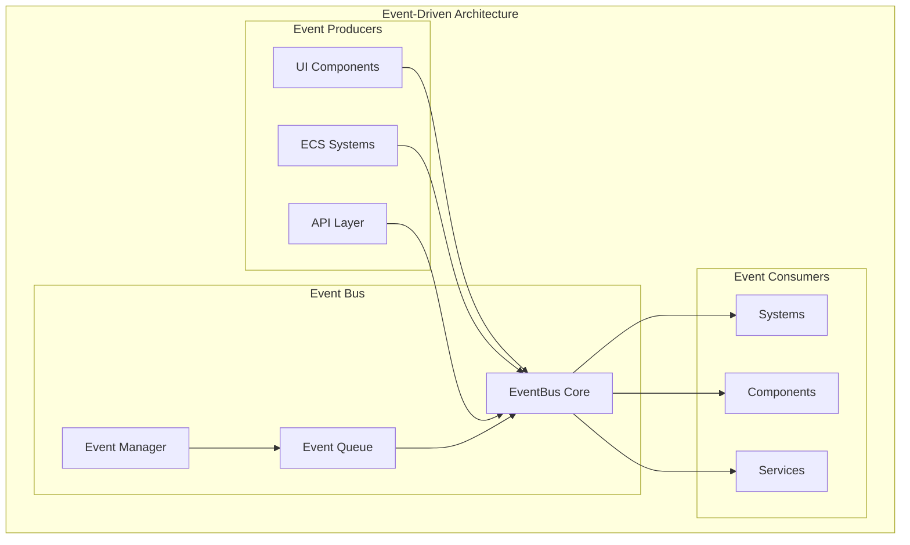
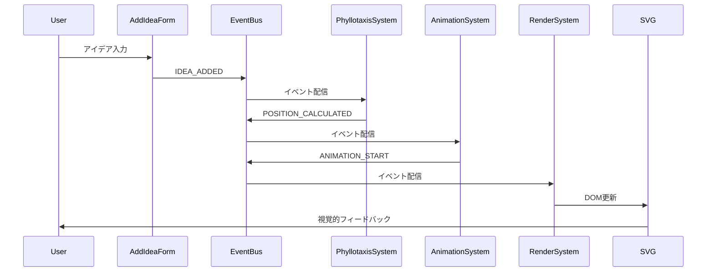

# イベント駆動アーキテクチャ設計

> [!info] 概要
> Phyllotaxis Plannerにおけるイベント駆動アーキテクチャの設計と実装詳細を説明します。

## アーキテクチャ概要

### 🎯 設計原則

> [!note] 疎結合による拡張性
> コンポーネント間の直接的な依存関係を排除し、イベントを介した通信により高い拡張性を実現



### 🔄 イベントフロー



## EventBus設計

### 🏗️ コアインターフェース

```typescript
// events/core/EventBus.ts
interface EventBus {
  emit<T>(event: string, data: T): void;
  on<T>(event: string, handler: (data: T) => void): () => void;
  off(event: string, handler: Function): void;
  once<T>(event: string, handler: (data: T) => void): void;
  clear(): void;
  getListenerCount(event: string): number;
}

interface EventBusOptions {
  maxListeners?: number;
  enableBatching?: boolean;
  batchInterval?: number;
  enableLogging?: boolean;
}
```

### ⚡ EventBus実装

```typescript
// events/core/EventBusImpl.ts
class EventBusImpl implements EventBus {
  private listeners = new Map<string, Set<Function>>();
  private onceListeners = new Map<string, Set<Function>>();
  private options: Required<EventBusOptions>;
  private batchQueue: Array<{ event: string; data: any }> = [];
  private batchTimeout: NodeJS.Timeout | null = null;
  
  constructor(options: EventBusOptions = {}) {
    this.options = {
      maxListeners: 100,
      enableBatching: false,
      batchInterval: 16, // 60fps
      enableLogging: false,
      ...options
    };
  }
  
  emit<T>(event: string, data: T): void {
    if (this.options.enableLogging) {
      console.log(`[EventBus] Emitting: ${event}`, data);
    }
    
    if (this.options.enableBatching) {
      this.batchEmit(event, data);
    } else {
      this.immediateEmit(event, data);
    }
  }
  
  private immediateEmit<T>(event: string, data: T): void {
    // 通常のリスナー実行
    const handlers = this.listeners.get(event);
    if (handlers) {
      handlers.forEach(handler => {
        try {
          handler(data);
        } catch (error) {
          console.error(`[EventBus] Error in handler for ${event}:`, error);
          this.emit('error', { event, error, data });
        }
      });
    }
    
    // onceリスナー実行と削除
    const onceHandlers = this.onceListeners.get(event);
    if (onceHandlers) {
      onceHandlers.forEach(handler => {
        try {
          handler(data);
        } catch (error) {
          console.error(`[EventBus] Error in once handler for ${event}:`, error);
        }
      });
      this.onceListeners.delete(event);
    }
  }
  
  private batchEmit<T>(event: string, data: T): void {
    this.batchQueue.push({ event, data });
    
    if (!this.batchTimeout) {
      this.batchTimeout = setTimeout(() => {
        this.flushBatch();
      }, this.options.batchInterval);
    }
  }
  
  private flushBatch(): void {
    const batch = [...this.batchQueue];
    this.batchQueue = [];
    this.batchTimeout = null;
    
    batch.forEach(({ event, data }) => {
      this.immediateEmit(event, data);
    });
  }
  
  on<T>(event: string, handler: (data: T) => void): () => void {
    if (!this.listeners.has(event)) {
      this.listeners.set(event, new Set());
    }
    
    const handlers = this.listeners.get(event)!;
    
    if (handlers.size >= this.options.maxListeners) {
      console.warn(`[EventBus] Max listeners (${this.options.maxListeners}) exceeded for event: ${event}`);
    }
    
    handlers.add(handler);
    
    // アンサブスクライブ関数を返す
    return () => this.off(event, handler);
  }
  
  off(event: string, handler: Function): void {
    const handlers = this.listeners.get(event);
    if (handlers) {
      handlers.delete(handler);
      if (handlers.size === 0) {
        this.listeners.delete(event);
      }
    }
  }
  
  once<T>(event: string, handler: (data: T) => void): void {
    if (!this.onceListeners.has(event)) {
      this.onceListeners.set(event, new Set());
    }
    this.onceListeners.get(event)!.add(handler);
  }
  
  clear(): void {
    this.listeners.clear();
    this.onceListeners.clear();
    if (this.batchTimeout) {
      clearTimeout(this.batchTimeout);
      this.batchTimeout = null;
    }
    this.batchQueue = [];
  }
  
  getListenerCount(event: string): number {
    const regular = this.listeners.get(event)?.size || 0;
    const once = this.onceListeners.get(event)?.size || 0;
    return regular + once;
  }
}
```

## イベント定義

### 📝 イベントタイプ

```typescript
// events/types/EventTypes.ts
export enum IdeaEvents {
  IDEA_ADDED = 'idea:added',
  IDEA_REMOVED = 'idea:removed',
  IDEA_UPDATED = 'idea:updated',
  THEME_CHANGED = 'theme:changed',
}

export enum SystemEvents {
  POSITION_CALCULATED = 'position:calculated',
  ANIMATION_START = 'animation:start',
  ANIMATION_END = 'animation:end',
  RENDER_REQUESTED = 'render:requested',
  ERROR_OCCURRED = 'error:occurred',
  SYSTEM_READY = 'system:ready',
}

export enum UIEvents {
  FORM_SUBMITTED = 'ui:form:submitted',
  BUTTON_CLICKED = 'ui:button:clicked',
  INPUT_CHANGED = 'ui:input:changed',
  MODAL_OPENED = 'ui:modal:opened',
  MODAL_CLOSED = 'ui:modal:closed',
}
```

### 🎭 イベントデータ型

```typescript
// events/types/EventData.ts
export interface IdeaAddedEvent {
  id: string;
  text: string;
  timestamp: Date;
  position?: { x: number; y: number };
}

export interface IdeaRemovedEvent {
  id: string;
  timestamp: Date;
}

export interface IdeaUpdatedEvent {
  id: string;
  oldText: string;
  newText: string;
  timestamp: Date;
}

export interface ThemeChangedEvent {
  oldTheme: string;
  newTheme: string;
  timestamp: Date;
}

export interface PositionCalculatedEvent {
  entityId: string;
  position: Position;
  angle: number;
  radius: number;
  index: number;
}

export interface AnimationEvent {
  entityId: string;
  animationType: AnimationType;
  duration: number;
  easing: EasingType;
}

export interface RenderRequestedEvent {
  entityId?: string; // undefined = 全体再描画
  priority: 'high' | 'normal' | 'low';
  timestamp: Date;
}

export interface ErrorEvent {
  source: string;
  message: string;
  error?: Error;
  recoverable: boolean;
  recoveryEvent?: string;
  recoveryData?: any;
  timestamp: Date;
}

// 型安全なイベントマップ
export interface EventMap {
  [IdeaEvents.IDEA_ADDED]: IdeaAddedEvent;
  [IdeaEvents.IDEA_REMOVED]: IdeaRemovedEvent;
  [IdeaEvents.IDEA_UPDATED]: IdeaUpdatedEvent;
  [IdeaEvents.THEME_CHANGED]: ThemeChangedEvent;
  [SystemEvents.POSITION_CALCULATED]: PositionCalculatedEvent;
  [SystemEvents.ANIMATION_START]: AnimationEvent;
  [SystemEvents.ANIMATION_END]: AnimationEvent;
  [SystemEvents.RENDER_REQUESTED]: RenderRequestedEvent;
  [SystemEvents.ERROR_OCCURRED]: ErrorEvent;
}
```

## React統合

### 🎣 useEventBus Hook

```typescript
// hooks/useEventBus.ts
export const useEventBus = () => {
  const eventBus = useRef<EventBus>(
    new EventBusImpl({
      enableBatching: true,
      enableLogging: process.env.NODE_ENV === 'development'
    })
  ).current;
  
  const emit = useCallback(<K extends keyof EventMap>(
    event: K,
    data: EventMap[K]
  ) => {
    eventBus.emit(event, data);
  }, [eventBus]);
  
  const subscribe = useCallback(<K extends keyof EventMap>(
    event: K,
    handler: (data: EventMap[K]) => void
  ) => {
    return eventBus.on(event, handler);
  }, [eventBus]);
  
  const subscribeOnce = useCallback(<K extends keyof EventMap>(
    event: K,
    handler: (data: EventMap[K]) => void
  ) => {
    eventBus.once(event, handler);
  }, [eventBus]);
  
  // クリーンアップ
  useEffect(() => {
    return () => {
      eventBus.clear();
    };
  }, [eventBus]);
  
  return { emit, subscribe, subscribeOnce, eventBus };
};
```

### 🔗 useEventListener Hook

```typescript
// hooks/useEventListener.ts
export const useEventListener = <K extends keyof EventMap>(
  event: K,
  handler: (data: EventMap[K]) => void,
  deps: React.DependencyList = []
) => {
  const { subscribe } = useEventBus();
  
  useEffect(() => {
    const unsubscribe = subscribe(event, handler);
    return unsubscribe;
  }, [event, subscribe, ...deps]);
};

// 使用例
const IdeaList: React.FC = () => {
  const [ideas, setIdeas] = useState<Idea[]>([]);
  
  useEventListener(IdeaEvents.IDEA_ADDED, (data) => {
    setIdeas(prev => [...prev, {
      id: data.id,
      text: data.text,
      createdAt: data.timestamp
    }]);
  }, []);
  
  useEventListener(IdeaEvents.IDEA_REMOVED, (data) => {
    setIdeas(prev => prev.filter(idea => idea.id !== data.id));
  }, []);
  
  return (
    <div>
      {ideas.map(idea => (
        <div key={idea.id}>{idea.text}</div>
      ))}
    </div>
  );
};
```

## システム間通信パターン

### 🔄 アイデア追加フロー

```typescript
// systems/flows/IdeaAdditionFlow.ts
export class IdeaAdditionFlow {
  constructor(private eventBus: EventBus) {
    this.setupEventHandlers();
  }
  
  private setupEventHandlers(): void {
    // 1. アイデア追加 → 位置計算
    this.eventBus.on(IdeaEvents.IDEA_ADDED, (data: IdeaAddedEvent) => {
      this.handleIdeaAdded(data);
    });
    
    // 2. 位置計算完了 → アニメーション開始
    this.eventBus.on(SystemEvents.POSITION_CALCULATED, (data: PositionCalculatedEvent) => {
      this.handlePositionCalculated(data);
    });
    
    // 3. アニメーション開始 → 描画要求
    this.eventBus.on(SystemEvents.ANIMATION_START, (data: AnimationEvent) => {
      this.handleAnimationStart(data);
    });
  }
  
  private handleIdeaAdded(data: IdeaAddedEvent): void {
    // PhyllotaxisSystemに位置計算を依頼
    // 実際の計算はPhyllotaxisSystemが行う
    console.log(`[Flow] Processing idea addition: ${data.text}`);
  }
  
  private handlePositionCalculated(data: PositionCalculatedEvent): void {
    // アニメーション開始イベントを発火
    this.eventBus.emit(SystemEvents.ANIMATION_START, {
      entityId: data.entityId,
      animationType: 'fadeIn',
      duration: 600,
      easing: 'ease-out'
    });
  }
  
  private handleAnimationStart(data: AnimationEvent): void {
    // 描画要求イベントを発火
    this.eventBus.emit(SystemEvents.RENDER_REQUESTED, {
      entityId: data.entityId,
      priority: 'high',
      timestamp: new Date()
    });
  }
}
```

### 🎨 テーマ変更フロー

```typescript
// systems/flows/ThemeChangeFlow.ts
export class ThemeChangeFlow {
  constructor(private eventBus: EventBus) {
    this.setupEventHandlers();
  }
  
  private setupEventHandlers(): void {
    this.eventBus.on(IdeaEvents.THEME_CHANGED, (data: ThemeChangedEvent) => {
      this.handleThemeChange(data);
    });
  }
  
  private handleThemeChange(data: ThemeChangedEvent): void {
    // 中心テーマの更新
    this.updateCenterTheme(data.newTheme);
    
    // 全体の再描画要求
    this.eventBus.emit(SystemEvents.RENDER_REQUESTED, {
      priority: 'normal',
      timestamp: new Date()
    });
    
    // アニメーション効果（オプション）
    this.eventBus.emit(SystemEvents.ANIMATION_START, {
      entityId: 'center-theme',
      animationType: 'pulse',
      duration: 300,
      easing: 'ease-in-out'
    });
  }
  
  private updateCenterTheme(newTheme: string): void {
    // ECSシステムを通じて中心テーマエンティティを更新
    console.log(`[Flow] Updating center theme to: ${newTheme}`);
  }
}
```

## エラーハンドリング

### 🚨 統一エラー処理

```typescript
// events/handlers/ErrorHandler.ts
export class EventErrorHandler {
  constructor(private eventBus: EventBus) {
    this.setupErrorHandling();
  }
  
  private setupErrorHandling(): void {
    this.eventBus.on(SystemEvents.ERROR_OCCURRED, (error: ErrorEvent) => {
      this.handleError(error);
    });
  }
  
  private handleError(error: ErrorEvent): void {
    console.error(`[${error.source}] ${error.message}`, error.error);
    
    // エラーレベルに応じた処理
    if (error.recoverable && error.recoveryEvent) {
      console.log(`[ErrorHandler] Attempting recovery with ${error.recoveryEvent}`);
      this.eventBus.emit(error.recoveryEvent, error.recoveryData);
    } else {
      // 回復不可能なエラーの場合
      this.handleCriticalError(error);
    }
    
    // エラー統計の更新
    this.updateErrorStats(error);
  }
  
  private handleCriticalError(error: ErrorEvent): void {
    // ユーザーへの通知
    this.eventBus.emit(UIEvents.MODAL_OPENED, {
      type: 'error',
      title: 'エラーが発生しました',
      message: 'アプリケーションを再読み込みしてください。',
      actions: ['reload', 'dismiss']
    });
  }
  
  private updateErrorStats(error: ErrorEvent): void {
    // エラー統計の記録（実装は省略）
  }
}
```

### 🔄 エラー回復パターン

```typescript
// systems/PhyllotaxisSystem.ts（エラー処理付き）
export class PhyllotaxisSystem {
  constructor(private eventBus: EventBus) {
    this.setupEventHandlers();
  }
  
  private setupEventHandlers(): void {
    this.eventBus.on(IdeaEvents.IDEA_ADDED, (data: IdeaAddedEvent) => {
      this.calculatePosition(data);
    });
  }
  
  private calculatePosition(data: IdeaAddedEvent): void {
    try {
      const position = this.performCalculation(data);
      
      this.eventBus.emit(SystemEvents.POSITION_CALCULATED, {
        entityId: data.id,
        position,
        angle: position.angle,
        radius: position.radius,
        index: this.getEntityIndex(data.id)
      });
      
    } catch (error) {
      this.eventBus.emit(SystemEvents.ERROR_OCCURRED, {
        source: 'PhyllotaxisSystem',
        message: `Position calculation failed for idea: ${data.id}`,
        error: error as Error,
        recoverable: true,
        recoveryEvent: SystemEvents.POSITION_CALCULATED,
        recoveryData: {
          entityId: data.id,
          position: this.getDefaultPosition(),
          angle: 0,
          radius: 100,
          index: 0
        },
        timestamp: new Date()
      });
    }
  }
  
  private performCalculation(data: IdeaAddedEvent): Position {
    // 実際の位置計算ロジック
    // エラーが発生する可能性のある処理
    throw new Error('Calculation failed'); // 例
  }
  
  private getDefaultPosition(): Position {
    return { x: 0, y: 0, angle: 0, radius: 100 };
  }
}
```

## パフォーマンス最適化

### ⚡ イベントバッチング

```typescript
// events/optimizations/BatchProcessor.ts
export class EventBatchProcessor {
  private batchQueue = new Map<string, any[]>();
  private processingTimeout: NodeJS.Timeout | null = null;
  
  constructor(
    private eventBus: EventBus,
    private batchInterval: number = 16
  ) {}
  
  batchEmit<T>(event: string, data: T): void {
    if (!this.batchQueue.has(event)) {
      this.batchQueue.set(event, []);
    }
    
    this.batchQueue.get(event)!.push(data);
    
    if (!this.processingTimeout) {
      this.processingTimeout = setTimeout(() => {
        this.processBatch();
      }, this.batchInterval);
    }
  }
  
  private processBatch(): void {
    this.batchQueue.forEach((dataArray, event) => {
      // バッチ処理用の特別なイベントを発火
      this.eventBus.emit(`${event}:batch`, dataArray);
    });
    
    this.batchQueue.clear();
    this.processingTimeout = null;
  }
}

// 使用例：大量の位置更新をバッチ処理
const batchProcessor = new EventBatchProcessor(eventBus);

// 個別の位置更新をバッチに追加
entities.forEach(entity => {
  batchProcessor.batchEmit(SystemEvents.POSITION_CALCULATED, {
    entityId: entity.id,
    position: entity.position
  });
});

// バッチ処理されたイベントを受信
eventBus.on('position:calculated:batch', (positions: PositionCalculatedEvent[]) => {
  // 一括で位置を更新
  renderSystem.updatePositions(positions);
});
```

### 🎯 イベントフィルタリング

```typescript
// events/filters/EventFilter.ts
export class EventFilter {
  private filters = new Map<string, (data: any) => boolean>();
  
  addFilter<T>(event: string, predicate: (data: T) => boolean): void {
    this.filters.set(event, predicate);
  }
  
  shouldProcess<T>(event: string, data: T): boolean {
    const filter = this.filters.get(event);
    return filter ? filter(data) : true;
  }
  
  removeFilter(event: string): void {
    this.filters.delete(event);
  }
}

// 使用例：重複イベントのフィルタリング
const eventFilter = new EventFilter();
const lastProcessedIds = new Set<string>();

eventFilter.addFilter(IdeaEvents.IDEA_ADDED, (data: IdeaAddedEvent) => {
  if (lastProcessedIds.has(data.id)) {
    return false; // 重複を除外
  }
  lastProcessedIds.add(data.id);
  return true;
});
```

## デバッグとモニタリング

### 🔍 イベントロガー

```typescript
// events/debug/EventLogger.ts
export class EventLogger {
  private logs: EventLog[] = [];
  private maxLogs: number = 1000;
  
  constructor(private eventBus: EventBus) {
    this.setupLogging();
  }
  
  private setupLogging(): void {
    // すべてのイベントをログ
    const originalEmit = this.eventBus.emit.bind(this.eventBus);
    
    this.eventBus.emit = <T>(event: string, data: T) => {
      this.logEvent(event, data);
      return originalEmit(event, data);
    };
  }
  
  private logEvent<T>(event: string, data: T): void {
    const log: EventLog = {
      event,
      data,
      timestamp: new Date(),
      stackTrace: new Error().stack
    };
    
    this.logs.push(log);
    
    if (this.logs.length > this.maxLogs) {
      this.logs.shift();
    }
    
    if (process.env.NODE_ENV === 'development') {
      console.log(`[EventBus] ${event}`, data);
    }
  }
  
  getLogs(filter?: (log: EventLog) => boolean): EventLog[] {
    return filter ? this.logs.filter(filter) : [...this.logs];
  }
  
  getEventStats(): Map<string, number> {
    const stats = new Map<string, number>();
    
    this.logs.forEach(log => {
      const count = stats.get(log.event) || 0;
      stats.set(log.event, count + 1);
    });
    
    return stats;
  }
  
  clearLogs(): void {
    this.logs = [];
  }
}

interface EventLog {
  event: string;
  data: any;
  timestamp: Date;
  stackTrace?: string;
}
```

### 📊 パフォーマンスモニター

```typescript
// events/debug/PerformanceMonitor.ts
export class EventPerformanceMonitor {
  private metrics = new Map<string, EventMetrics>();
  
  constructor(private eventBus: EventBus) {
    this.setupMonitoring();
  }
  
  private setupMonitoring(): void {
    const originalEmit = this.eventBus.emit.bind(this.eventBus);
    
    this.eventBus.emit = <T>(event: string, data: T) => {
      const startTime = performance.now();
      const result = originalEmit(event, data);
      const endTime = performance.now();
      
      this.recordMetric(event, endTime - startTime);
      return result;
    };
  }
  
  private recordMetric(event: string, duration: number): void {
    if (!this.metrics.has(event)) {
      this.metrics.set(event, {
        count: 0,
        totalDuration: 0,
        minDuration: Infinity,
        maxDuration: 0,
        avgDuration: 0
      });
    }
    
    const metric = this.metrics.get(event)!;
    metric.count++;
    metric.totalDuration += duration;
    metric.minDuration = Math.min(metric.minDuration, duration);
    metric.maxDuration = Math.max(metric.maxDuration, duration);
    metric.avgDuration = metric.totalDuration / metric.count;
  }
  
  getMetrics(): Map<string, EventMetrics> {
    return new Map(this.metrics);
  }
  
  getSlowEvents(threshold: number = 16): Array<{ event: string; metrics: EventMetrics }> {
    return Array.from(this.metrics.entries())
      .filter(([_, metrics]) => metrics.avgDuration > threshold)
      .map(([event, metrics]) => ({ event, metrics }));
  }
}

interface EventMetrics {
  count: number;
  totalDuration: number;
  minDuration: number;
  maxDuration: number;
  avgDuration: number;
}
```

## テスト戦略

### 🧪 イベントバステスト

```typescript
// __tests__/events/EventBus.test.ts
describe('EventBus', () => {
  let eventBus: EventBus;
  
  beforeEach(() => {
    eventBus = new EventBusImpl();
  });
  
  afterEach(() => {
    eventBus.clear();
  });
  
  it('should emit and receive events', () => {
    const handler = jest.fn();
    const testData = { id: '1', text: 'test' };
    
    eventBus.on(IdeaEvents.IDEA_ADDED, handler);
    eventBus.emit(IdeaEvents.IDEA_ADDED, testData);
    
    expect(handler).toHaveBeenCalledWith(testData);
  });
  
  it('should unsubscribe correctly', () => {
    const handler = jest.fn();
    
    const unsubscribe = eventBus.on(IdeaEvents.IDEA_ADDED, handler);
    unsubscribe();
    
    eventBus.emit(IdeaEvents.IDEA_ADDED, { id: '1', text: 'test' });
    
    expect(handler).not.toHaveBeenCalled();
  });
  
  it('should handle once listeners', () => {
    const handler = jest.fn();
    
    eventBus.once(IdeaEvents.IDEA_ADDED, handler);
    
    eventBus.emit(IdeaEvents.IDEA_ADDED, { id: '1', text: 'test' });
    eventBus.emit(IdeaEvents.IDEA_ADDED, { id: '2', text: 'test2' });
    
    expect(handler).toHaveBeenCalledTimes(1);
  });
  
  it('should handle errors in listeners', () => {
    const errorHandler = jest.fn();
    const faultyHandler = jest.fn(() => {
      throw new Error('Test error');
    });
    
    eventBus.on('error', errorHandler);
    eventBus.on(IdeaEvents.IDEA_ADDED, faultyHandler);
    
    eventBus.emit(IdeaEvents.IDEA_ADDED, { id: '1', text: 'test' });
    
    expect(errorHandler).toHaveBeenCalled();
  });
});
```

### 🔗 統合テスト

```typescript
// __tests__/integration/EventFlow.test.ts
describe('Event Flow Integration', () => {
  let eventBus: EventBus;
  let phyllotaxisSystem: PhyllotaxisSystem;
  let animationSystem: AnimationSystem;
  let renderSystem: RenderSystem;
  
  beforeEach(() => {
    eventBus = new EventBusImpl();
    phyllotaxisSystem = new PhyllotaxisSystem(eventBus);
    animationSystem = new AnimationSystem(eventBus);
    renderSystem = new RenderSystem(eventBus, mockSvgElement);
  });
  
  it('should complete idea addition flow', async () => {
    const renderSpy = jest.spyOn(renderSystem, 'render');
    
    // アイデア追加イベントを発火
    eventBus.emit(IdeaEvents.IDEA_ADDED, {
      id: 'test-idea',
      text: 'Test Idea',
      timestamp: new Date()
    });
    
    // 非同期処理の完了を待機
    await new Promise(resolve => setTimeout(resolve, 100));
    
    // 描画が実行されたことを確認
    expect(renderSpy).toHaveBeenCalled();
  });
  
  it('should handle error recovery', () => {
    const errorSpy = jest.fn();
    eventBus.on(SystemEvents.ERROR_OCCURRED, errorSpy);
    
    // エラーを発生させる
    eventBus.emit(IdeaEvents.IDEA_ADDED, {
      id: 'invalid-idea',
      text: '', // 空のテキストでエラーを誘発
      timestamp: new Date()
    });
    
    expect(errorSpy).toHaveBeenCalled();
  });
});
```

## 関連文書

> [!info] ECS設計文書
> - [[ecs/overview|ECS概要]]
> - [[ecs/world|World設計]]
> - [[ecs/systems|システム設計]]
> - [[ecs/integration|React統合]]

> [!note] アーキテクチャ文書
> - [[system-overview|システム概要図]]
> - [[component-diagram|コンポーネント関係図]]
> - [[data-flow|データフロー図]]

> [!info] 設計決定記録
> - [[../adr/0005-event-driven-architecture|ADR-0005: イベント駆動アーキテクチャ採用]]
> - [[../adr/0004-ecs-architecture|ADR-0004: ECSアーキテクチャ採用]]

> [!tip] 学習リソース
> - [Event-Driven Architecture](https://en.wikipedia.org/wiki/Event-driven_architecture)
> - [Observer Pattern](https://refactoring.guru/design-patterns/observer)
> - [React Custom Hooks](https://reactjs.org/docs/hooks-custom.html)