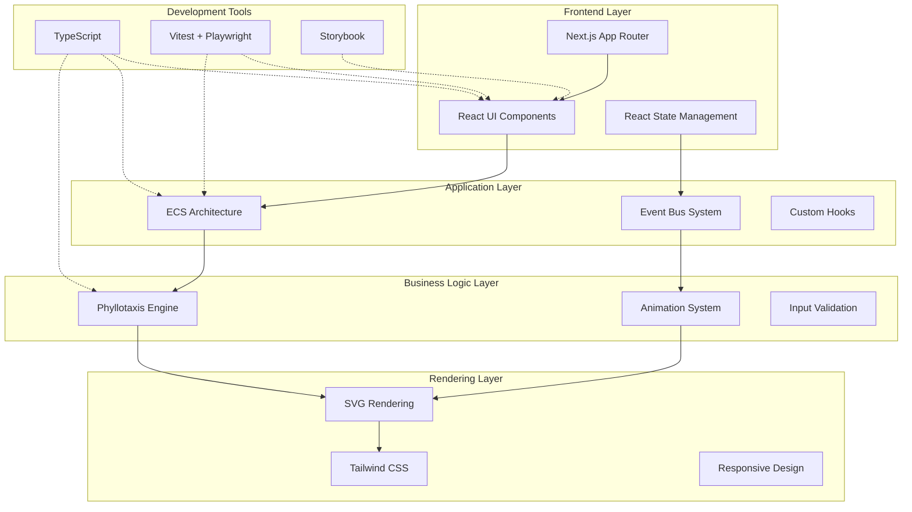
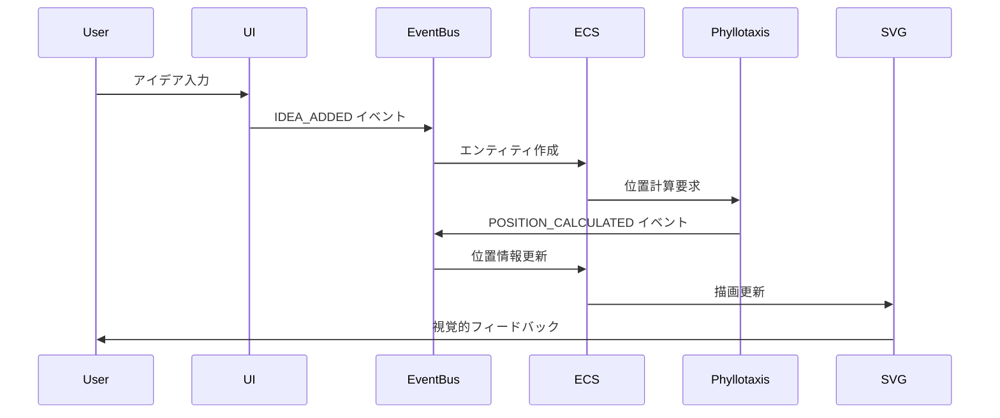
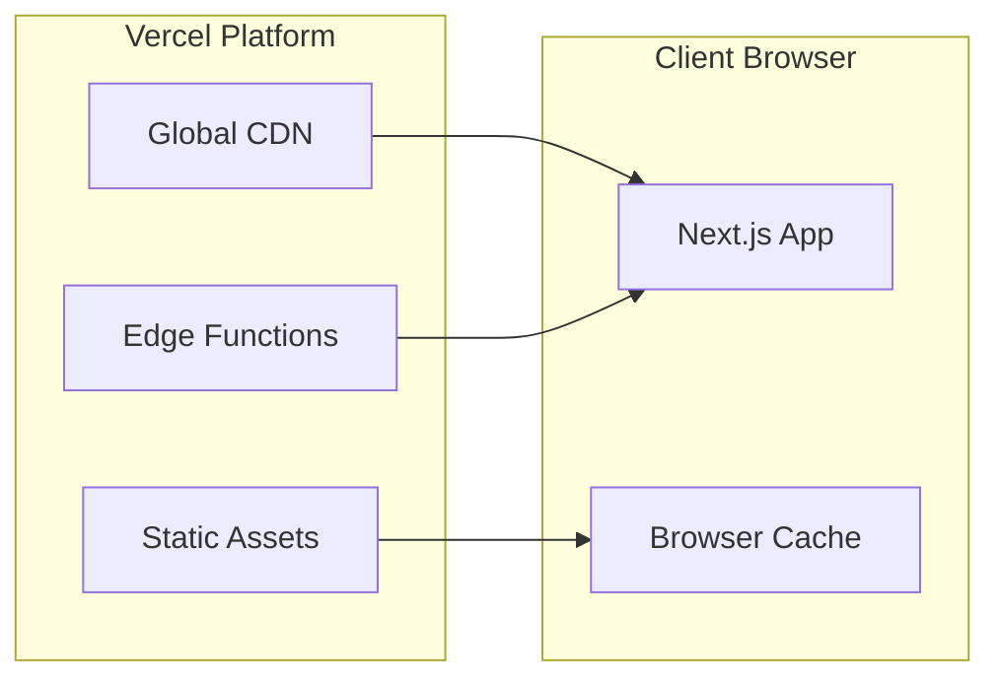

# システム概要図

> [!info] 概要
> Phyllotaxis Plannerのシステム全体のアーキテクチャ概要を示します。

## システム全体構成

## アーキテクチャ層の詳細

### 🎨 Frontend Layer

> [!note] 責務
> ユーザーインターフェースとルーティングを担当

**主要コンポーネント:**
- **React UI Components**: ユーザーインターフェースの構築
- **Next.js App Router**: ページルーティングとレイアウト管理
- **React State Management**: コンポーネント状態の管理

**技術スタック:**
- Next.js 15 (App Router)
- React 18
- TypeScript

### ⚙️ Application Layer

> [!note] 責務
> アプリケーションの核となるアーキテクチャパターンを実装

**主要コンポーネント:**
- **ECS Architecture**: エンティティ・コンポーネント・システムパターン
- **Event Bus System**: コンポーネント間の疎結合通信
- **Custom Hooks**: React固有のロジックの抽象化

**設計パターン:**
- Entity Component System (ECS)
- Event-Driven Architecture
- Observer Pattern

### 🧮 Business Logic Layer

> [!note] 責務
> アプリケーション固有のビジネスロジックを実装

**主要コンポーネント:**
- **Phyllotaxis Engine**: 黄金角による螺旋配置計算
- **Animation System**: アイデアノードのアニメーション制御
- **Input Validation**: ユーザー入力の検証とサニタイゼーション

**核となるアルゴリズム:**
- フィロタキシス位置計算
- 黄金角（137.5°）による配置
- アニメーション状態管理

### 🎭 Rendering Layer

> [!note] 責務
> 視覚的表現とユーザー体験を担当

**主要コンポーネント:**
- **SVG Rendering**: ベクターグラフィックスによる描画
- **Tailwind CSS**: ユーティリティファーストのスタイリング
- **Responsive Design**: マルチデバイス対応

**描画戦略:**
- DOM統合によるアクセシビリティ確保
- CSS transitionsによるスムーズなアニメーション
- レスポンシブデザインによるマルチデバイス対応

### 🛠️ Development Tools

> [!note] 責務
> 開発効率と品質保証を支援

**主要ツール:**
- **TypeScript**: 型安全性とコード品質の向上
- **Testing**: 単体テスト・統合テスト・E2Eテスト
- **Storybook**: コンポーネントドキュメントとデザインシステム

## データフロー概要

## 技術的特徴

### 🌟 主要な設計原則

1. **関心の分離**: 各層が明確な責務を持つ
2. **疎結合**: イベント駆動による柔軟な連携
3. **再利用性**: コンポーネントベースの設計
4. **拡張性**: 新機能追加時の影響最小化
5. **テスタビリティ**: 各層の独立したテスト

### 🚀 パフォーマンス戦略

- **React.memo**: 不要な再レンダリングの防止
- **useMemo/useCallback**: 計算結果のメモ化
- **SVG最適化**: DOM要素数の制限（50個上限）
- **イベントバッチング**: 大量イベントの効率的処理

### 🔒 品質保証

- **TypeScript**: コンパイル時の型チェック
- **ESLint/Prettier**: コード品質の統一
- **単体テスト**: 各システムの動作検証
- **E2Eテスト**: ユーザーフローの検証

## 配置環境

### 🌐 本番環境

**特徴:**
- Vercelによる自動デプロイメント
- Global CDNによる高速配信
- Edge Functionsによる最適化

### 🔧 開発環境

- **Local Development**: Next.js Dev Server
- **Hot Reload**: 開発時の即座反映
- **TypeScript**: リアルタイム型チェック
- **Storybook**: コンポーネント開発環境

## 関連文書

> [!info] アーキテクチャ文書
> - [[component-diagram|コンポーネント関係図]]
> - [[data-flow|データフロー図]]
> - [[ecs-design|ECS設計詳細]]
> - [[event-driven-design|イベント駆動設計]]

> [!note] 設計決定記録
> - [[0001-use-nextjs-15|ADR-0001: Next.js 15採用]]
> - [[0002-svg-over-canvas|ADR-0002: SVG over Canvas]]
> - [[0004-ecs-architecture|ADR-0004: ECSアーキテクチャ]]
> - [[0005-event-driven-architecture|ADR-0005: イベント駆動アーキテクチャ]]

> [!info] プロジェクト文書
> - [[design|設計書]]
> - [[requirements|要件定義書]]
> - [[tasks|実装計画]]