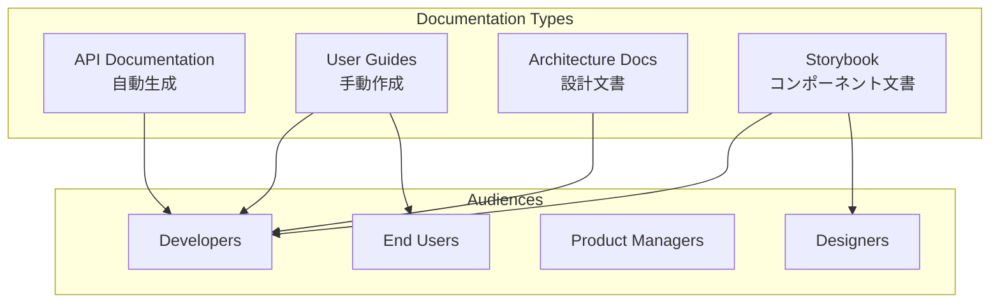

# ドキュメント戦略

> [!info] 概要
> Phyllotaxis Plannerの包括的なドキュメント戦略を定義し、開発者体験とプロジェクトの持続可能性を向上させます。

## ドキュメント方針

### 🎯 戦略目標

| 目標 | 指標 | 達成方法 |
|------|------|----------|
| **開発者オンボーディング** | 30分以内でセットアップ完了 | 段階的ガイド + 自動化 |
| **コンポーネント理解** | 5分以内で使用方法理解 | Storybook + インタラクティブ例 |
| **保守性向上** | ドキュメント更新率90%以上 | 自動生成 + レビュープロセス |
| **品質保証** | ドキュメントエラー率<1% | 自動チェック + 継続的更新 |

### 📚 ドキュメント分類



## Storybook戦略

### 🎨 Storybook設計原則

#### 1. コンポーネント中心設計
```typescript
// stories/PhyllotaxisMap.stories.ts
import type { Meta, StoryObj } from '@storybook/react';
import { PhyllotaxisMap } from '../src/components/PhyllotaxisMap';

const meta: Meta<typeof PhyllotaxisMap> = {
  title: 'Components/PhyllotaxisMap',
  component: PhyllotaxisMap,
  parameters: {
    layout: 'fullscreen',
    docs: {
      description: {
        component: `
# PhyllotaxisMap

メインのマップコンポーネント。フィロタキシスの法則に従ってアイデアを配置します。

## 特徴
- 🌱 自動的なフィロタキシス配置
- 🎨 滑らかなアニメーション
- 📱 レスポンシブ対応
- ⚡ 高速レンダリング

## 使用例
中心テーマを設定し、アイデアを追加することで美しい思考マップを作成できます。
        `
      }
    }
  },
  argTypes: {
    initialTheme: {
      control: 'text',
      description: '初期の中心テーマ'
    },
    maxIdeas: {
      control: { type: 'range', min: 10, max: 100, step: 10 },
      description: '最大アイデア数'
    },
    themeColor: {
      control: 'select',
      options: ['green', 'blue', 'purple', 'orange'],
      description: 'テーマカラー'
    },
    enableAnimation: {
      control: 'boolean',
      description: 'アニメーション有効化'
    }
  }
};

export default meta;
type Story = StoryObj<typeof meta>;

// 基本ストーリー
export const Default: Story = {
  args: {
    initialTheme: 'My Project',
    maxIdeas: 50,
    themeColor: 'green',
    enableAnimation: true
  }
};

// 空の状態
export const Empty: Story = {
  args: {
    initialTheme: '',
    maxIdeas: 50,
    themeColor: 'green',
    enableAnimation: true
  },
  parameters: {
    docs: {
      description: {
        story: '初期状態。中心テーマが設定されていない状態を表示します。'
      }
    }
  }
};

// 多数のアイデア
export const ManyIdeas: Story = {
  args: {
    initialTheme: 'Complex Project',
    maxIdeas: 50,
    themeColor: 'blue',
    enableAnimation: false
  },
  play: async ({ canvasElement }) => {
    // 自動的にアイデアを追加するインタラクション
    const canvas = within(canvasElement);
    const input = canvas.getByPlaceholderText('Enter your new idea...');
    const button = canvas.getByRole('button', { name: /add idea/i });
    
    const ideas = [
      'User Research', 'Wireframing', 'Prototyping',
      'User Testing', 'Design System', 'Implementation',
      'Quality Assurance', 'Launch Planning', 'Marketing',
      'Analytics Setup'
    ];
    
    for (const idea of ideas) {
      await userEvent.type(input, idea);
      await userEvent.click(button);
      await new Promise(resolve => setTimeout(resolve, 200));
    }
  }
};

// モバイル表示
export const Mobile: Story = {
  args: {
    initialTheme: 'Mobile Project',
    maxIdeas: 20,
    themeColor: 'purple',
    enableAnimation: true
  },
  parameters: {
    viewport: {
      defaultViewport: 'mobile1'
    },
    docs: {
      description: {
        story: 'モバイルデバイスでの表示。レスポンシブ対応を確認できます。'
      }
    }
  }
};

// アクセシビリティテスト
export const AccessibilityTest: Story = {
  args: {
    initialTheme: 'Accessible Design',
    maxIdeas: 30,
    themeColor: 'orange',
    enableAnimation: false
  },
  parameters: {
    a11y: {
      config: {
        rules: [
          {
            id: 'color-contrast',
            enabled: true
          },
          {
            id: 'keyboard-navigation',
            enabled: true
          }
        ]
      }
    }
  }
};
```

#### 2. インタラクティブドキュメント

```typescript
// stories/IdeaNode.stories.ts
export const Interactive: Story = {
  args: {
    idea: {
      id: 'interactive-idea',
      text: 'Interactive Example',
      position: { x: 200, y: 150 },
      angle: 45,
      radius: 100
    },
    clickable: true,
    hoverable: true
  },
  render: (args) => {
    const [isSelected, setIsSelected] = useState(false);
    const [isHovered, setIsHovered] = useState(false);
    
    return (
      <div style={{ width: 400, height: 300, position: 'relative' }}>
        <IdeaNode
          {...args}
          isSelected={isSelected}
          isHovered={isHovered}
          onClick={() => setIsSelected(!isSelected)}
          onMouseEnter={() => setIsHovered(true)}
          onMouseLeave={() => setIsHovered(false)}
        />
        <div style={{ position: 'absolute', bottom: 10, left: 10 }}>
          <p>Selected: {isSelected ? 'Yes' : 'No'}</p>
          <p>Hovered: {isHovered ? 'Yes' : 'No'}</p>
        </div>
      </div>
    );
  },
  parameters: {
    docs: {
      description: {
        story: `
インタラクティブな例。クリックやホバーの動作を確認できます。

### インタラクション
- **クリック**: 選択状態の切り替え
- **ホバー**: ホバー状態の表示
- **状態表示**: 現在の状態をリアルタイム表示
        `
      }
    }
  }
};
```

### 📖 ドキュメント自動生成

#### 1. TypeScript型からの自動生成

```typescript
// scripts/generate-docs.ts
import { Project } from 'ts-morph';
import { writeFileSync } from 'fs';

interface ComponentDoc {
  name: string;
  description: string;
  props: PropDoc[];
  examples: string[];
}

interface PropDoc {
  name: string;
  type: string;
  required: boolean;
  description: string;
  defaultValue?: string;
}

class DocumentationGenerator {
  private project: Project;
  
  constructor() {
    this.project = new Project({
      tsConfigFilePath: 'tsconfig.json'
    });
  }
  
  generateComponentDocs(componentPath: string): ComponentDoc {
    const sourceFile = this.project.getSourceFileOrThrow(componentPath);
    const interfaces = sourceFile.getInterfaces();
    
    const propsInterface = interfaces.find(i => i.getName().endsWith('Props'));
    if (!propsInterface) {
      throw new Error(`Props interface not found in ${componentPath}`);
    }
    
    const props: PropDoc[] = propsInterface.getProperties().map(prop => ({
      name: prop.getName(),
      type: prop.getType().getText(),
      required: !prop.hasQuestionToken(),
      description: this.extractJSDocDescription(prop),
      defaultValue: this.extractDefaultValue(prop)
    }));
    
    return {
      name: this.extractComponentName(componentPath),
      description: this.extractComponentDescription(sourceFile),
      props,
      examples: this.extractExamples(sourceFile)
    };
  }
  
  generateMarkdownDoc(componentDoc: ComponentDoc): string {
    return `
# ${componentDoc.name}

${componentDoc.description}

## Props

| Name | Type | Required | Default | Description |
|------|------|----------|---------|-------------|
${componentDoc.props.map(prop => 
  `| ${prop.name} | \`${prop.type}\` | ${prop.required ? '✅' : '❌'} | ${prop.defaultValue || '-'} | ${prop.description} |`
).join('\n')}

## Examples

${componentDoc.examples.map(example => `\`\`\`typescript\n${example}\n\`\`\``).join('\n\n')}
    `.trim();
  }
}
```

#### 2. Storybook自動設定

```typescript
// .storybook/main.ts
import type { StorybookConfig } from '@storybook/nextjs';

const config: StorybookConfig = {
  stories: [
    '../src/**/*.stories.@(js|jsx|ts|tsx|mdx)',
    '../docs/**/*.stories.@(js|jsx|ts|tsx|mdx)'
  ],
  addons: [
    '@storybook/addon-essentials',
    '@storybook/addon-interactions',
    '@storybook/addon-a11y',
    '@storybook/addon-docs',
    '@storybook/addon-controls',
    '@storybook/addon-viewport',
    '@storybook/addon-backgrounds'
  ],
  framework: {
    name: '@storybook/nextjs',
    options: {}
  },
  docs: {
    autodocs: 'tag',
    defaultName: 'Documentation'
  },
  typescript: {
    check: false,
    reactDocgen: 'react-docgen-typescript',
    reactDocgenTypescriptOptions: {
      shouldExtractLiteralValuesFromEnum: true,
      propFilter: (prop) => (prop.parent ? !/node_modules/.test(prop.parent.fileName) : true),
    },
  }
};

export default config;
```

### 🎭 ストーリー分類戦略

#### 1. 基本ストーリー
- **Default**: 標準的な使用例
- **Empty**: 空の状態
- **Loading**: ローディング状態
- **Error**: エラー状態

#### 2. バリエーションストーリー
- **Small/Medium/Large**: サイズバリエーション
- **Light/Dark**: テーマバリエーション
- **Desktop/Tablet/Mobile**: デバイスバリエーション

#### 3. インタラクションストーリー
- **Interactive**: ユーザーインタラクション
- **Animated**: アニメーション効果
- **Form Validation**: フォーム検証

#### 4. テストストーリー
- **Accessibility**: アクセシビリティテスト
- **Performance**: パフォーマンステスト
- **Edge Cases**: エッジケーステスト

## コンポーネントドキュメント方針

### 📝 ドキュメント構造

```markdown
# ComponentName

## 概要
コンポーネントの目的と主要機能の説明

## 使用例
基本的な使用方法とコード例

## Props
プロパティの詳細仕様

## イベント
発火するイベントとその詳細

## スタイリング
CSSクラスとカスタマイズ方法

## アクセシビリティ
アクセシビリティ対応とARIA属性

## パフォーマンス
パフォーマンス考慮事項と最適化

## 関連コンポーネント
関連するコンポーネントへのリンク
```

### 🔄 自動更新システム

```typescript
// scripts/update-component-docs.ts
import { execSync } from 'child_process';
import { readdirSync, statSync } from 'fs';
import { join } from 'path';

class ComponentDocUpdater {
  private componentsDir = 'src/components';
  private storiesDir = 'src/stories';
  
  updateAllComponentDocs(): void {
    const components = this.findComponents();
    
    components.forEach(component => {
      try {
        this.updateComponentDoc(component);
        console.log(`✅ Updated documentation for ${component}`);
      } catch (error) {
        console.error(`❌ Failed to update ${component}:`, error);
      }
    });
  }
  
  private findComponents(): string[] {
    const findTsxFiles = (dir: string): string[] => {
      const files: string[] = [];
      const items = readdirSync(dir);
      
      items.forEach(item => {
        const fullPath = join(dir, item);
        const stat = statSync(fullPath);
        
        if (stat.isDirectory()) {
          files.push(...findTsxFiles(fullPath));
        } else if (item.endsWith('.tsx') && !item.endsWith('.test.tsx')) {
          files.push(fullPath);
        }
      });
      
      return files;
    };
    
    return findTsxFiles(this.componentsDir);
  }
  
  private updateComponentDoc(componentPath: string): void {
    const generator = new DocumentationGenerator();
    const componentDoc = generator.generateComponentDocs(componentPath);
    const markdownDoc = generator.generateMarkdownDoc(componentDoc);
    
    const docPath = componentPath
      .replace(this.componentsDir, 'docs/components')
      .replace('.tsx', '.md');
    
    writeFileSync(docPath, markdownDoc);
  }
}

// 実行
if (require.main === module) {
  const updater = new ComponentDocUpdater();
  updater.updateAllComponentDocs();
}
```

## ドキュメント品質管理

### ✅ 品質チェックリスト

#### コンテンツ品質
- [ ] 誤字脱字のチェック
- [ ] コード例の動作確認
- [ ] リンクの有効性確認
- [ ] 画像・図表の表示確認

#### 技術的品質
- [ ] Markdown構文の正確性
- [ ] TypeScript型定義の整合性
- [ ] Storybook動作確認
- [ ] 自動生成ドキュメントの検証

#### ユーザビリティ
- [ ] 情報の見つけやすさ
- [ ] 段階的な学習パス
- [ ] 実用的な例の提供
- [ ] 検索しやすいキーワード

### 🔄 継続的改善プロセス

#### 1. 定期レビュー
```typescript
// scripts/doc-health-check.ts
interface DocHealthMetrics {
  outdatedDocs: string[];
  brokenLinks: string[];
  missingExamples: string[];
  lowQualityDocs: string[];
}

class DocumentationHealthChecker {
  async checkHealth(): Promise<DocHealthMetrics> {
    return {
      outdatedDocs: await this.findOutdatedDocs(),
      brokenLinks: await this.findBrokenLinks(),
      missingExamples: await this.findMissingExamples(),
      lowQualityDocs: await this.findLowQualityDocs()
    };
  }
  
  private async findOutdatedDocs(): Promise<string[]> {
    // 最終更新から30日以上経過したドキュメントを検出
    const thirtyDaysAgo = new Date(Date.now() - 30 * 24 * 60 * 60 * 1000);
    // 実装省略
    return [];
  }
  
  private async findBrokenLinks(): Promise<string[]> {
    // リンク切れを検出
    // 実装省略
    return [];
  }
}
```

#### 2. 自動化されたメンテナンス
```yaml
# .github/workflows/docs-maintenance.yml
name: Documentation Maintenance

on:
  schedule:
    - cron: '0 2 * * 1' # 毎週月曜日 2:00 AM
  workflow_dispatch:

jobs:
  update-docs:
    runs-on: ubuntu-latest
    steps:
      - uses: actions/checkout@v4
      - uses: actions/setup-node@v4
        with:
          node-version: '18'
          cache: 'npm'
      
      - run: npm ci
      - run: npm run docs:update
      - run: npm run docs:health-check
      
      - name: Create PR if changes
        uses: peter-evans/create-pull-request@v5
        with:
          title: 'docs: automated documentation updates'
          body: |
            Automated documentation maintenance:
            - Updated component documentation
            - Fixed broken links
            - Refreshed examples
          branch: docs/automated-updates
```

## 関連文書

> [!info] ドキュメント戦略
> - [[readme-strategy|README戦略]]
> - [[testing-strategy|テスト戦略]]
> - [[development|開発環境セットアップ]]

> [!note] 開発ガイド
> - [[contributing|コントリビューションガイド]]
> - [[coding-standards|コーディング規約]]

> [!tip] 外部リソース
> - [Storybook Documentation](https://storybook.js.org/docs)
> - [Documentation Best Practices](https://documentation.divio.com/)
> - [Technical Writing Guide](https://developers.google.com/tech-writing)