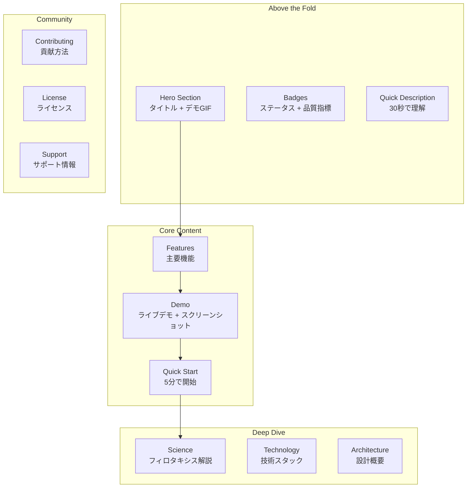
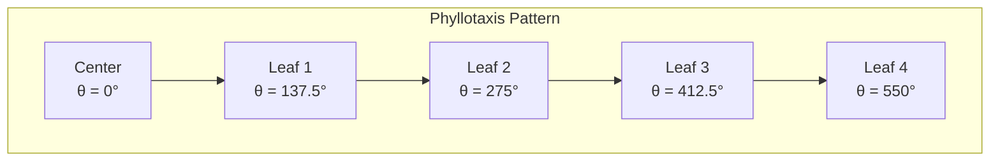
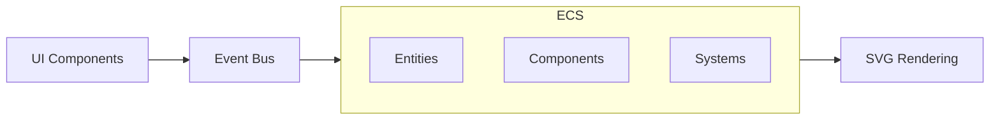

# README戦略

> [!info] 概要
> Phyllotaxis Plannerの魅力的で効果的なREADMEの作成戦略を定義します。

## README設計原則

### 🎯 目標設定

| 目標 | 指標 | 達成方法 |
|------|------|----------|
| **第一印象の最大化** | 5秒以内の理解 | ヒーローセクション + デモGIF |
| **技術的信頼性** | 開発者の関心獲得 | 技術スタック + アーキテクチャ図 |
| **使いやすさの訴求** | クイックスタート完了率 | ステップバイステップガイド |
| **科学的興味の喚起** | フィロタキシス理解 | 視覚的説明 + 数学的背景 |

### 📖 読者ペルソナ

#### 1. 技術者・開発者
- **ニーズ**: 技術的詳細、実装方法、拡張性
- **行動**: コードを読む、技術スタックを確認、デモを試す
- **提供価値**: アーキテクチャ図、API文書、開発ガイド

#### 2. デザイナー・クリエイター
- **ニーズ**: 視覚的魅力、使用感、創作への応用
- **行動**: デモを見る、スクリーンショットを確認、実際に使用
- **提供価値**: 美しいデモ、使用例、デザイン哲学

#### 3. 研究者・学習者
- **ニーズ**: フィロタキシスの理解、科学的背景、教育的価値
- **行動**: 理論を読む、参考文献を確認、実験的使用
- **提供価値**: 科学的説明、参考文献、教育的コンテンツ

#### 4. 一般ユーザー
- **ニーズ**: 簡単な使用方法、実用性、楽しさ
- **行動**: デモを試す、簡単な説明を読む、すぐに使用
- **提供価値**: 簡潔な説明、クイックスタート、使用例

## README構成戦略

### 🏗️ 情報アーキテクチャ



### 📝 セクション別戦略

#### 1. ヒーローセクション

```markdown
# 🌿 Phyllotaxis Planner

> 植物の葉序の法則で思考を美しく整理する


[](https://nextjs.org/)
[](https://www.typescriptlang.org/)
[](https://opensource.org/licenses/MIT)
[](https://phyllotaxis-planner.vercel.app)

**Phyllotaxis Planner**は、植物の葉序（フィロタキシス）の法則を応用した革新的な思考整理ツールです。あなたのアイデアが自然の黄金角に従って美しく自動配置され、まるで植物が成長するような有機的な思考マップを作り出します。
```

**戦略ポイント:**
- 絵文字で親しみやすさを演出
- デモGIFで即座に価値を伝達
- バッジで技術的信頼性を確保
- 30秒で理解できる説明

#### 2. 特徴セクション

```markdown
## ✨ 特徴

### 🌱 自然な配置
黄金角137.5°による有機的なレイアウトで、アイデア同士が重なることなく美しく配置されます。

### 🎨 美しいアニメーション
思考が生き物のように成長する様子を、滑らかなアニメーションで表現します。

### 📱 レスポンシブ対応
デスクトップからモバイルまで、あらゆるデバイスで快適にご利用いただけます。

### ⚡ 高速パフォーマンス
Next.js 15とTypeScriptによる最適化されたパフォーマンスを実現しています。
```

**戦略ポイント:**
- 視覚的アイコンで理解を促進
- 具体的な数値（137.5°）で科学的根拠を示す
- 技術的優位性を簡潔に表現

#### 3. デモセクション

```markdown
## 🚀 ライブデモ

### [🌐 オンラインで試す](https://phyllotaxis-planner.vercel.app)

または、以下のスクリーンショットで機能をご確認ください：

<table>
<tr>
<td width="50%">

**デスクトップ表示**


</td>
<td width="50%">

**モバイル表示**


</td>
</tr>
<tr>
<td width="50%">

**アイデア追加**


</td>
<td width="50%">

**フィロタキシス配置**


</td>
</tr>
</table>
```

**戦略ポイント:**
- ライブデモへの直接リンク
- レスポンシブ対応を視覚的に証明
- GIFで動的な機能を表現
- テーブルレイアウトで整理された表示

#### 4. クイックスタート

```markdown
## 🏃‍♂️ クイックスタート

### 前提条件
- Node.js 18以上
- npm または yarn

### インストール

```bash
# リポジトリをクローン
git clone https://github.com/your-username/phyllotaxis-planner.git

# ディレクトリに移動
cd phyllotaxis-planner

# 依存関係をインストール
npm install

# 開発サーバーを起動
npm run dev
```

### 使用方法

1. **中心テーマを設定**: マップの中心となるメインテーマを入力
2. **アイデアを追加**: 新しいアイデアをテキストで入力
3. **自動配置を確認**: フィロタキシスの法則に従った美しい配置を体験

🎉 **完了！** ブラウザで `http://localhost:3000` を開いて、あなたの思考マップを作成しましょう。
```

**戦略ポイント:**
- 5分以内で完了可能な手順
- 前提条件を明確に記載
- ステップバイステップの明確な指示
- 成功体験を演出する結論

#### 5. 科学的背景

```markdown
## 🧬 フィロタキシス（葉序）とは？

**フィロタキシス**は、植物の葉や花びらが茎の周りに配置される数学的パターンです。

### 黄金角の魔法

植物は**137.5077640500378度**（黄金角）の角度で新しい葉を配置することで、以下を実現しています：

- 🌞 **最大限の日光受光**: 葉同士が重ならない最適配置
- 🌧️ **効率的な雨水収集**: 水滴が根元に集まる構造
- 🌪️ **風の抵抗最小化**: 空気の流れを妨げない配置

### 数学的美しさ

```
黄金角 = 360° × (1 - 1/φ)
φ（黄金比） = (1 + √5) / 2 ≈ 1.618
```

この自然の法則を思考整理に応用することで、アイデア同士の関係性が自然に浮かび上がり、新たな発見や洞察を促進します。

### 参考文献
- [The Golden Angle in Nature](https://en.wikipedia.org/wiki/Golden_angle)
- [Phyllotaxis: A Systemic Study in Plant Morphogenesis](https://www.cambridge.org/core/books/phyllotaxis/9780521404822)
```

**戦略ポイント:**
- 科学的正確性を重視
- 視覚的説明で理解を促進
- 実用的価値との関連性を明示
- 信頼できる参考文献を提供

#### 6. 技術スタック

```markdown
## 🛠️ 技術スタック

### フロントエンド
- **[Next.js 15](https://nextjs.org/)** - React フレームワーク（App Router）
- **[TypeScript](https://www.typescriptlang.org/)** - 型安全な開発
- **[Tailwind CSS](https://tailwindcss.com/)** - ユーティリティファーストCSS
- **[SVG](https://developer.mozilla.org/en-US/docs/Web/SVG)** - 高品質な図形描画

### アーキテクチャ
- **[ECS (Entity Component System)](docs/architecture/ecs/overview.md)** - 柔軟なデータ管理
- **[Event-Driven Architecture](docs/architecture/event-driven-design.md)** - 疎結合な設計
- **[Phyllotaxis Algorithm](docs/architecture/phyllotaxis-algorithm.md)** - 数学的配置計算

### 開発・テスト
- **[Vitest](https://vitest.dev/)** - 高速単体テスト
- **[Playwright](https://playwright.dev/)** - E2Eテスト
- **[Storybook](https://storybook.js.org/)** - コンポーネント開発

### デプロイ・運用
- **[Vercel](https://vercel.com/)** - 自動デプロイ
- **[GitHub Actions](https://github.com/features/actions)** - CI/CD

### なぜこの技術選択？
各技術選択の詳細な理由は [Architecture Decision Records](docs/adr/) をご覧ください。
```

**戦略ポイント:**
- 最新技術の採用をアピール
- 各技術の役割を明確に説明
- 詳細文書への適切なリンク
- 技術選択の透明性を確保

## 視覚的要素戦略

### 🎨 デモGIF作成指針

#### 1. ヒーローGIF（30秒以内）
- **シナリオ**: 中心テーマ設定 → アイデア追加 → 美しい配置
- **フォーカス**: フィロタキシス配置の美しさ
- **品質**: 高解像度、滑らかなアニメーション
- **サイズ**: 最大2MB、最適化済み

#### 2. 機能別GIF
- **アイデア追加**: 入力からアニメーション配置まで
- **レスポンシブ**: デスクトップ→モバイル切り替え
- **インタラクション**: ホバー効果、クリック反応

### 📸 スクリーンショット戦略

#### 1. デバイス別表示
- **デスクトップ**: 1920x1080、複数アイデア表示
- **タブレット**: 768x1024、中程度のアイデア数
- **モバイル**: 375x667、シンプルな表示

#### 2. 状態別表示
- **空の状態**: プレースホルダーとガイダンス
- **使用中**: 実際のアイデアが配置された状態
- **満杯状態**: 50個のアイデアが美しく配置

### 🎯 図表・ダイアグラム

#### 1. フィロタキシスパターン図


#### 2. アーキテクチャ概要図


## コンテンツ最適化

### 📊 SEO戦略

#### メタデータ最適化
```markdown
<!-- README.md のメタ情報 -->
title: Phyllotaxis Planner - 植物の法則で思考を整理
description: フィロタキシス（葉序）の法則を応用した革新的な思考整理ツール。アイデアが自然の黄金角に従って美しく自動配置されます。
keywords: phyllotaxis, 思考整理, マインドマップ, 黄金角, フィロタキシス, アイデア管理
```

#### GitHub検索最適化
- **トピック**: `phyllotaxis`, `mindmap`, `golden-angle`, `nextjs`, `typescript`
- **説明文**: 簡潔で検索されやすいキーワードを含む
- **タグ**: 関連技術とドメインキーワード

### 🌐 多言語対応

#### 英語版README
- 科学的用語の正確な翻訳
- 文化的コンテキストの調整
- 国際的な参考文献の追加

#### 日本語版README
- 日本の教育文脈に合わせた説明
- 日本語の自然な表現
- 日本の研究機関の参考文献

## 品質管理

### ✅ チェックリスト

#### コンテンツ品質
- [ ] 誤字脱字のチェック
- [ ] リンクの動作確認
- [ ] 画像の表示確認
- [ ] コードブロックの動作確認

#### 技術的品質
- [ ] Markdown構文の正確性
- [ ] 画像ファイルサイズの最適化
- [ ] アクセシビリティの確保
- [ ] モバイル表示の確認

#### ユーザビリティ
- [ ] 5秒ルールの確認（5秒で理解可能）
- [ ] クイックスタートの実行テスト
- [ ] 外部リンクの有効性確認
- [ ] 読みやすさの評価

### 📈 効果測定

#### 指標設定
- **GitHub Stars**: 技術者からの評価
- **Fork数**: 実際の使用・改良意欲
- **Issue/PR数**: コミュニティの活発さ
- **ライブデモアクセス数**: 実際の関心度

#### 改善サイクル
1. **月次レビュー**: 指標の確認と分析
2. **四半期更新**: コンテンツの大幅改善
3. **年次戦略見直し**: 全体戦略の再評価

## 関連文書

> [!info] ドキュメント戦略
> - [[documentation-strategy|ドキュメント戦略]]
> - [[development|開発環境セットアップ]]
> - [[contributing|コントリビューションガイド]]

> [!note] アーキテクチャ文書
> - [[../architecture/system-overview|システム概要]]
> - [[../architecture/ecs/overview|ECS概要]]
> - [[../adr/README|アーキテクチャ決定記録]]

> [!tip] 参考リソース
> - [GitHub README Best Practices](https://github.com/matiassingers/awesome-readme)
> - [Markdown Guide](https://www.markdownguide.org/)
> - [Open Source Guide](https://opensource.guide/)