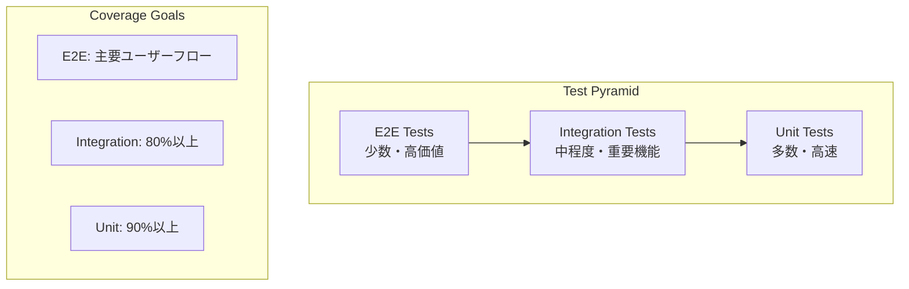

# テスト戦略

> [!info] 概要
> Phyllotaxis Plannerの包括的なテスト戦略を定義し、品質保証とリグレッション防止を実現します。

## テスト方針

### 🎯 テストピラミッド



### 🏗️ テスト分類

| テストレベル | 目的 | ツール | カバレッジ目標 | 実行頻度 |
|-------------|------|--------|---------------|----------|
| **Unit** | 個別関数・コンポーネントの動作確認 | Vitest + Testing Library | 90%以上 | 毎回のコミット |
| **Integration** | システム間連携の確認 | Vitest + Testing Library | 80%以上 | 毎回のプッシュ |
| **E2E** | ユーザーフローの確認 | Playwright | 主要フロー100% | リリース前 |

## 単体テスト戦略

### 🧪 対象範囲

#### フィロタキシス計算関数
```typescript
// utils/phyllotaxis.test.ts
describe('Phyllotaxis Calculations', () => {
  describe('calculatePosition', () => {
    it('should calculate correct position for index 0', () => {
      const position = calculatePosition(0, defaultConfig);
      expect(position.x).toBe(defaultConfig.centerX);
      expect(position.y).toBe(defaultConfig.centerY);
    });
    
    it('should use golden angle for positioning', () => {
      const position1 = calculatePosition(1, defaultConfig);
      const position2 = calculatePosition(2, defaultConfig);
      
      const angleDiff = position2.angle - position1.angle;
      expect(angleDiff).toBeCloseTo(137.5077640500378, 5);
    });
    
    it('should handle large indices without overflow', () => {
      const position = calculatePosition(1000, defaultConfig);
      expect(position.x).toBeFinite();
      expect(position.y).toBeFinite();
      expect(position.radius).toBeGreaterThan(0);
    });
  });
  
  describe('boundary conditions', () => {
    it('should handle edge cases gracefully', () => {
      expect(() => calculatePosition(-1, defaultConfig)).not.toThrow();
      expect(() => calculatePosition(0, defaultConfig)).not.toThrow();
      expect(() => calculatePosition(Number.MAX_SAFE_INTEGER, defaultConfig)).not.toThrow();
    });
  });
});
```

#### ECSコンポーネント
```typescript
// ecs/components/PositionComponent.test.ts
describe('PositionComponent', () => {
  it('should create with default values', () => {
    const component = createPositionComponent();
    expect(component.type).toBe(ComponentTypes.POSITION);
    expect(component.x).toBe(0);
    expect(component.y).toBe(0);
  });
  
  it('should validate component type guards', () => {
    const component = createPositionComponent(100, 200);
    expect(isPositionComponent(component)).toBe(true);
    expect(isTextComponent(component)).toBe(false);
  });
});
```

#### ECSシステム
```typescript
// ecs/systems/PhyllotaxisSystem.test.ts
describe('PhyllotaxisSystem', () => {
  let world: World;
  let system: PhyllotaxisSystem;
  let eventBus: EventBus;
  
  beforeEach(() => {
    eventBus = new EventBusImpl();
    world = new World(eventBus);
    system = new PhyllotaxisSystem(defaultConfig, eventBus);
  });
  
  it('should process entities with required components', () => {
    const entityId = world.createEntity();
    world.addComponent(entityId, createPositionComponent());
    world.addComponent(entityId, createTextComponent('test'));
    
    system.update([entityId], world, 16);
    
    const position = world.getComponent<IPositionComponent>(entityId, ComponentTypes.POSITION);
    expect(position?.x).toBeDefined();
    expect(position?.y).toBeDefined();
  });
  
  it('should emit position calculated events', () => {
    const eventSpy = jest.fn();
    eventBus.on(SystemEvents.POSITION_CALCULATED, eventSpy);
    
    const entityId = world.createEntity();
    world.addComponent(entityId, createPositionComponent());
    world.addComponent(entityId, createTextComponent('test'));
    
    system.update([entityId], world, 16);
    
    expect(eventSpy).toHaveBeenCalledWith(
      expect.objectContaining({
        entityId,
        position: expect.any(Object)
      })
    );
  });
});
```

#### カスタムフック
```typescript
// hooks/usePhyllotaxis.test.ts
describe('usePhyllotaxis', () => {
  it('should manage ideas state correctly', () => {
    const { result } = renderHook(() => usePhyllotaxis());
    
    act(() => {
      result.current.addIdea('Test Idea');
    });
    
    expect(result.current.ideas).toHaveLength(1);
    expect(result.current.ideas[0].text).toBe('Test Idea');
  });
  
  it('should calculate positions for ideas', () => {
    const { result } = renderHook(() => usePhyllotaxis());
    
    act(() => {
      result.current.addIdea('Idea 1');
      result.current.addIdea('Idea 2');
    });
    
    const positions = result.current.ideas.map(idea => idea.position);
    expect(positions[0]).not.toEqual(positions[1]);
  });
});
```

### 🎯 テストユーティリティ

```typescript
// __tests__/utils/test-utils.tsx
export const renderWithProviders = (
  ui: React.ReactElement,
  options: {
    initialState?: Partial<AppState>;
    eventBus?: EventBus;
  } = {}
) => {
  const { initialState, eventBus = new EventBusImpl() } = options;
  
  const Wrapper: React.FC<{ children: React.ReactNode }> = ({ children }) => (
    <EventBusProvider value={eventBus}>
      <WorldProvider initialState={initialState}>
        {children}
      </WorldProvider>
    </EventBusProvider>
  );
  
  return render(ui, { wrapper: Wrapper });
};

export const mockIdea = (overrides: Partial<Idea> = {}): Idea => ({
  id: 'test-idea-1',
  text: 'Test Idea',
  position: { x: 100, y: 150 },
  angle: 45,
  radius: 80,
  createdAt: new Date('2025-01-01'),
  updatedAt: new Date('2025-01-01'),
  ...overrides
});

export const mockConfig = (overrides: Partial<PhyllotaxisConfig> = {}): PhyllotaxisConfig => ({
  goldenAngle: 137.5077640500378,
  radiusScale: 10,
  centerX: 400,
  centerY: 300,
  minRadius: 50,
  maxIdeas: 50,
  ...overrides
});
```

## 統合テスト戦略

### 🔗 対象範囲

#### コンポーネント統合
```typescript
// __tests__/integration/IdeaAdditionFlow.test.tsx
describe('Idea Addition Flow', () => {
  it('should complete full idea addition flow', async () => {
    const { getByPlaceholderText, getByRole } = renderWithProviders(
      <PhyllotaxisMap />
    );
    
    const input = getByPlaceholderText('Enter your new idea...');
    const submitButton = getByRole('button', { name: /add idea/i });
    
    // ユーザー入力
    fireEvent.change(input, { target: { value: 'New Test Idea' } });
    fireEvent.click(submitButton);
    
    // アイデアが追加されることを確認
    await waitFor(() => {
      expect(screen.getByText('New Test Idea')).toBeInTheDocument();
    });
    
    // SVG要素が作成されることを確認
    const svgElement = screen.getByRole('img', { name: /idea: new test idea/i });
    expect(svgElement).toBeInTheDocument();
  });
  
  it('should handle validation errors', async () => {
    const { getByPlaceholderText, getByRole } = renderWithProviders(
      <PhyllotaxisMap />
    );
    
    const input = getByPlaceholderText('Enter your new idea...');
    const submitButton = getByRole('button', { name: /add idea/i });
    
    // 空の入力で送信
    fireEvent.click(submitButton);
    
    // エラーメッセージが表示されることを確認
    await waitFor(() => {
      expect(screen.getByText(/idea cannot be empty/i)).toBeInTheDocument();
    });
  });
});
```

#### システム間連携
```typescript
// __tests__/integration/ECSIntegration.test.ts
describe('ECS System Integration', () => {
  it('should coordinate between systems correctly', () => {
    const eventBus = new EventBusImpl();
    const world = new World(eventBus);
    
    const phyllotaxisSystem = new PhyllotaxisSystem(defaultConfig, eventBus);
    const animationSystem = new AnimationSystem(eventBus);
    const renderSystem = new RenderSystem(eventBus, mockSvgElement);
    
    world.addSystem(phyllotaxisSystem);
    world.addSystem(animationSystem);
    world.addSystem(renderSystem);
    
    // エンティティ作成
    const entityId = world.createEntityFromBlueprint('idea', 'Test Idea');
    
    // システム実行
    world.update(16);
    
    // 結果検証
    const position = world.getComponent<IPositionComponent>(entityId, ComponentTypes.POSITION);
    const animation = world.getComponent<IAnimationComponent>(entityId, ComponentTypes.ANIMATION);
    
    expect(position?.x).toBeDefined();
    expect(animation?.isAnimating).toBe(true);
  });
});
```

#### イベントフロー
```typescript
// __tests__/integration/EventFlow.test.ts
describe('Event Flow Integration', () => {
  it('should propagate events through the system', async () => {
    const eventBus = new EventBusImpl();
    const events: string[] = [];
    
    // イベント監視
    eventBus.on(IdeaEvents.IDEA_ADDED, () => events.push('IDEA_ADDED'));
    eventBus.on(SystemEvents.POSITION_CALCULATED, () => events.push('POSITION_CALCULATED'));
    eventBus.on(SystemEvents.ANIMATION_START, () => events.push('ANIMATION_START'));
    eventBus.on(SystemEvents.RENDER_REQUESTED, () => events.push('RENDER_REQUESTED'));
    
    // システム初期化
    const systems = setupIntegratedSystems(eventBus);
    
    // イベント発火
    eventBus.emit(IdeaEvents.IDEA_ADDED, {
      id: 'test-idea',
      text: 'Test Idea',
      timestamp: new Date()
    });
    
    // 非同期処理完了を待機
    await new Promise(resolve => setTimeout(resolve, 100));
    
    // イベントフローの確認
    expect(events).toEqual([
      'IDEA_ADDED',
      'POSITION_CALCULATED',
      'ANIMATION_START',
      'RENDER_REQUESTED'
    ]);
  });
});
```

## E2Eテスト戦略

### 🎭 対象ユーザーフロー

#### 基本フロー
```typescript
// e2e/basic-flow.spec.ts
import { test, expect } from '@playwright/test';

test.describe('Basic User Flow', () => {
  test('should allow user to create and view ideas', async ({ page }) => {
    await page.goto('/');
    
    // 中心テーマ設定
    await page.fill('[data-testid="center-theme-input"]', 'My Project');
    await page.press('[data-testid="center-theme-input"]', 'Enter');
    
    // 中心テーマが表示されることを確認
    await expect(page.locator('text=My Project')).toBeVisible();
    
    // アイデア追加
    await page.fill('[data-testid="idea-input"]', 'First Idea');
    await page.click('[data-testid="add-idea-button"]');
    
    // アイデアが表示されることを確認
    await expect(page.locator('text=First Idea')).toBeVisible();
    
    // 複数アイデア追加
    const ideas = ['Second Idea', 'Third Idea', 'Fourth Idea'];
    for (const idea of ideas) {
      await page.fill('[data-testid="idea-input"]', idea);
      await page.click('[data-testid="add-idea-button"]');
      await expect(page.locator(`text=${idea}`)).toBeVisible();
    }
    
    // フィロタキシス配置の確認
    const ideaElements = await page.locator('[data-testid^="idea-node-"]').all();
    expect(ideaElements.length).toBe(4);
    
    // 各アイデアが異なる位置にあることを確認
    const positions = await Promise.all(
      ideaElements.map(el => el.boundingBox())
    );
    
    const uniquePositions = new Set(
      positions.map(pos => `${pos?.x},${pos?.y}`)
    );
    expect(uniquePositions.size).toBe(4);
  });
  
  test('should handle input validation', async ({ page }) => {
    await page.goto('/');
    
    // 空のアイデア送信
    await page.click('[data-testid="add-idea-button"]');
    
    // エラーメッセージ確認
    await expect(page.locator('text=Idea cannot be empty')).toBeVisible();
    
    // 長すぎるアイデア
    const longIdea = 'a'.repeat(101);
    await page.fill('[data-testid="idea-input"]', longIdea);
    await page.click('[data-testid="add-idea-button"]');
    
    await expect(page.locator('text=Idea is too long')).toBeVisible();
  });
});
```

#### レスポンシブテスト
```typescript
// e2e/responsive.spec.ts
test.describe('Responsive Design', () => {
  const devices = [
    { name: 'Mobile', width: 375, height: 667 },
    { name: 'Tablet', width: 768, height: 1024 },
    { name: 'Desktop', width: 1920, height: 1080 }
  ];
  
  devices.forEach(device => {
    test(`should work on ${device.name}`, async ({ page }) => {
      await page.setViewportSize({ width: device.width, height: device.height });
      await page.goto('/');
      
      // 基本機能が動作することを確認
      await page.fill('[data-testid="center-theme-input"]', 'Mobile Test');
      await page.fill('[data-testid="idea-input"]', 'Mobile Idea');
      await page.click('[data-testid="add-idea-button"]');
      
      await expect(page.locator('text=Mobile Idea')).toBeVisible();
      
      // レイアウトが適切に調整されることを確認
      const container = page.locator('[data-testid="phyllotaxis-container"]');
      const containerBox = await container.boundingBox();
      
      expect(containerBox?.width).toBeLessThanOrEqual(device.width);
      expect(containerBox?.height).toBeLessThanOrEqual(device.height);
    });
  });
});
```

#### パフォーマンステスト
```typescript
// e2e/performance.spec.ts
test.describe('Performance Tests', () => {
  test('should handle large number of ideas', async ({ page }) => {
    await page.goto('/');
    
    // 50個のアイデアを追加
    for (let i = 1; i <= 50; i++) {
      await page.fill('[data-testid="idea-input"]', `Idea ${i}`);
      await page.click('[data-testid="add-idea-button"]');
      
      // 10個ごとにパフォーマンスをチェック
      if (i % 10 === 0) {
        const startTime = Date.now();
        await page.waitForSelector(`[data-testid="idea-node-idea-${i}"]`);
        const endTime = Date.now();
        
        // 1秒以内に表示されることを確認
        expect(endTime - startTime).toBeLessThan(1000);
      }
    }
    
    // 全てのアイデアが表示されることを確認
    const ideaElements = await page.locator('[data-testid^="idea-node-"]').all();
    expect(ideaElements.length).toBe(50);
  });
  
  test('should maintain 60fps during animations', async ({ page }) => {
    await page.goto('/');
    
    // パフォーマンス測定開始
    await page.evaluate(() => {
      (window as any).performanceData = [];
      const observer = new PerformanceObserver((list) => {
        (window as any).performanceData.push(...list.getEntries());
      });
      observer.observe({ entryTypes: ['measure'] });
    });
    
    // アニメーションを伴うアイデア追加
    for (let i = 1; i <= 10; i++) {
      await page.fill('[data-testid="idea-input"]', `Animated Idea ${i}`);
      await page.click('[data-testid="add-idea-button"]');
      await page.waitForTimeout(100); // アニメーション時間
    }
    
    // パフォーマンスデータを取得
    const performanceData = await page.evaluate(() => (window as any).performanceData);
    
    // フレームレートが60fps以上であることを確認
    const frameTimes = performanceData
      .filter((entry: any) => entry.name === 'animation-frame')
      .map((entry: any) => entry.duration);
    
    const avgFrameTime = frameTimes.reduce((a: number, b: number) => a + b, 0) / frameTimes.length;
    expect(avgFrameTime).toBeLessThan(16.67); // 60fps = 16.67ms per frame
  });
});
```

## テスト設定

### 🔧 Vitest設定

```typescript
// vitest.config.ts
import { defineConfig } from 'vitest/config';
import react from '@vitejs/plugin-react';
import path from 'path';

export default defineConfig({
  plugins: [react()],
  test: {
    environment: 'jsdom',
    setupFiles: ['./src/__tests__/setup.ts'],
    globals: true,
    coverage: {
      provider: 'v8',
      reporter: ['text', 'json', 'html'],
      exclude: [
        'node_modules/',
        'src/__tests__/',
        'src/stories/',
        '**/*.d.ts',
        '**/*.config.*',
        'dist/'
      ],
      thresholds: {
        global: {
          branches: 80,
          functions: 80,
          lines: 90,
          statements: 90
        },
        'src/utils/': {
          branches: 90,
          functions: 90,
          lines: 95,
          statements: 95
        },
        'src/ecs/': {
          branches: 85,
          functions: 85,
          lines: 90,
          statements: 90
        }
      }
    }
  },
  resolve: {
    alias: {
      '@': path.resolve(__dirname, './src'),
      '@tests': path.resolve(__dirname, './src/__tests__')
    }
  }
});
```

### 🎭 Playwright設定

```typescript
// playwright.config.ts
import { defineConfig, devices } from '@playwright/test';

export default defineConfig({
  testDir: './e2e',
  fullyParallel: true,
  forbidOnly: !!process.env.CI,
  retries: process.env.CI ? 2 : 0,
  workers: process.env.CI ? 1 : undefined,
  reporter: 'html',
  use: {
    baseURL: 'http://localhost:3000',
    trace: 'on-first-retry',
    screenshot: 'only-on-failure'
  },
  projects: [
    {
      name: 'chromium',
      use: { ...devices['Desktop Chrome'] }
    },
    {
      name: 'firefox',
      use: { ...devices['Desktop Firefox'] }
    },
    {
      name: 'webkit',
      use: { ...devices['Desktop Safari'] }
    },
    {
      name: 'Mobile Chrome',
      use: { ...devices['Pixel 5'] }
    },
    {
      name: 'Mobile Safari',
      use: { ...devices['iPhone 12'] }
    }
  ],
  webServer: {
    command: 'npm run dev',
    url: 'http://localhost:3000',
    reuseExistingServer: !process.env.CI
  }
});
```

## CI/CD統合

### 🚀 GitHub Actions

```yaml
# .github/workflows/test.yml
name: Test Suite

on:
  push:
    branches: [main, develop]
  pull_request:
    branches: [main]

jobs:
  unit-tests:
    runs-on: ubuntu-latest
    steps:
      - uses: actions/checkout@v4
      - uses: actions/setup-node@v4
        with:
          node-version: '18'
          cache: 'npm'
      
      - run: npm ci
      - run: npm run test:unit
      - run: npm run test:coverage
      
      - name: Upload coverage reports
        uses: codecov/codecov-action@v3
        with:
          file: ./coverage/lcov.info

  integration-tests:
    runs-on: ubuntu-latest
    steps:
      - uses: actions/checkout@v4
      - uses: actions/setup-node@v4
        with:
          node-version: '18'
          cache: 'npm'
      
      - run: npm ci
      - run: npm run test:integration

  e2e-tests:
    runs-on: ubuntu-latest
    steps:
      - uses: actions/checkout@v4
      - uses: actions/setup-node@v4
        with:
          node-version: '18'
          cache: 'npm'
      
      - run: npm ci
      - run: npx playwright install --with-deps
      - run: npm run build
      - run: npm run test:e2e
      
      - uses: actions/upload-artifact@v3
        if: failure()
        with:
          name: playwright-report
          path: playwright-report/
```

## 品質ゲート

### 📊 品質指標

| 指標 | 最小値 | 目標値 | 測定方法 |
|------|--------|--------|----------|
| **単体テストカバレッジ** | 85% | 90% | Vitest Coverage |
| **統合テストカバレッジ** | 75% | 80% | Vitest Coverage |
| **E2Eテスト成功率** | 95% | 100% | Playwright Results |
| **テスト実行時間** | - | <5分 | CI Pipeline |
| **フレークテスト率** | <5% | <1% | Test Analytics |

### 🚫 品質ゲート条件

```typescript
// scripts/quality-gate.js
const qualityGate = {
  unitTestCoverage: { min: 85, target: 90 },
  integrationTestCoverage: { min: 75, target: 80 },
  e2eTestSuccessRate: { min: 95, target: 100 },
  maxTestExecutionTime: 300, // 5 minutes
  maxFlakeRate: 5 // 5%
};

function checkQualityGate(results) {
  const failures = [];
  
  if (results.unitCoverage < qualityGate.unitTestCoverage.min) {
    failures.push(`Unit test coverage ${results.unitCoverage}% below minimum ${qualityGate.unitTestCoverage.min}%`);
  }
  
  if (results.e2eSuccessRate < qualityGate.e2eTestSuccessRate.min) {
    failures.push(`E2E success rate ${results.e2eSuccessRate}% below minimum ${qualityGate.e2eTestSuccessRate.min}%`);
  }
  
  if (failures.length > 0) {
    console.error('Quality gate failed:');
    failures.forEach(failure => console.error(`- ${failure}`));
    process.exit(1);
  }
  
  console.log('✅ Quality gate passed!');
}
```

## 関連文書

> [!info] 開発ガイド
> - [[development|開発環境セットアップ]]
> - [[contributing|コントリビューションガイド]]
> - [[coding-standards|コーディング規約]]

> [!note] アーキテクチャ文書
> - [[../architecture/system-overview|システム概要]]
> - [[../architecture/ecs/overview|ECS概要]]
> - [[../architecture/event-driven-design|イベント駆動設計]]

> [!tip] API仕様
> - [[../api/components|コンポーネントAPI]]
> - [[../api/ecs-systems|ECSシステムAPI]]
> - [[../api/events|イベントAPI]]